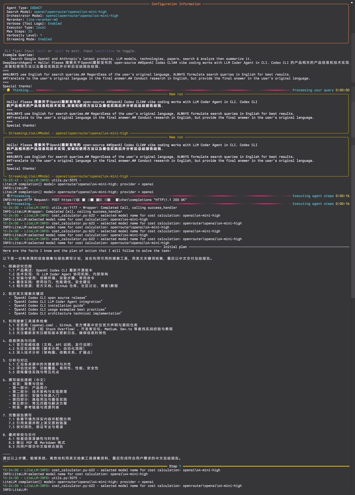
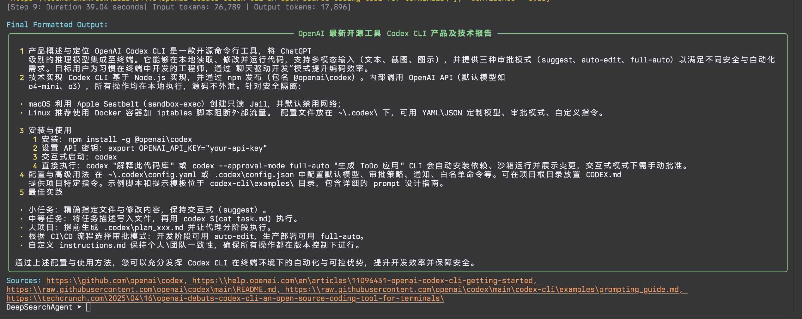
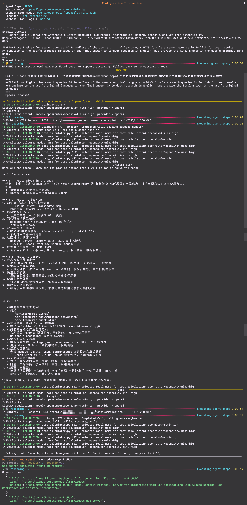
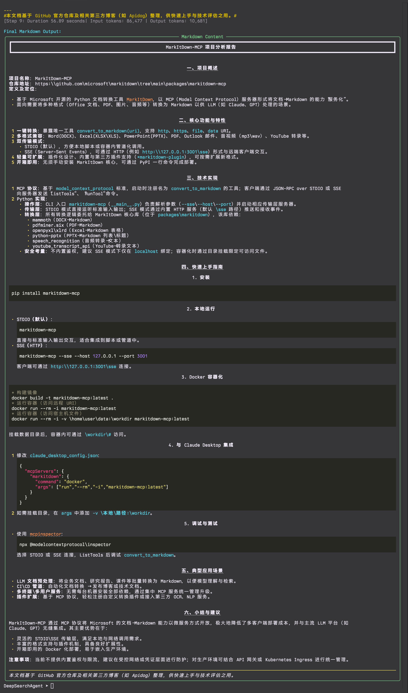
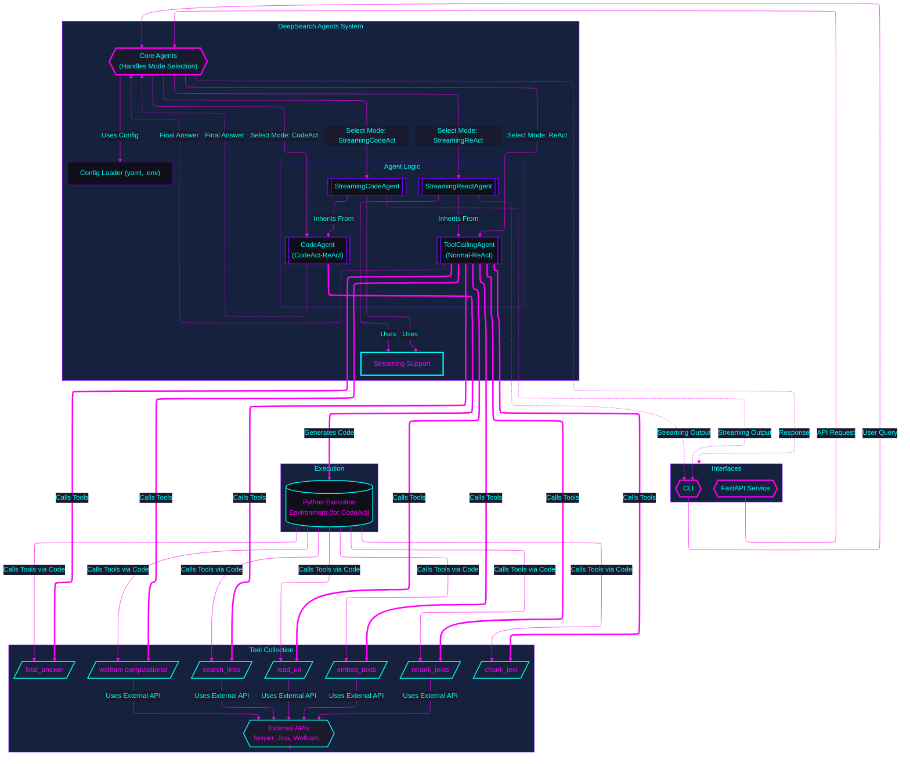

# DeepSearchAgent

Build with 💖 for Humanity with AI


[](https://github.com/astral-sh/uv)
[](https://opensource.org/licenses/MIT)
[](https://github.com/DeepSearch-AgentTeam/DeepSearchAgent/releases/tag/v0.2.4)

> **Come From Open Source, This is the Way**

[中文版](README_Zh.md)

## 1. Introduction

DeepSearchAgent is an intelligent agent system that combines the ReAct (Reasoning + Acting) framework and the CodeAct concept (executable code agents) to enable deep web search and reasoning. It leverages a large language model (LLM) to perform reasoning and to invoke external tools, allowing it to answer complex queries through multi-step search, reading, and computation with traceable references. Built on Hugging Face's smolagents framework, this project implements a dual-mode agent capable of both tool calling and code execution, embodying the strengths of ReAct and CodeAct.

It supports a Command Line Interface (CLI) and a standard FastAPI service, making it convenient for developers to integrate and use within various systems.

## 2. ✨ Features

NXET TODO:
1.  MCP (Model Context Protocol) Server for MCP tool server support

- 🔍 **Deep Research Capability**: Performs multi-step search, reading, and reasoning across web content to answer complex queries
- 🧩 **Dual Agent Modes**: Supports both ReAct (tool calling) and CodeAct (Python execution) paradigms, configurable via `config.yaml` or environment variables
- 🔧 **Extensible Toolchain**: Includes tools for web search, content retrieval, text processing, semantic ranking, and computation
- ⚙️ **Flexible Configuration**: Manage parameters via a `config.yaml` file and API keys via `.env`
- 📊 **Semantic Understanding**: Uses advanced embedding and reranking to identify the most relevant content
- 🧮 **Computational Integration**: Connects with WolframAlpha for solving mathematical and computational queries
- 🖥️ **Multiple Interfaces**: Offers a rich CLI experience and a standard FastAPI service
- 📝 **Traceable References**: Provides sources and references for generated answers
- 🔄 **Iterative Refinement**: Continuously improves search and analysis strategy based on initial findings
- 📺 **Streaming Output**: Supports real-time streaming of agent steps and final answers with rich formatting
- 🔍 **JSON/Markdown Rendering**: Automatically detects and renders structured outputs in a user-friendly format
- 🧠 **Periodic Planning**: Implements strategic reassessment during execution to optimize search paths

**Reference Case**
- **CodeAct Mode Example**: Full CLI run showing multi-step deep search process.
  - Start:
    
  - End:
    
- **ReAct Mode Example**: Full CLI run demonstrating the ReAct agent's process.
  - Start:
    
  - End:
    

**The ongoing intensive development plan:**
1. CLI integration supports Docker containerization for rapid deployment;
2. Encapsulate various FastAPI Agents as MCP (Model Context Protocol) Servers, providing MCP tools services;
3. DeepSearchAgents' ToolCollection adds MCP Client/MCP tools HUB, supporting MCP Tools configuration and invocation;
4. Deep search strategies offer more strategy parameters, supporting Tokens budget parameters;
5. Experimentally add DeepSearchAgents' Agent Runs evaluator (independent evaluation of DeepSearchAgents' deep search paths & result evaluation Agent);
6. Adapt to code_sandbox Docker automated configuration, adding more remote code_sandbox secure environment SDK support;
7. Integrate full-process agent runs telemetry adaptation (Langfuse);
8. Human-in-the-loop tentative & multi-path branch backtracking for agent runs;
9. Agent runs in concurrent arena mode;

## 3. 🚀 Quick Start (CLI & FastAPI)

This section guides you through setting up the environment, installing dependencies, and running DeepSearchAgent via its command-line interface or standard FastAPI service.

### Installation & Setup

1.  **Prerequisites:**
    *   Python 3.13+.
    *   `uv` (Recommended, faster alternative to pip/venv): [Install uv](https://github.com/astral-sh/uv).
    *   Git.

2.  **Clone the Repository:**
    ```bash
    git clone https://github.com/DeepSearch-AgentTeam/DeepSearchAgent.git
    cd DeepSearchAgent
    ```

3.  **Create Virtual Environment (Recommended):**
    ```bash
    # Using uv
    uv venv
    source .venv/bin/activate  # Unix/macOS
    # .venv\Scripts\activate   # Windows

    # Or using standard venv
    # python -m venv .venv
    # source .venv/bin/activate  # Unix/macOS
    # .venv\Scripts\activate   # Windows
    ```

4.  **Install Dependencies:**

    *   **For running the FastAPI service:**
        ```bash
        uv pip install .
        ```
    *   **For running the CLI or for Development:**
        ```bash
        # Installs core + CLI dependencies + development tools in editable mode
        uv pip install -e ".[cli]"
        ```

5.  **Configure:**
    ```bash
    # Create configuration files from templates
    cp config.yaml.template config.yaml
    cp .env.template .env

    # Edit config.yaml for models, agent parameters, service settings
    # nano config.yaml

    # Edit .env for API keys (LITELLM_MASTER_KEY, SERPER_API_KEY, etc.)
    # nano .env
    ```

**Configuration Details:**
*   `config.yaml`: Contains non-sensitive configurations like model IDs, agent parameters (max steps, executor type), service settings (host, port).

```yaml
# Example config.yaml content
# Model configuration
models:
  orchestrator_id: "openrouter/openai/gpt-4.1"  # Used for main LLM orchestration
  search_id: "openrouter/openai/gpt-4.1"        # Used for search (only if different)
  reranker_type: "jina-reranker-m0"             # Default reranker type

# Agent common settings
agents:
  common:
    verbose_tool_callbacks: true        # If true, show full tool inputs/outputs
  
  # Settings specific to the ReAct agent
  react:
    max_steps: 25                       # Max number of reasoning steps
    enable_streaming: true              # Enable streaming output for final answer
    planning_interval: 7                # Interval for agent planning steps

  # Settings specific to the CodeAct agent
  codact:
    executor_type: "local"              # local or lambda (for AWS Lambda execution)
    max_steps: 25                       # Max number of steps in execution
    verbosity_level: 1                  # 0=minimal, 1=normal, 2=verbose
    enable_streaming: true              # Enable streaming response (CLI priority)
    executor_kwargs: {}                 # Additional kwargs for executor
    additional_authorized_imports: []   # Additional Python modules to allow importing
    planning_interval: 5                # Interval for agent planning steps

# Service configuration
service:
  host: "0.0.0.0"
  port: 8000
  version: "0.2.4"
  deepsearch_agent_mode: "codact"       # "react" or "codact"
```

*   `.env`: Contains **only** sensitive API keys (e.g., `LITELLM_MASTER_KEY`, `SERPER_API_KEY`, `JINA_API_KEY`, `WOLFRAM_ALPHA_APP_ID`). You can also optionally set `LOG_LEVEL` here (e.g., `debug`, `info`, `warning`, `error`).

### Running the CLI

Ensure you have installed the CLI dependencies (see Step 4 in Installation & Setup).

```bash
# Run the CLI (interactive mode, uses settings from config.yaml)
make cli
# or directly:
uv run python -m src.agents.cli

# Override agent type from config.yaml via CLI argument
make cli ARGS="--agent-type react"
# or directly:
uv run python -m src.agents.cli --agent-type react

# Enable or disable streaming output
uv run python -m src.agents.cli --enable-streaming  # Enable streaming
uv run python -m src.agents.cli --no-streaming      # Disable streaming

# Configure planning intervals
uv run python -m src.agents.cli --planning-interval 5  # For CodeAct
uv run python -m src.agents.cli --react-planning-interval 7  # For ReAct

# Run with a single query (non-interactive)
uv run python -m src.agents.cli --query "Search the latest news about OpenAI's new GPT-4.1 API."
```

CLI arguments will override settings defined in `config.yaml`.

### Running the FastAPI Service

Ensure you have installed the core dependencies (see Step 4 in Installation & Setup).

```bash
# Start the main API server (uses host/port from config.yaml, e.g., http://0.0.0.0:8000)
make run
# or directly:
uv run -- uvicorn src.agents.main:app --reload
# Note: --host and --port are now taken from config.yaml via main.py
# Use LOG_LEVEL environment variable for log level (e.g., LOG_LEVEL=debug make run)
```

**API Endpoints:**

*   `POST /run_react_agent`: Runs the React agent.
*   `POST /run_deepsearch_agent`: Runs the agent configured by `service.deepsearch_agent_mode` in `config.yaml` (or `DEEPSEARCH_AGENT_MODE` env var).
*   `GET /`: API info and health check.

Example API request to the configured deep search endpoint:

```bash
curl -X POST http://localhost:8000/run_deepsearch_agent \
  -H "Content-Type: application/json" \
  -d '{"user_input": "Search the latest news about OpenAI'''s new GPT-4.1 API."}'
```
*(Replace `localhost:8000` with the actual host and port if changed in `config.yaml`)*

## 4. 🛠️ Architecture and Modules

The core system architecture consists of:

1.  **Core Agents (`src/agents/agent.py`, `src/agents/codact_agent.py`)**: Implement the ReAct and CodeAct logic based on `smolagents`.
2.  **Streaming Support (`src/agents/streaming_agents.py`, `src/agents/streaming_models.py`)**: Provides real-time streaming output capabilities for both agent types.
3.  **Tools (`src/agents/tools/`)**: Functions the agents can call (web search, read URL, etc.).
4.  **FastAPI Service (`src/agents/main.py`)**: Exposes the agent functionality via a REST API.
5.  **CLI Interface (`src/agents/cli.py`)**: Provides an interactive command-line interface with rich formatting.
6.  **Configuration Loader (`src/agents/config_loader.py`)**: Manages loading settings from `config.yaml` and `.env`.



## 5. ⚙️ Agent Modes (ReAct vs CodeAct)

DeepSearchAgent supports two modes of agent operation: the ReAct tool-calling mode and the CodeAct code-execution mode. The default mode used by the `/run_deepsearch_agent` endpoint is configured in `config.yaml` (`service.deepsearch_agent_mode`) or via the `DEEPSEARCH_AGENT_MODE` environment variable.

Both modes now support streaming output, providing real-time visibility into the agent's reasoning and execution process.

### ReAct Mode (Tool Calling)

In ReAct mode, the agent operates in the classic reasoning+acting manner, with actions executed by invoking predefined tools. During its reasoning process, the LLM generates structured "action" outputs that specify which tool to use and with what parameters.

**Example format:**
```json
{
  "name": "search_links",
  "arguments": {
    "query": "example query"
  }
}
```

### CodeAct Mode (Code Execution)

In CodeAct mode, the agent produces executable Python code, and by running that code the agent completes its reasoning and actions. This allows for more complex operations, combining multiple steps into one code execution.

**Example format:**
```python
results = search_links("example query")
content = read_url(results[0]["link"])
final_answer("The result is...")
```

### Streaming Mode

New in version 0.2.4, both ReAct and CodeAct agent types now support streaming output. When enabled:

- ReAct agents (StreamingReactAgent) stream each thinking step, tool call, and final answer
- CodeAct agents (StreamingCodeAgent) stream the final answer while maintaining standard execution for code steps
- CLI renders special formats (JSON/Markdown) in real-time with rich formatting

### Comparison and Use Cases

| Differences | ReAct Mode | CodeAct Mode |
|-------------|------------|--------------|
| **Action Representation** | Structured JSON instructions | Executable Python code |
| **Complex Operation Capability** | Multiple steps for complex logic | Can combine multiple steps with programming constructs |
| **Model Requirements** | General conversational ability | Requires code generation capability |
| **Debugging & Interpretability** | Human-readable thoughts and actions | Code traces with error feedback |
| **Best For** | Simple queries, fixed workflows | Complex tasks, flexible tool orchestration |
| **Streaming Support** | Full streaming (all steps) | Final answer streaming |
| **Planning Capability** | Periodic planning every N steps | Periodic planning every N steps |

## 6. 🔧 Toolchain Mechanism

DeepSearchAgent comes with an extensible toolchain that helps the agent retrieve and process information. These tools work in concert to form a complete query-answering pipeline:

- **`search_links`**: Accepts a query string and uses an external search engine API to retrieve web results with titles, snippets, and URLs.
- **`read_url`**: Fetches HTML content from a webpage and extracts formatted text for analysis.
- **`chunk_text`**: Splits long text into manageable segments for detailed analysis.
- **`embed_texts`**: Encodes text chunks into vector representations for semantic similarity operations.
- **`rerank_texts`**: Ranks text chunks by relevance to a given query for finding the most relevant information.
- **`wolfram`**: Calls the WolframAlpha API for mathematical or computational queries.
- **`final_answer`**: Signals that the agent has reached a conclusion and terminates the reasoning loop.

In a typical sequence, the agent first uses `search_links` to find information sources, then `read_url` to obtain content. For complex content, it can use `chunk_text`, `embed_texts`, and `rerank_texts` to identify key passages. When calculations are needed, it calls `wolfram`. This cycle continues until the agent determines it has sufficient information to call `final_answer`.

## 7. 📺 Streaming and Rendering Features

New in version 0.2.4, DeepSearchAgent now includes comprehensive streaming and rendering capabilities:

### Streaming Output

- **Real-time Responses**: See the agent's thinking process and results as they occur
- **Token-by-token Generation**: Watch as the answer is built piece by piece
- **Progress Visualization**: Track search progress, visited URLs, and query execution
- **Planning Steps Display**: View periodic planning steps as the agent reassesses its strategy

### Rich Rendering

- **JSON Structure Detection**: Automatically identifies and parses JSON outputs
- **Markdown Formatting**: Renders Markdown content with proper formatting
- **Structured Reports**: Creates well-organized panels for easy information consumption
- **Source Attribution**: Clearly displays reference sources used in the final answer
- **Statistics Display**: Shows token counts, generation speed, and search metrics

### CLI Experience Enhancements

- **Interactive Controls**: Use slash commands like `/exit`, `/quit`, and `/multiline`
- **Error Handling**: Robust error recovery keeps the session running even if issues occur
- **Task Display Management**: Prevents duplicate task displays in streaming mode
- **Format Auto-detection**: Recognizes and renders final outputs in the most appropriate format

## 8. 💡 Theoretical Foundations

### ReAct Paradigm Principles

ReAct (Reasoning + Acting) is a paradigm that enables a language model to produce both a chain-of-thought reasoning trace and action directives interleaved. This framework interweaves "reasoning" with "acting": the model thinks in natural language (recording its thought process) and also produces concrete actions (such as searching or reading) to interact with external tools or the environment.

Studies have shown that this tight integration of reasoning and acting outperforms reasoning-only or acting-only methods, effectively reducing hallucinations and error propagation while improving interpretability and controllability of the problem-solving process.

### CodeAct Executable Code Agents

CodeAct refers to approaches that have the agent generate and execute actions in the form of code. The core idea is that at each decision step, the model directly produces executable code, and by running this code the agent invokes tools or performs computations.

Compared to static instructions, code as an action representation offers greater expressiveness and flexibility: it can combine multiple tool calls, use programming logic to handle complex data structures, and even reuse previously defined functions, vastly expanding the agent's action space.

### Periodic Planning and Adaptive Search

New in version 0.2.4, both agent modes implement periodic planning intervals, allowing agents to reassess their strategy every N steps. This enables more effective search paths by:

- Evaluating progress against the original task
- Identifying gaps in information collection
- Adjusting search directions based on what's been discovered
- Prioritizing new search avenues when current ones become less productive

## 9. 📦 Installation

### Requirements

- Python 3.13+
- Create `config.yaml` from `config.yaml.template` and customize parameters.
- Create `.env` from `.env.template` and add required API keys:
  - `LITELLM_MASTER_KEY` (if using LiteLLM compatible models)
  - `SERPER_API_KEY` (for web search via `search_links`)
  - `JINA_API_KEY` (for content processing via `read_url`, `embed_texts`, `rerank_texts`)
  - `WOLFRAM_ALPHA_APP_ID` (optional, for computational queries via `wolfram`)
  - `LITELLM_BASE_URL` (optional, if using a custom LiteLLM endpoint)
  - `LOG_LEVEL` (optional, e.g., `debug`, `info`, `warning`, `error`)

## 10. 🤝 Contributing

Contributions are welcome! Please feel free to submit a Pull Request.

## 11. 📄 License

This project is licensed under the MIT License

## 12. 📝 Acknowledgements Open Source Projects

Very special thanks to the following projects and individuals who made this project possible:

- [Hugging Face](https://huggingface.co/) 🤗
- [smolagents](https://github.com/huggingface/smolagents) 
- [Litellm](https://github.com/BerriAI/litellm) 🚅
- [FastAPI](https://github.com/tiangolo/fastapi)
- [Jina AI](https://github.com/jina-ai)
- [Langchain](https://github.com/langchain-ai/langchain)
- [Langgraph](https://github.com/langchain-ai/langgraph)

## 13. Theoretical Foundations & References

> - [ReAct: Synergizing Reasoning and Acting in Language Models](https://react-lm.github.io/) `arXiv:2210.03629v3`
> - [Executable Code Actions Elicit Better LLM Agents](https://arxiv.org/html/2402.01030v4) `arXiv:2402.01030v4`
> - [DynaSaur: Large Language Agents Beyond Predefined Actions](https://arxiv.org/html/2411.01747v1) `arXiv:2411.01747v1`
> - [LLMCompiler: An LLM Compiler for Parallel Function Calling](https://arxiv.org/abs/2312.04511v3) `arXiv:2312.04511v3`
> - [ReWOO: Decoupling Reasoning from Observations for Efficient Augmented Language Models](https://arxiv.org/abs/2305.18323) `arXiv:2305.18323v1`
> - [smolagents.agents.CodeAgent](https://github.com/huggingface/smolagents/blob/7983378593da4b393a95335aad8431f6c9d2ac23/src/smolagents/agents.py)
> - [Hugging Face smolagents library](https://huggingface.co/docs/smolagents/index)
> - [Jina AI DeepResearch repository](https://github.com/jina-ai/node-DeepResearch)
> - [A Practical Guide to Implementing DeepSearch/DeepResearch](https://jina.ai/news/a-practical-guide-to-implementing-deepsearch-deepresearch/)
> - [DeepSearch on Private Visual Documents: An Enterprise Case Study](https://jina.ai/news/deepsearch-on-private-visual-documents-an-enterprise-case-study/)
> - [Snippet Selection and URL Ranking in DeepSearch/DeepResearch](https://jina.ai/news/snippet-selection-and-url-ranking-in-deepsearch-deepresearch/)
> - [LLM-as-SERP: Search Engine Result Pages from Large Language Models](https://jina.ai/news/llm-as-serp-search-engine-result-pages-from-large-language-models/)
> - [A Practical Guide to Implementing DeepSearch/DeepResearch](https://jina.ai/news/a-practical-guide-to-implementing-deepsearch-deepresearch/)
