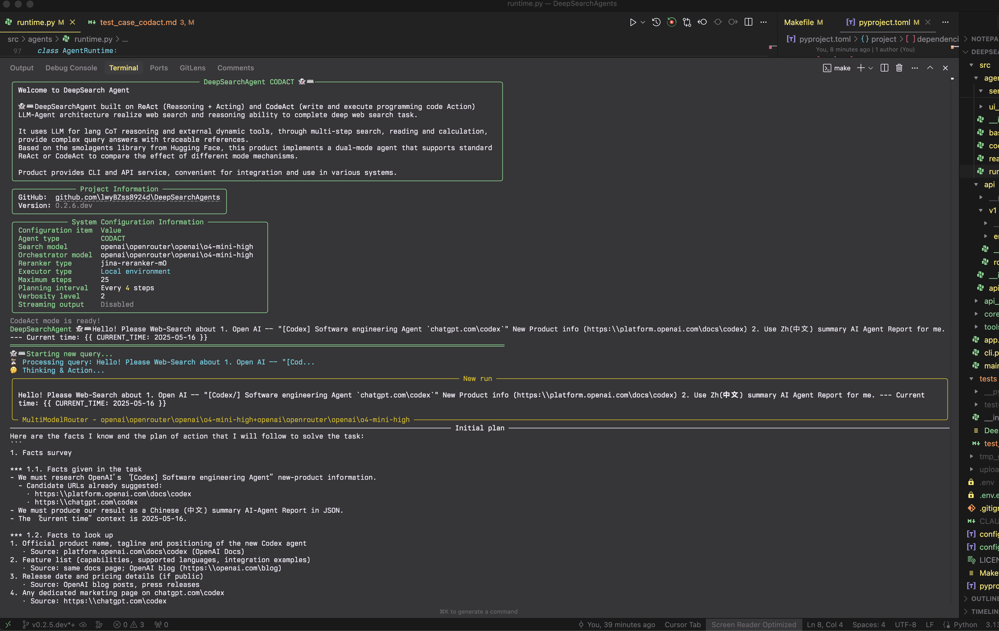
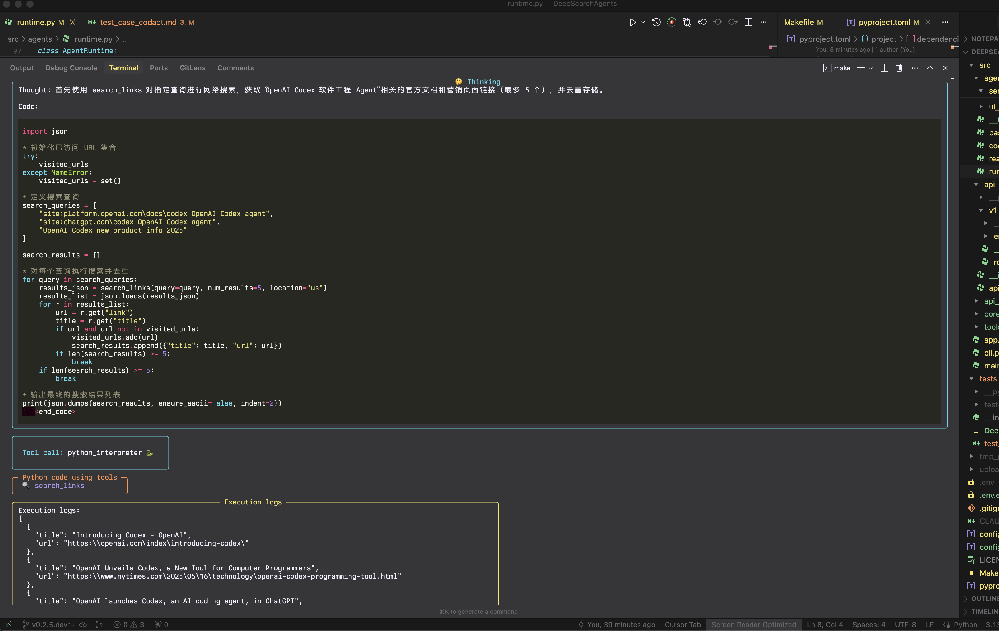
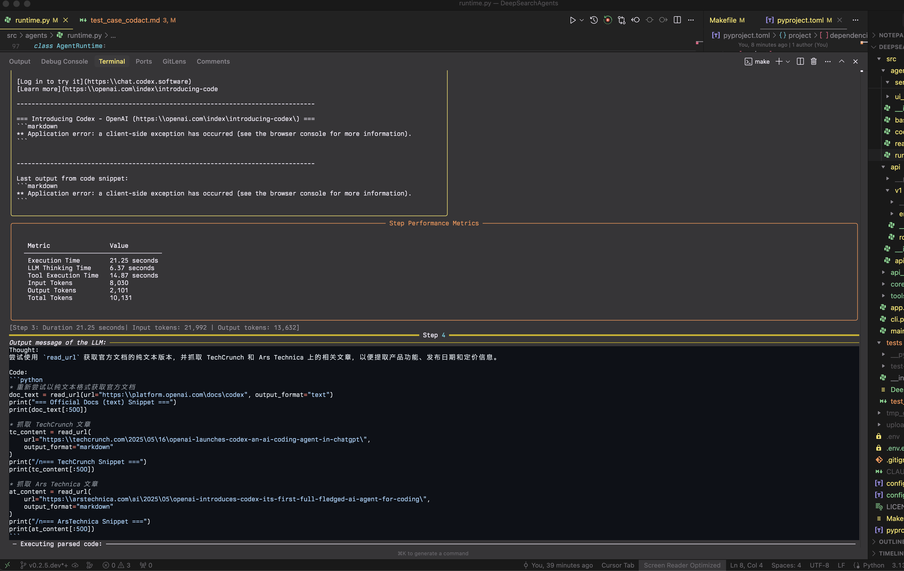
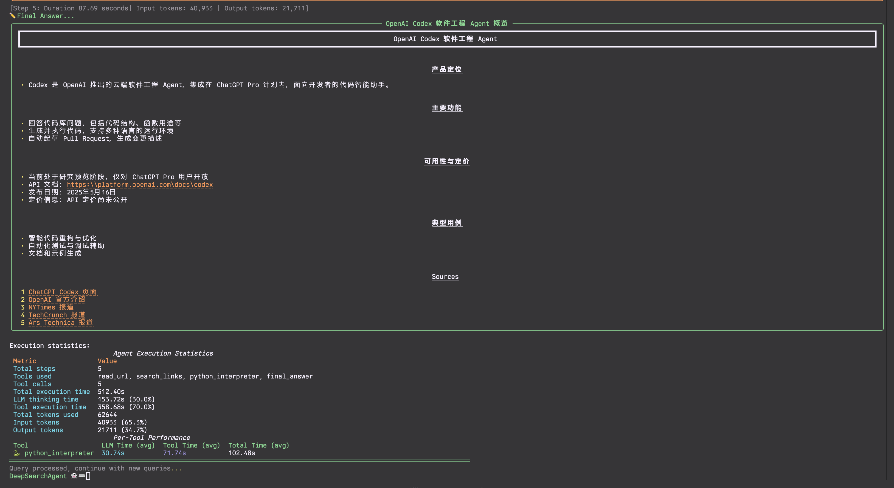
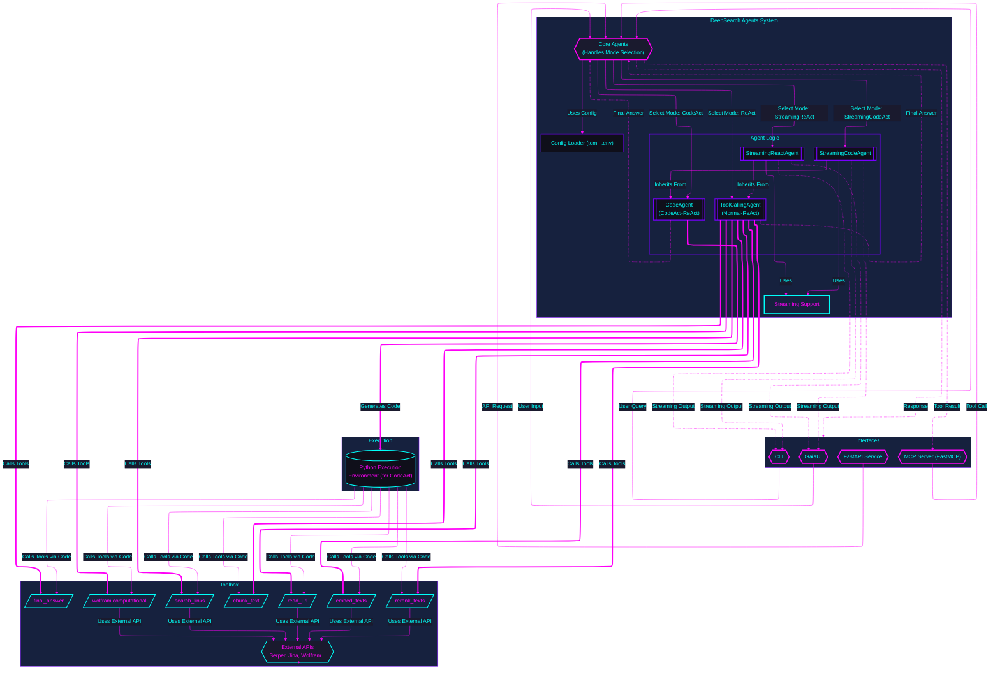

# DeepSearchAgent

Build with 💖 for Humanity with AI

<h2>

 

 

 🚅

 


[](https://github.com/astral-sh/uv)
[](https://opensource.org/licenses/MIT)
[](https://github.com/DeepSearch-AgentTeam/DeepSearchAgent/releases/tag/v0.2.8)

[](https://deepwiki.com/lwyBZss8924d/DeepSearchAgents)

</h2>

> **Come From Open Source, This is the Way**

[中文版](README_Zh.md)

## 1. Introduction

The DeepSearchAgent project is an intelligent agent system based on the ReAct (Reasoning + Acting) reasoning and action framework and the CodeAct (executable code-based intelligence) concept. It aims to achieve deep network search and reasoning. It leverages the reasoning capabilities of large language models (LLMs) as well as the ability to invoke external toolkits, enabling multi-step search, multimodal web text processing, reading, and multi-step reasoning to handle complex network search tasks that are both broad and deep, while providing traceable reference materials. The project is built on Hugging Face's smolagents framework and implements a dual-mode intelligent agent that can both invoke predefined tools and execute code.

The project supports command-line interface (CLI), standard FastAPI services, and GradioUI web GUI services, making it convenient for developers to develop experiments and integrate or use in various systems. It is an open-source project of Code Agent that is friendly to beginners. It is a great project for learning and developing Code Agent.

## 2. ✨ Features

- 👻 **Deep Search Task Capability**: Handles complex questions through multi-step searching, reading, and reasoning processes involving online content.
- **DeepSearch Specialist**: Supports both CodeAct (Python code execution) mode and ReAct (tool invocation) mode for experimental comparison; configuration of related Agent runtime, language models, and various tools can be managed via `config.toml` (`src/core/config/settings.py`).
- 🪄 **Extensible Toolbox**: Built-in set of tools for web searching, content retrieval, text processing, semantic ranking, and computation.
- 🔍 **Text Embedding and Re-ranking**: Uses Jina AI embedding and re-ranking models to process multimodal web content from URLs.
- 🧠 **Periodic Planning and Updates**: Implements strategic reevaluation during execution to optimize search paths.
- 🔄 **Iterative Optimization**: Continuously improves search and analysis strategies based on initial findings.
- 💻 **Multiple Development and Debugging Interaction Modes**: Offers CLI command-line interaction, standard FastAPI service, and Gradio UI web interface.
- 🔗 **Traceable References**: Provides sources and references for generated answers.
- 📺 **Streaming Output**: Supports real-time streaming of agent steps and final answers, with rich text formatting.
- 🧮 **Computational Engine**: Integrates WolframAlpha for mathematical and computational queries.
- 📝 **JSON/Markdown Rendering**: Automatically detects and presents structured outputs in user-friendly formats.

**Reference Case**

- **CodeAct Mode Example**: Full CLI run showing multi-step deep search process.
  - Start:
    
  
  
  
  

  - FinalAnswer:
    

**The ongoing intensive development plan:**

1. CLI integration supports Docker containerization for rapid deployment;
2. [DONE] Encapsulate various FastAPI Agents as MCP (Model Context Protocol) Servers, providing MCP tools services;
3. [DONE] DeepSearchAgents' Toolbox adds MCP Client/MCP tools HUB, supporting MCP Tools configuration and invocation;
4. [DONE] Multiple search engine support (added XCom alongside Serper) with configurable provider selection;
5. Deep search strategies offer more strategy parameters, supporting Tokens budget parameters;
6. Experimentally add DeepSearchAgents' Agent Runs evaluator (independent evaluation of DeepSearchAgents' deep search paths & result evaluation Agent);
7. Adapt to code_sandbox Docker automated configuration, adding more remote code_sandbox secure environment SDK support;
8. Integrate full-process agent runs telemetry adaptation (Langfuse);
9. Human-in-the-loop tentative & multi-path branch backtracking for agent runs;
10. Agent runs in concurrent arena mode;

## 3. 🚀 Quick Start (CLI & FastAPI)

This section guides you through setting up the environment, installing dependencies, and running DeepSearchAgent via its command-line interface or standard FastAPI service.

### Installation & Setup

1.  **Prerequisites:**
    *   Python 3.13+.
    *   `uv` (Recommended, faster alternative to pip/venv): [Install uv](https://github.com/astral-sh/uv).
    *   Git.

2.  **Clone the Repository:**

    ```bash
    git clone https://github.com/DeepSearch-AgentTeam/DeepSearchAgent.git
    cd DeepSearchAgent
    ```

3.  **Create Virtual Environment (Recommended):**

    ```bash
    # Using uv
    uv venv
    source .venv/bin/activate  # Unix/macOS
    # .venv\Scripts\activate   # Windows

    # Or using standard venv
    # python -m venv .venv
    # source .venv/bin/activate  # Unix/macOS
    # .venv\Scripts\activate   # Windows
    ```

4.  **Install Dependencies:**

    *   **For running the FastAPI service:**

        ```bash
        uv pip install .
        ```

    *   **For running the CLI or for Development:**

        ```bash
        # Installs core + CLI dependencies + development tools in editable mode
        uv pip install -e ".[cli]"
        ```
  
    *   **For Development:**

        ```bash
        uv pip install -e ".[dev,test,cli]"
        ```

5.  **Configure:**

    ```bash
    # Create configuration files from templates
    cp config.template.toml config.toml
    cp .env.template .env

    # Edit config.toml for models, agent parameters, service settings
    # nano config.toml

    # Edit .env for API keys (LITELLM_MASTER_KEY, SERPER_API_KEY, etc.)
    # nano .env
    ```

**Configuration Details:**
*   `config.toml`: Contains non-sensitive configurations like model IDs, agent parameters (max steps, executor type), service settings (host, port).

*   `.env`: Contains **only** sensitive API keys (e.g., `LITELLM_MASTER_KEY`, `SERPER_API_KEY`, `JINA_API_KEY`, `WOLFRAM_ALPHA_APP_ID`).

### (1) Running the CLI console

Ensure you have installed the CLI dependencies (see Step 4 in Installation & Setup).

```bash
# Run the CLI (interactive mode, uses settings from config.toml)
make cli
# or directly:
uv run python -m src.agents.cli
```

CLI arguments will override settings defined in `config.toml`.

### (2) Running the FastAPI Service

Ensure you have installed the core dependencies (see Step 4 in Installation & Setup).

```bash
# Start the main API server (uses host/port from config.toml, e.g., http://0.0.0.0:8000)
make run
# or directly:
uv run -- uvicorn src.agents.main:app --reload
# Note: --host and --port are now taken from config.toml via main.py
# Use LOG_LEVEL environment variable for log level (e.g., LOG_LEVEL=debug make run)
```

**API Endpoints:**

*   `POST /run_react_agent`: Runs the React agent.
*   `POST /run_deepsearch_agent`: Runs the agent configured by `service.deepsearch_agent_mode` in `config.toml` (or `DEEPSEARCH_AGENT_MODE` env var).
*   `GET /`: API info and health check.

Example API request to the configured deep search REST API endpoint:

```bash
curl -X POST http://localhost:8000/run_deepsearch_agent \
  -H "Content-Type: application/json" \
  -d '{"user_input": "Search the latest news about OpenAI'''s new GPT-4.1 API."}'
```

*(Replace `localhost:8000` with the actual host and port if changed in `config.toml`)*

### (3) Running the GradioUI Web GUI Web Service

```bash
make app
# or directly:
python src/app.py
```

### (4) Running the MCP Server (MCP Tools `deepsearch_tool`)

DeepSearchAgent now supports serving as a Model Context Protocol (MCP) server, exposing deep search capabilities as an MCP tool `deepsearch_tool` that can be accessed by any MCP client.

```bash
# Run the FastMCP server with default settings
python -m src.agents.servers.run_fastmcp
# or
python -m src.agents.servers.run_fastmcp --agent-type codact --port 8100
```

This starts a FastMCP server with Streamable HTTP transport at `http://localhost:8100/mcp` (default), providing access to DeepSearchAgent's functionality through the `deepsearch_tool` endpoint.

**Server Arguments:**

* `--agent-type`: Agent type to use (`codact` or `react`, default: `codact`)
* `--port`: Port number for server (default: `8100`)
* `--host`: Host address (default: `0.0.0.0`)
* `--debug`: Enable debug logging
* `--path`: Custom URL path (default: `/mcp`)

**Debugging with MCP Inspector:**

The MCP Inspector can be used to debug and interact with the DeepSearchAgent MCP server:

1. Install MCP Inspector if you haven't already:

```bash
npm install -g @modelcontextprotocol/inspector
```

2. Start the MCP Inspector dev MCP Client debugging console:

```bash
npx @modelcontextprotocol/inspector
```

3. In the browser UI that opens (typically at `http://127.0.0.1:6274`):
   * Set Transport Type: `Streamable HTTP`
   * Set URL: `http://localhost:8100/mcp`
   * Click "Connect"
   * Navigate to "Tools" tab and select "deepsearch_tool"
   * Enter your search query and click "Run Tool" button

4. You'll see real-time progress updates and the final search results rendered in the MCP Inspector Web UI.

**FastMCP Server in FastAPI Application:**

You can also embed the FastMCP server in the main FastAPI application:

```bash
# Run main API server with FastMCP integration
python -m src.main --enable-fastmcp --agent-type codact
```

When run with `--enable-fastmcp`, the main API server mounts the FastMCP server at `/mcp-server` (default) for integrated operation.

## 4. 🛠️ Architecture and Modules

The core system architecture includes:

1. **Core Specialist Agents Modules (`src/agents/react_agent.py`, `src/agents/codact_agent.py`)**: Implement ReAct and CodeAct logic based on `smolagents`. `src/agents/runtime.py` serves as the runtime manager, responsible for managing the agent's runtime environment.
2. **Specialist Core Agent Runtime Module (`src/agents/runtime.py`)**: Responsible for managing the agent's runtime environment.
3. **Agent Toolkit Collection (`src/tools/`)**: Functions that the agent can invoke (such as web search, reading URLs, etc.).
4. **FastAPI Service (`src/api`)**: FastAPI service providing REST API related services.
5. **CLI Interface (`src/cli.py`)**: Provides an interactive command-line interface with rich formatting.
6. **GaiaUI Web Interface (`src/app.py`)**: Gradio-based web GUI for interacting with agents.
7. **MCP Server (`src/agents/servers/run_fastmcp.py`)**: FastMCP server providing MCP tools services with Streamable HTTP transport.

*Architecture diagram updated for version `v0.2.8`*



## 5. ⚙️ Agent Modes (ReAct vs CodeAct)

DeepSearchAgent supports two modes of agent operation: the CodeAct code-execution mode and the ReAct tool-calling mode. The default mode used by the `/run_deepsearch_agent` endpoint is configured in `config.toml` (`service.deepsearch_agent_mode`) or via the `DEEPSEARCH_AGENT_MODE` environment variable.

Both modes now support streaming output, providing real-time visibility into the agent's reasoning and execution process.

### CodeAct Mode (Code Execution)

In CodeAct mode, the agent produces executable Python code, and by running that code the agent completes its reasoning and actions. This allows for more complex operations, combining multiple steps into one code execution.

**Example format:**

```python
results = search_links("example query")
content = read_url(results[0]["link"])
final_answer("The result is...")
```

### ReAct Mode (Tool Calling)

In ReAct mode, the agent operates in the classic reasoning+acting manner, with actions executed by invoking predefined tools. During its reasoning process, the LLM generates structured "action" outputs that specify which tool to use and with what parameters.

**Example format:**

```json
{
  "name": "search_links",
  "arguments": {
    "query": "example query"
  }
}
```

### Comparison and Use Cases

| Differences | ReAct Mode | CodeAct Mode |
|-------------|------------|--------------|
| **Action Representation** | Structured JSON instructions | Executable Python code |
| **Complex Operation Capability** | Multiple steps for complex logic | Can combine multiple steps with programming constructs |
| **Model Requirements** | General conversational ability | Requires code generation capability |
| **Debugging & Interpretability** | Human-readable thoughts and actions | Code traces with error feedback |
| **Best For** | Simple queries, fixed workflows | Complex tasks, flexible tool orchestration |
| **Streaming Support** | Full streaming (all steps) | Final answer streaming |
| **Planning Capability** | Periodic planning every N steps | Periodic planning every N steps |

## 6. 🔧 Toolchain Mechanism

DeepSearchAgent comes with an extensible toolchain that helps the agent retrieve and process information. These tools work in concert to form a complete query-answering pipeline:

- **`search_links`**: Accepts a query string and uses an external search engine API to retrieve web results with titles, snippets, and URLs.
- **`read_url`**: Fetches HTML content from a webpage and extracts formatted text for analysis.
- **`chunk_text`**: Splits long text into manageable segments for detailed analysis.
- **`embed_texts`**: Encodes text chunks into vector representations for semantic similarity operations.
- **`rerank_texts`**: Ranks text chunks by relevance to a given query for finding the most relevant information.
- **`wolfram`**: Calls the WolframAlpha API for mathematical or computational queries.
- **`final_answer`**: Signals that the agent has reached a conclusion and terminates the reasoning loop.

In a typical sequence, the agent first uses `search_links` to find information sources, then `read_url` to obtain content. For complex content, it can use `chunk_text`, `embed_texts`, and `rerank_texts` to identify key passages. When calculations are needed, it calls `wolfram`. This cycle continues until the agent determines it has sufficient information to call `final_answer`.

## 7. 📺 Streaming and Rendering Features

In version >= `v0.2.6.dev`, DeepSearchAgent now includes comprehensive streaming and rendering capabilities (CLI & GUI):

### Streaming Output

- **Real-time Responses**: See the agent's thinking process and results as they occur
- **Token-by-token Generation**: Watch as the answer is built piece by piece
- **Progress Visualization**: Track search progress, visited URLs, and query execution
- **Planning Steps Display**: View periodic planning steps as the agent reassesses its strategy

### Rich Rendering

- **JSON Structure Detection**: Automatically identifies and parses JSON outputs
- **Markdown Formatting**: Renders Markdown content with proper formatting
- **Structured Reports**: Creates well-organized panels for easy information consumption
- **Source Attribution**: Clearly displays reference sources used in the final answer
- **Statistics Display**: Shows token counts, generation speed, and search metrics

### CLI Experience Enhancements

- **Interactive Controls**: Use slash commands like `/exit`, `/quit`, and `/multiline`
- **Error Handling**: Robust error recovery keeps the session running even if issues occur
- **Task Display Management**: Prevents duplicate task displays in streaming mode
- **Format Auto-detection**: Recognizes and renders final outputs in the most appropriate format

## 8. 💡 Theoretical Foundations

### ReAct Paradigm Principles

ReAct (Reasoning + Acting) is a paradigm that enables a language model to produce both a chain-of-thought reasoning trace and action directives interleaved. This framework interweaves "reasoning" with "acting": the model thinks in natural language (recording its thought process) and also produces concrete actions (such as searching or reading) to interact with external tools or the environment.

Studies have shown that this tight integration of reasoning and acting outperforms reasoning-only or acting-only methods, effectively reducing hallucinations and error propagation while improving interpretability and controllability of the problem-solving process.

### CodeAct Executable Code Agents

CodeAct refers to approaches that have the agent generate and execute actions in the form of code. The core idea is that at each decision step, the model directly produces executable code, and by running this code the agent invokes tools or performs computations.

Compared to static instructions, code as an action representation offers greater expressiveness and flexibility: it can combine multiple tool calls, use programming logic to handle complex data structures, and even reuse previously defined functions, vastly expanding the agent's action space.

### Periodic Planning and Adaptive Search

Both agent modes implement periodic planning intervals, allowing agents to reassess their strategy every N steps. This enables more effective search paths by:

- Evaluating progress against the original task
- Identifying gaps in information collection
- Adjusting search directions based on what's been discovered
- Prioritizing new search avenues when current ones become less productive

## 9. 📦 Installation

### Requirements

- Python 3.13+
- Create `config.toml` from `config.template.toml` and customize parameters.
- Create `.env` from `.env.template` and add required API keys:
  - `LITELLM_MASTER_KEY` (if using LiteLLM compatible models)
  - `SERPER_API_KEY` (for web search via `search_links`)
  - `JINA_API_KEY` (for content processing via `read_url`, `embed_texts`, `rerank_texts`)
  - `WOLFRAM_ALPHA_APP_ID` (optional, for computational queries via `wolfram`)
  - `LITELLM_BASE_URL` (optional, if using a custom LiteLLM endpoint)

## 10. 🤝 Contributing

Contributions are welcome! Please feel free to submit a Pull Request.

## 11. 📄 License

This project is licensed under the MIT License

## 12. 📝 Acknowledgements Open Source Projects

Special thanks to the following open-source projects (as well as other equally important projects not listed), "May the Force be with you":

- [Hugging Face](https://huggingface.co/) 🤗
- [smolagents](https://github.com/huggingface/smolagents)
- [Litellm](https://github.com/BerriAI/litellm) 🚅
- [FastAPI](https://github.com/tiangolo/fastapi)
- [Jina AI](https://github.com/jina-ai)
- [Langchain](https://github.com/langchain-ai/langchain)

## 13. Theoretical Foundations & References

> - [ReAct: Synergizing Reasoning and Acting in Language Models](https://react-lm.github.io/) `arXiv:2210.03629v3`
> - [Executable Code Actions Elicit Better LLM Agents](https://arxiv.org/html/2402.01030v4) `arXiv:2402.01030v4`
> - [DynaSaur: Large Language Agents Beyond Predefined Actions](https://arxiv.org/html/2411.01747v1) `arXiv:2411.01747v1`
> - [LLMCompiler: An LLM Compiler for Parallel Function Calling](https://arxiv.org/abs/2312.04511v3) `arXiv:2312.04511v3`
> - [ReWOO: Decoupling Reasoning from Observations for Efficient Augmented Language Models](https://arxiv.org/abs/2305.18323) `arXiv:2305.18323v1`
> - [smolagents.agents.CodeAgent](https://github.com/huggingface/smolagents/blob/7983378593da4b393a95335aad8431f6c9d2ac23/src/smolagents/agents.py)
> - [Hugging Face smolagents library](https://huggingface.co/docs/smolagents/index)
> - [Jina AI DeepResearch repository](https://github.com/jina-ai/node-DeepResearch)
> - [A Practical Guide to Implementing DeepSearch/DeepResearch](https://jina.ai/news/a-practical-guide-to-implementing-deepsearch-deepresearch/)
> - [DeepSearch on Private Visual Documents: An Enterprise Case Study](https://jina.ai/news/deepsearch-on-private-visual-documents-an-enterprise-case-study/)
> - [Snippet Selection and URL Ranking in DeepSearch/DeepResearch](https://jina.ai/news/snippet-selection-and-url-ranking-in-deepsearch-deepresearch/)
> - [LLM-as-SERP: Search Engine Result Pages from Large Language Models](https://jina.ai/news/llm-as-serp-search-engine-result-pages-from-large-language-models/)
> - [A Practical Guide to Implementing DeepSearch/DeepResearch](https://jina.ai/news/a-practical-guide-to-implementing-deepsearch-deepresearch/)

## 14. 👨‍💻 AI Coder Pair Programming Assistance Reference

The DeepSearchAgent project is designed with modern AI engineers and human engineers collaborating in software development and coding workflows in mind. We have integrated special repository workspace rule files (`.cursor/rules/*.mdc`) to facilitate AI-assisted development and ensure consistency within the codebase.

### Equivalent to `.cursor/rules/` (`.mdc`)

- `CLAUDE.md`: `Claude Code` Prompting markdown file.
- `AGENTS.md`: `Codex CLI` & `Codex` Software engineering Agent, Prompting markdown file.

### Use `.cursor/rules/` Files

This repository contains special Markdown files in the `.cursor/rules/` directory, serving as contextual guideline prompts for human developers and AI coding assistants. These files are similar to the `CLAUDE.md` concept described in [Claude Code Best Practices](dev-docs/claude-code-best-practices.md), providing structured information about project architecture, components, and conventions.

#### Available Rules Files

- **agent-architecture.mdc**: Documents the agent design patterns (ReAct and CodeAct) and their functionalities

- **configuration.mdc**: Provides detailed explanations of the customized configuration system options
- **interfaces.mdc**: Describes the available interfaces (CLI, FastAPI, MCP Tool Server)
- **jina-ai-api-rules.mdc**: Contains guidelines for using various Jina AI APIs within the codebase
- **periodic-planning.mdc**: Explains the cyclical planning features used for strategic reassessment
- **project-overview.mdc**: Offers a comprehensive overview and structure of the project
- **tools.mdc**: Records the functionalities of dedicated tools used for web search, content processing, and analysis

### Benefits for Developers

These rules files facilitate collaboration between human developers and AI engineers by:

1. **Quick Onboarding**: Helping AI engineers rapidly understand the project architecture and design decisions
2. **Consistent Development**: Ensuring code adheres to established patterns and conventions
3. **AI-Assisted Development**: Providing context to AI engineers for generating more accurate and relevant code
4. **Code as Documentation**: Keeping documentation closely integrated with the code for easy access

### Best Practices for AI Engineer Collaboration

When using AI to assist in developing this project, we recommend the following workflow:

1. **Understand the Rules**: Review the `.cursor/rules/*.mdc` files related to the component you are developing.
2. **Reference Specific Rules**: When collaborating with AI engineers, explicitly cite the relevant rule files.
3. **Iterative Improvement**: Use AI for initial code generation, then refine the solution according to project conventions.
4. **Planning for Complex Changes**: For complex features, have AI outline the plan before generating implementation code.
5. **Test-Driven Approach**: For key components, work with AI engineers to write tests before implementing the code.
6. **Update Rules**: When making significant changes, update the relevant rule files.

### Example Workflow

#### Exploring the Codebase

When pairing with AI engineers to explore the codebase, you can start like this:

```bash
Please help me understand the DeepSearchAgent architecture. Refer to .cursor/rules/project-overview.mdc and .cursor/rules/agent-architecture.mdc for details.
```

#### Add New Feature

When adding a new tool to the tool collection:

```bash
I need to add a new tool for YouTube video analysis. Please implement it following the pattern in .cursor/rules/tools.mdc and the code style in .cursor/rules/python-code-style-pep8.mdc.
```

#### Update Configuration

When modifying the configuration system:

```bash
I need to add new configuration options for depth search Tokens budget & index depth. Please advise on how to extend the configuration structure according to .cursor/rules/configuration.mdc.
```

### Contributing to Rules

As the project evolves, we encourage contributors to update and expand these rules files. If you're adding a new major component or changing existing architecture, please update the relevant `.mdc` files to reflect these changes. This helps maintain the documentation as a living resource that accurately represents the current state of the codebase.

## Project Structure

```tree
src/
├── main.py                # Main application entry point
├── cli.py                 # Command-line interface
├── app.py                 # Gradio UI web application
├── agents/               # Agent implementations
│   ├── __init__.py        # Package initialization
│   ├── base_agent.py      # Base agent interface
│   ├── codact_agent.py    # CodeAct agent implementation
│   ├── react_agent.py     # ReAct agent implementation
│   ├── runtime.py         # Agent runtime manager
│   ├── prompt_templates/  # Modular prompt template system
│   │   ├── __init__.py
│   │   ├── codact_prompts.py
│   │   └── react_prompts.py
│   ├── servers/           # Server implementations 
│   │   ├── __init__.py
│   │   ├── run_fastmcp.py # FastMCP MCP server implementation
│   │   ├── run_gaia.py    # Gradio UI web server
│   │   └── gradio_patch.py # Gradio patch functions
│   └── ui_common/         # Shared UI components
├── api/                   # FastAPI service components
│   └── v1/                # API version 1 endpoints
├── core/                  # Core system components
│   ├── chunk/             # Text chunking components
│   ├── config/            # Configuration handling
│   ├── ranking/           # Content ranking
│   ├── scraping/          # Web content scraping
│   └── search_engines/    # Search engine integrations
└── tools/                 # Tool implementations
    ├── __init__.py
    ├── chunk.py           # Text chunking tool
    ├── embed.py           # Text embedding tool
    ├── final_answer.py    # Final answer generation tool
    ├── readurl.py         # URL content reading tool
    ├── rerank.py          # Content reranking tool
    ├── search.py          # Web search tool
    ├── toolbox.py         # Tool management utilities
    └── wolfram.py         # Wolfram Alpha computational tool
```
