# DeepSearchAgents

VIBE 🖖 Build with 💖 for Humanity with AI

<h2>

 

 

 🚅

 


[](https://github.com/astral-sh/uv)
[](https://opensource.org/licenses/MIT)
[](https://github.com/DeepSearch-AgentTeam/DeepSearchAgent/releases/tag/v0.3.3.dev)

[](https://deepwiki.com/lwyBZss8924d/DeepSearchAgents)

</h2>

> **Come From Open Source, This is the Way**

[中文版](README_Zh.md)

README Update Date: `2025-07-29`

[`v0.3.3.dev`] Dev Status: `"New version of Web frontend integration in progress"`

## 1. Introduction

The DeepSearchAgent project is an intelligent agent system based on the ReAct (Reasoning + Acting) reasoning and action framework and the CodeAct ("Code as Action") AI agent concept. It aims to realize broader task reasoning and execution through "DeepResearch" `DR-Multi-Agent`, leveraging DeepSearch’s multi-step network deep search foundational capabilities. It utilizes the reasoning power of AI language models (LLMs), along with a toolbox collection and programming action invocation abilities within a Python packages sandbox, enabling it to handle complex web search tasks that are both broad and deep via multi-step deep search, multimodal webpage text processing, reading, and multi-step reasoning. The system also provides traceable reference materials. Built upon Hugging Face’s smolagents framework, this project implements a dual-mode intelligent agent system capable of invoking predefined toolboxes as well as writing action code—realizing both "generation of dedicated dynamic DSLs based on task plans" and "AI self-created dynamic one-time dedicated tools.

The project supports a CLI TUI interface for terminal command-line operation, a standard FastAPI service, the FastMCP MCP server, and an accompanying Web GUI frontend service that showcases CodeAct Agent's long-running multi-step task execution. (v0.3.2.rc2 has provided a supporting web API, and the web frontend is currently being integrated and debugged) suitable for displaying the CodeAct Agent Run process. It facilitates developers in experimentation, integration, and usage across various systems. This is an open-source project aimed at providing VIBER beginners with a friendly Code Agent experience, learning opportunities, and extensibility.

## 2. ✨ Features

- 👻 **Deep Search Task Capability**: Handles complex questions through multi-step searching, reading, and reasoning processes involving online content.
- **DeepSearch Specialist**: Supports both CodeAct (Python code execution) mode and ReAct (tool invocation) mode for experimental comparison; configuration of related Agent runtime, language models, and various tools can be managed via `config.toml` (`src/core/config/settings.py`).
- 🪄 **Extensible Toolbox**: Built-in set of tools for web searching, content retrieval, text processing, semantic ranking, computation, and GitHub repository analysis.
- 🌐 **Hybrid Search Engine** (v0.3.1): Multi-provider search aggregation supporting Google (Serper), X.com, Jina AI, and Exa Neural search with intelligent deduplication and ranking.
- 🌐 **Web API v2 with Real-time WebSocket Streaming** (v0.3.2): Simplified Gradio message pass-through architecture for web frontend integration with real-time agent execution visibility.
- 🔍 **Text Embedding and Re-ranking**: Uses Jina AI embedding and re-ranking models to process multimodal web content from URLs.
- 📚 **GitHub Repository Q&A** (v0.3.1): AI-powered repository analysis tool using DeepWiki MCP for understanding GitHub projects.
- 🐦 **X.com Deep Query** (v0.3.1): Specialized tools for searching, reading, and analyzing X.com (Twitter) content using xAI's Live Search API.
- 🧠 **Periodic Planning and Updates**: Implements strategic reevaluation during execution to optimize search paths.
- 🔄 **Iterative Optimization**: The AI specialist continuously improves search and analysis strategies based on initial findings through self-optimization, and continuously optimizes task execution paths by updating the task plan to achieve task objectives.
- 💻 **Multiple development debugging and user interaction modes**: Provides CLI command-line interaction, standard FastAPI service, and Web GUI frontend service
- 🔗 **Traceable References**: Provides sources and references for generated answers.
- 📺 **Streaming Output**: Supports real-time streaming of agent steps and final answers, with rich text formatting.
- 🧮 **Symbolic Computation**: Integrated WolframAlpha symbolic computation engine, supporting mathematical and computational problems
- 📝 **JSON/Markdown Rendering**: Automatically detects and presents structured outputs in user-friendly formats.
- 🤝 **Hierarchical Multi-Agent Support** (v0.2.9): Manager agent mode orchestrates teams of specialized agents for collaborative problem-solving.
- ⚡ **Parallel Tool Execution** (v0.2.9): Multiple concurrent tool calls for improved performance and efficiency.
- 📊 **Enhanced Execution Metrics** (v0.2.9): RunResult objects provide detailed execution metadata including token usage and timing.
- 🔒 **Improved Security** (v0.2.9): Latest security patches from smolagents v1.17.0-v1.19.0 applied.
- 🧠 **Structured Generation** (v0.2.9): Optional structured outputs for CodeAgent improving reliability.
- 🔄 **Context Manager Support** (v0.2.9): Proper resource cleanup lifecycle for better memory management.
- 💾 **Enhanced Memory Management** (v0.2.9): Agent memory reset and summary capabilities for long-running sessions.

**Reference Use Cases** (To be updated v0.3.1+)

- **CodeAct Mode Example**: Full CLI run showing multi-step deep search process.
  - Start:
    
  
  
  
  

  - FinalAnswer:
    

**Development Plan Currently Under Intensive Iteration:**

1. [DONE] Developed Web API v2 with real-time WebSocket streaming (v0.3.2) - Simplified Gradio message pass-through architecture replacing complex event-driven system (~5000 lines reduced to ~500 lines). Frontend development and Docker packaging pending;

2. [DONE] Added MCP Client/MCP tools HUB to DeepSearchAgents' DeepSearchToolbox, supporting MCP Tools configuration and invocation;

3. [DONE] Provided packaging of DeepSearchAgents as an MCP server, offering DeepSearchAgent MCP tools services;

4. [DONE] Supported multi-vertical search engine source aggregation (Google, X.com, Jina AI, Exa Neural) with hybrid search aggregation and intelligent result deduplication (v0.3.1);

5. [DONE] Upgraded to smolagents v1.19.0 with hierarchical agent management, parallel tool execution, and enhanced streaming architecture;

6. [DONE] Add a `DeepWiki` Remote MCP tool to enhance the `GitHub URLs` vertical crawler/parser with GitHub Repository Q&A capabilities (v0.3.1);

7. [Partially supported in the tool layer] The deep search strategy provides more strategy parameters and adds support for strategy parameters based on Tokens budget;

8. [Experimental version testing] Implement auxiliary methods and tools for Agent Action search width & depth based on Monte Carlo Tree Search strategies in DeepSearchAgents, along with strategy control parameters;

9. [TODO] LLM as Judge: Experimentally add an Agent Runs evaluator for DeepSearchAgents (independently evaluate the deep search paths & results of DeepSearchAgents);

10. [TODO] Add persistent memory layer functionality for Agents & provide users with persistent search records;

11. Add suitable open-source sandbox (E2B-like) adapted code_sandbox Docker automation configuration, and increase support for more remote code_sandbox secure environment SDKs;

12. Integrate full-process Agent Runs telemetry adaptation ("OpenTelemetry" & Langfuse) (integrated together with the Docker packaged version);

13. [TODO] Human-in-the-loop & multi-path branching backtracking functionality for Agent Runs;

14. [Experimental] Special implementation version of multi_agent_HiRA (Hierarchical Reasoning Framework for Deep Search) based on special tokens protocol (`arXiv-2507.02652v1`);

15. [Experimental] Add auxiliary method optimization to the agent omni-tools-query pipeline based on [`submodular-optimization`] ("submodular optimization algorithm") to improve reQuery query effectiveness when using various external query tools; this auxiliary pipeline uses "submodular optimization algorithms" to optimize query selection, generate diversified tool search query inputs, perform effect evaluation, and return ReAct Agent action callbacks to help the Agent observe query result optimization effects in order to continuously iterate towards retrieval goals in subsequent Steps Actions. (https://jina.ai/news/submodular-optimization-for-diverse-query-generation-in-deepresearch/)

## 3. 🚀 Quick Start (CLI & FastAPI)

This section guides you through setting up the environment, installing dependencies, and running DeepSearchAgent via its command-line interface or standard FastAPI service.

### Installation & Setup

1.  **Prerequisites:**
    *   Python 3.13+.
    *   `uv` (Recommended, faster alternative to pip/venv): [Install uv](https://github.com/astral-sh/uv).
    *   Git.

2.  **Clone the Repository:**

    ```bash
    git clone https://github.com/DeepSearch-AgentTeam/DeepSearchAgent.git
    cd DeepSearchAgent
    ```

3.  **Create Virtual Environment (Recommended):**

    ```bash
    # Using uv
    uv venv
    source .venv/bin/activate  # Unix/macOS
    # .venv\Scripts\activate   # Windows

    # Or using standard venv
    # python -m venv .venv
    # source .venv/bin/activate  # Unix/macOS
    # .venv\Scripts\activate   # Windows
    ```

4.  **Install Dependencies:**

    *   **For running the FastAPI service:**

        ```bash
        uv pip install .
        ```

    *   **For running the CLI or for Development:**

        ```bash
        # Installs core + CLI dependencies + development tools in editable mode
        uv pip install -e ".[cli]"
        ```
  
    *   **For Development:**

        ```bash
        uv pip install -e ".[dev,test,cli]"
        ```

5.  **Configure:**

    ```bash
    # Create configuration files from templates
    cp config.template.toml config.toml
    cp .env.template .env

    # Edit config.toml for models, agent parameters, service settings
    # nano config.toml

    # Edit .env for API keys (LITELLM_MASTER_KEY, SERPER_API_KEY, etc.)
    # nano .env
    ```

**Configuration Details:**
*   `config.toml`: Contains non-sensitive configurations like model IDs, agent parameters (max steps, executor type), service settings (host, port).

*   `.env`: Contains **only** sensitive API keys (e.g., `LITELLM_MASTER_KEY`, `SERPER_API_KEY`, `JINA_API_KEY`, `WOLFRAM_ALPHA_APP_ID`).

### (1) Running the CLI console

Ensure you have installed the CLI dependencies (see Step 4 in Installation & Setup).

```bash
# Run the CLI (interactive mode, uses settings from config.toml)
make cli
# or directly:
uv run python -m src.agents.cli

# Run with specific agent mode
python -m src.cli --agent-type react    # ReAct DeepSearch agent mode (Baseline ToolCalling mode)
python -m src.cli --agent-type codact   # CodeAct DeepSearch agent mode
python -m src.cli --agent-type manager  # Manager multi-agent mode (v0.2.9)

# Manager multi-agent mode with research team
python -m src.cli --agent-type manager --team research
```

CLI arguments will override settings defined in `config.toml`.

### (2) Running the FastAPI Service

Ensure you have installed the core dependencies (see Step 4 in Installation & Setup).

```bash
# Start the main API server (uses host/port from config.toml, e.g., http://0.0.0.0:8000)
make run
# or directly:
uv run -- uvicorn src.agents.main:app --reload
# Note: --host and --port are now taken from config.toml via main.py
# Use LOG_LEVEL environment variable for log level (e.g., LOG_LEVEL=debug make run)
```

**API Endpoints:**

*   `POST /run_codact_agent`: Runs the CodeAct DeepSearch agent.
*   `POST /run_deepsearch_agent`: Runs the agent configured by `service.deepsearch_agent_mode` in `config.toml` (or `DEEPSEARCH_AGENT_MODE` env var).
*   `GET /`: API info and health check.

Example API request to the configured deep search REST API endpoint:

```bash
curl -X POST http://localhost:8000/run_deepsearch_agent \
  -H "Content-Type: application/json" \
  -d '{"user_input": "Search the latest news about OpenAI'''s new GPT-4.1 API."}'
```

*(Replace `localhost:8000` with the actual host and port if changed in `config.toml`)*

### (3) Using the Web API v2

The Web API v2 provides real-time WebSocket streaming for web frontend integration. This major refactoring (v0.3.2) delivers a clean, maintainable architecture that processes agent events directly through the `web_ui.py` module.

**Architecture Overview:**
```
Agent (React/CodeAct) → stream_agent_messages() → DSAgentMessageProcessor → WebSocket → Frontend
```

**Key Features:**
- **Direct Event Processing**: Handles 4 main event types from smolagents:
  - `PlanningStep`: Agent planning with strategy updates
  - `ActionStep`: Tool execution with thoughts and results
  - `FinalAnswerStep`: Structured final answers
  - `ChatMessageStreamDelta`: Real-time streaming updates
- **Metadata-Driven Routing**: Frontend components selected via message metadata
- **Real-time Streaming**: Watch agent reasoning, tool execution, and results as they happen
- **Session Management**: Multi-turn conversations with session isolation
- **Component Routing**: Messages routed to chat, webide, or terminal based on content

**Quick Start:**
```javascript
// Connect to WebSocket
const ws = new WebSocket('ws://localhost:8000/api/v2/ws/my-session?agent_type=codact');

// Handle incoming messages with component routing
ws.onmessage = (event) => {
  const message = JSON.parse(event.data);
  
  // Route based on metadata
  if (message.metadata?.component === 'chat') {
    // Display in chat (planning, thoughts, final answers)
  } else if (message.metadata?.component === 'webide') {
    // Show in code editor (Python execution)
  } else if (message.metadata?.component === 'terminal') {
    // Display in terminal (tool outputs, logs)
  }
};

// Send query
ws.send(JSON.stringify({type: 'query', query: 'Your question here'}));
```

**Message Format:**
- Each `DSAgentRunMessage` includes routing metadata
- Message types: planning_header, action_thought, tool_call, final_answer, etc.
- Streaming support with initial → delta → final pattern

See `src/api/v2/README.md` for comprehensive documentation, `src/api/v2/STREAM_EVENTS.md` for event flow details, and `src/api/v2/examples/` for example implementations.

### (4) Running the MCP Server (MCP Tools `deepsearch_tool`)

DeepSearchAgent now supports serving as a Model Context Protocol (MCP) server, exposing deep search capabilities as an MCP tool `deepsearch_tool` that can be accessed by any MCP client.

```bash
# Run the FastMCP server with default settings
python -m src.agents.servers.run_fastmcp
# or
python -m src.agents.servers.run_fastmcp --agent-type codact --port 8100
```

This starts a FastMCP server with Streamable HTTP transport at `http://localhost:8100/mcp` (default), providing access to DeepSearchAgent's functionality through the `deepsearch_tool` endpoint.

**Server Arguments:**

* `--agent-type`: Agent type to use (`codact` or `react`, default: `codact`)
* `--port`: Port number for server (default: `8100`)
* `--host`: Host address (default: `0.0.0.0`)
* `--debug`: Enable debug logging
* `--path`: Custom URL path (default: `/mcp`)

**Debugging with MCP Inspector:**

The MCP Inspector can be used to debug and interact with the DeepSearchAgent MCP server:

1. Install MCP Inspector if you haven't already:
It is also recommended to consider using the forked enhanced version of the MCP Inspector client development debug console: [MCPJam-Inspector](https://github.com/MCPJam/inspector)

```bash
npm install -g @modelcontextprotocol/inspector
```

2. Start the MCP Inspector dev MCP Client debugging console:

```bash
npx @modelcontextprotocol/inspector
```

3. In the browser UI that opens (typically at `http://127.0.0.1:6274`):
   * Set Transport Type: `Streamable HTTP`
   * Set URL: `http://localhost:8100/mcp`
   * Click "Connect"
   * Navigate to "Tools" tab and select "deepsearch_tool"
   * Enter your search query and click "Run Tool" button

4. You'll see real-time progress updates and the final search results rendered in the MCP Inspector Web UI.

**FastMCP Server in FastAPI Application:**

You can also embed the FastMCP server in the main FastAPI application:

```bash
# Run main API server with FastMCP integration
python -m src.main --enable-fastmcp --agent-type codact
```

When run with `--enable-fastmcp`, the main API server mounts the FastMCP server at `/mcp-server` (default) for integrated operation.

### (5) Frontend Development Quick Start

DeepSearchAgents includes a modern web frontend built with Next.js that provides a rich interface for interacting with agents through the Web API v2.

**Technology Stack:**
- **Framework**: Next.js 15.3.3 with App Router
- **UI Library**: React 19 with TypeScript
- **Styling**: TailwindCSS with custom design tokens
- **Components**: Radix UI primitives, Monaco Editor, XTerm.js
- **Real-time**: WebSocket with automatic reconnection
- **Rendering**: React Markdown with syntax highlighting

**Setup Frontend Development Environment:**

```bash
# Navigate to frontend directory
cd frontend

# Install dependencies
npm install
# or
yarn install

# Create environment variables
cp .env.example .env.local

# Edit .env.local to set backend URLs
# NEXT_PUBLIC_API_URL=http://localhost:8000
# NEXT_PUBLIC_WS_URL=ws://localhost:8000
```

**Development Commands:**

```bash
# Start development server (http://localhost:3000)
npm run dev

# Build for production
npm run build

# Run production server
npm run start

# Run linting
npm run lint
```

**Key Frontend Features:**
- **Component-Based Routing**: Messages automatically routed to appropriate UI components
- **Real-time Streaming**: See agent thoughts, actions, and results as they happen
- **Rich UI Components**:
  - `AgentChat`: Main chat interface with message grouping
  - `ActionThoughtCard`: Displays agent reasoning (truncated to 60 chars)
  - `PlanningCard`: Shows planning steps with badges
  - `FinalAnswerDisplay`: Structured final answer rendering
  - Code editor for Python execution
  - Terminal for tool outputs
- **Session Management**: Persistent sessions with conversation history
- **Responsive Design**: Optimized for desktop and mobile

**Frontend Integration Example:**

```typescript
// Using the WebSocket hook
import { useWebSocket } from '@/hooks/use-websocket';

function MyComponent() {
  const { messages, sendMessage, isConnected } = useWebSocket({
    sessionId: 'my-session',
    agentType: 'codact'
  });

  const handleQuery = () => {
    sendMessage({
      type: 'query',
      query: 'Search for latest AI developments'
    });
  };

  return (
    <div>
      {messages.map(msg => (
        <AgentChat key={msg.message_id} message={msg} />
      ))}
    </div>
  );
}
```

See `frontend/README-DeepSearchAgents.md` for comprehensive frontend documentation and development guidelines.

## 4. 🛠️ Architecture and Modules

The core system architecture includes:

1. **Core Specialist Agents Modules (`src/agents/react_agent.py`, `src/agents/codact_agent.py`, `src/agents/manager_agent.py`)**: Implement ReAct, CodeAct, and Manager agent logic based on `smolagents`. Manager agent (v0.2.9) orchestrates teams of specialized agents for collaborative problem-solving.
2. **Specialist Core Agent Runtime Module (`src/agents/runtime.py`)**: Responsible for managing the agent's runtime environment, including hierarchical agent orchestration.
3. **Agent Toolkit Collection (`src/tools/`)**: Functions that the agent can invoke (such as web search, reading URLs, etc.).
4. **FastAPI Service (`src/api`)**: FastAPI service providing REST API related services.
5. **CLI Interface (`src/cli.py`)**: Provides an interactive command-line interface with rich formatting.
6. **Web API v2 (`src/api/v2/`)**: Real-time WebSocket API with direct agent event processing via `web_ui.py` and `DSAgentMessageProcessor`, transforming smolagents events into metadata-rich messages for frontend component routing.
7. **MCP Server (`src/agents/servers/run_fastmcp.py`)**: FastMCP server providing MCP tools services with Streamable HTTP transport.

### Web API v2 Architecture (v0.3.2.rc2)

The Web API v2 features a streamlined architecture that processes AI agent long-running multi-step task events directly:

**Event Processing Pipeline:**
```
smolagents Events → web_ui.py → DSAgentMessageProcessor → WebSocket → Frontend Components
```

**Key Components:**
- **`web_ui.py`**: Core event processor handling 4 main event types from smolagents
- **`DSAgentMessageProcessor`**: Wraps processed events into DSAgentRunMessage format
- **Session Manager**: Handles multi-session support and agent lifecycle
- **WebSocket Endpoint**: Streams messages with extensive metadata for frontend routing

**Event Type Mapping:**
- **PlanningStep** → [InitialPlanning&UpdatePlanning] Multiple messages: planning_header, planning_content, planning_footer
- **ActionStep** → [ActionReasoning&CodeGeneration&SandboxExecution&Observation] Multiple messages: action_header, action_thought, tool_call, execution_logs
- **FinalAnswerStep** → [FinalAnswerStructuredOutput] final_answer with structured data
- **ChatMessageStreamDelta** → Streaming deltas for real-time updates

*Architecture diagram updated for version `v0.3.2.rc2`*

See [docs/architecture-diagram/architecture-diagram-v0.3.2.rc2.mmd](docs/architecture-diagram/architecture-diagram-v0.3.2.rc2.mmd) for the latest architecture diagram details.



## 5. ⚙️ Agent Modes (ToolCalling ReAct vs CodeAct)

DeepSearchAgent supports two modes of agent operation: the CodeAct code-execution mode and the ReAct tool-calling mode. The default mode used by the `/run_deepsearch_agent` endpoint is configured in `config.toml` (`service.deepsearch_agent_mode`) or via the `DEEPSEARCH_AGENT_MODE` environment variable.

Both modes now support streaming output, providing real-time visibility into the agent's reasoning and execution process.

### CodeAct Mode (Code Execution)

In CodeAct mode, the agent produces executable Python code, and by running that code the agent completes its reasoning and actions. This allows for more complex operations, combining multiple steps into one code execution.

**Example format:**

```python
results = search_links("example query")
content = read_url(results[0]["link"])
final_answer("The result is...")
```

### ReAct (Function Calling Tool) Baseline Mode

In ReAct mode, the agent operates in the classic reasoning+acting manner, with actions executed by invoking predefined tools. During its reasoning process, the LLM generates structured "action" outputs that specify which tool to use and with what parameters.

**Example format:**

```json
{
  "name": "search_links",
  "arguments": {
    "query": "example query"
  }
}
```

### Comparison and Use Cases

| Differences | ToolCalling ReAct Mode | CodeAct Mode |
|-------------|------------|--------------|
| **Action Representation** | Structured JSON instructions | Executable Python code |
| **Complex Operation Capability** | Multiple steps for complex logic | Can combine multiple steps with programming constructs |
| **Model Requirements** | General conversational ability | Requires code generation capability |
| **Debugging & Interpretability** | Human-readable thoughts and actions | Code traces with error feedback |
| **Best For** | Simple queries, fixed workflows | Complex tasks, flexible tool orchestration |
| **Streaming Support** | Support | Support |
| **Planning Capability** | Periodic planning every N steps | Periodic planning every N steps |

### Manager Mode (Hierarchical Multi-Agent) - v0.2.9

Manager mode introduces hierarchical agent orchestration, where a manager agent coordinates a team of specialized agents to solve complex problems collaboratively. This mode leverages the managed agents support added in smolagents v1.19.0.

**Architecture:**

- **Manager Agent**: High-level orchestrator that breaks down complex queries
- **Specialized Agents**: Team members with specific expertise (ReAct or CodeAct agents)
- **Delegation Logic**: Manager assigns subtasks to the most appropriate agent

**Research Team Configuration:**

The default research team includes:
1. **Web Research Specialist** (ReAct Agent): Focuses on web search, content retrieval, and information gathering
2. **Data Analysis Specialist** (CodeAct Agent): Handles data processing, computation, and synthesis

**Example Usage:**

```bash
# CLI with research team
python -m src.cli --agent-type manager --team research

# Custom team configuration
python -m src.cli --agent-type manager --team custom --managed-agents react codact
```

**Benefits:**

- **Collaborative Problem Solving**: Different agents handle their specialty areas
- **Improved Accuracy**: Combines strengths of different agent paradigms
- **Scalability**: Easy to add new specialized agents to teams
- **Task Parallelization**: Manager can delegate multiple subtasks concurrently

| Feature | Manager Mode |
|---------|--------------|
| **Agent Coordination** | Hierarchical delegation to specialized agents |
| **Complex Query Handling** | Breaks down into subtasks for team members |
| **Model Requirements** | Orchestration + specialized agent capabilities |
| **Best For** | Multi-faceted research, comparative analysis, complex workflows |
| **Team Composition** | Configurable teams of ReAct/CodeAct agents |

## 6. 🔧 Agent Toolbox Chain

DeepSearchAgent comes with an extensible toolchain that helps the agent retrieve and process information. These tools work in concert to form a complete query-answering pipeline:

### Search and Discovery Tools

- **`search_links`**: Accepts a query string and uses external search engine APIs to retrieve web results with titles, snippets, and URLs. **Enhanced in v0.3.1**: Now supports hybrid search with multiple providers:
  - **Serper API (Google)**: Traditional web search for comprehensive coverage
  - **X.com (xAI API)**: Real-time social media content from X.com/Twitter with live data access
  - **Jina AI Search**: LLM-optimized search with advanced content extraction
  - **Exa Neural Search**: Semantic search with neural understanding
  - **Hybrid Aggregation**: Intelligent deduplication and ranking across all providers
  - **Auto-detection**: Automatically selects the appropriate search engine based on query content
- **`search_fast`** (v0.3.1): Optimized search tool for speed-critical operations
- **`github_repo_qa`** (v0.3.1): AI-powered GitHub repository analysis using DeepWiki MCP

### Content Retrieval and Processing Tools

- **`read_url`**: Fetches HTML content from standard web pages and extracts formatted text for analysis. **Enhanced in v0.3.1** with modular scraping architecture:
  - **Auto-provider selection**: Chooses best scraper based on URL and availability
  - **JinaReader**: LLM-optimized content extraction
  - **Firecrawl**: Advanced JavaScript rendering support
  - **Fallback mechanism**: Automatic failover between providers
- **`xcom_read_url`**: Specialized tool for reading X.com (Twitter) content using xAI's Live Search API. Provides real-time access to posts, profiles, and search results.
- **`xcom_qa`** (v0.3.1): Deep Q&A tool for X.com content analysis with search, read, and query operations
- **`chunk_text`**: Splits long text into manageable segments for detailed analysis using intelligent segmentation.
- **`embed_texts`**: Encodes text chunks into vector representations for semantic similarity operations.
- **`rerank_texts`**: Ranks text chunks by relevance to a given query for finding the most relevant information.

### Calculation & Scientific Query Tools

- **`wolfram` (Computation Engine)**: Calls the WolframAlpha API to handle mathematical calculations or scientific queries.

### Structured Output Tools

- **`final_answer` (Final Answer)**: Indicates that the agent has reached a conclusion, using structured output & terminating the reasoning loop.

### Toolbox Management System

**NEW in v0.2.8**: The `toolbox.py` module provides a unified interface for managing DeepSearchAgent tools:

- **Tool Registry**: Centralized registration system for all built-in and external tools
- **Factory Methods**: Automated tool instantiation with proper API key configuration
- **Extension Support**: Integration with Hugging Face Hub collections and MCP (Model Context Protocol) servers
- **Configuration Loading**: Automatic tool loading based on `config.toml` settings

#### Toolbox Features:

```python
# Create tool collection with specific tools
toolbox.create_tool_collection(
    api_keys=api_keys,
    tool_names=["search_links", "read_url", "xcom_read_url"],
    verbose=True
)

# Load tools from Hub collections
toolbox.load_from_hub("collection_slug", trust_remote_code=True)

# Load tools from MCP servers
with toolbox.load_from_mcp(server_params, trust_remote_code=True):
    # Use tools from MCP server
    pass
```

### Enhanced Search Workflow Task Reasoning Prompting Template

In the typical v0.3.1 enhanced sequence:

1. **Hybrid Enhanced Search**: The agent specialist uses `search_links`, which automatically detects whether the query is related to X.com content (mentions @username, hashtags, trending topics) and routes it to the appropriate search engine.
2. **Content Parsing**: Depending on the source, use `read_url` to handle standard web content or `xcom_read_url` for X.com content.
3. **Content Processing Pipeline**: For complex content, use `chunk_text`, `embed_texts`, and `rerank_texts` to identify key paragraphs.
4. **Computational Analysis**: When calculations are needed, call `wolfram` for mathematical analysis.
5. **Final Answer**: This loop continues until the agent specialist determines there is enough information and calls `final_answer`.

### Multi-Source Agent Specialist Collaborative Search

The enhanced toolchain now offers:

- **Hybrid Search Capability**: Traditional web search, real-time social media, semantic search, and codebase analysis.
- **Adaptive Parsing**: Different extraction strategies and pipeline parsing tools tailored for various content types.
- **Unified Interface**: Consistent tool invocation regardless of underlying data sources.
- **Real-Time Data**: Access to real-time social media content via xAI integration.
- **Code Repository Understanding**: AI-driven code repository analysis through DeepWiki integration.

## 7. 💡 Theoretical Foundations

### CodeAct Executable Code Agents | CodeAct Executable Code Agents

CodeAct refers to a method where agents generate and execute actions in the form of code. The core idea is that at each decision step, the model directly produces executable code, which is run to invoke tools or perform computations.

Compared to static instructions, using code as an action representation offers greater expressive power and flexibility: it can combine multiple tool calls, apply programming logic to handle complex data structures, and even reuse previously defined functions, greatly expanding the agent’s action space.

### Periodic Planning and Adaptive Search | Periodic Planning and Adaptive Search

The agent mode implements periodic planning intervals, allowing the agent to reassess its strategy every N steps. This enables more efficient search paths by:
- Evaluating progress relative to the original task
- Identifying gaps in information gathering
- Adjusting search direction based on discovered content
- Prioritizing new search avenues when current approaches are ineffective

### References

> - [ReAct: Synergizing Reasoning and Acting in Language Models](https://react-lm.github.io/) `arXiv:2210.03629v3`
> - [Executable Code Actions Elicit Better LLM Agents](https://arxiv.org/html/2402.01030v4) `arXiv:2402.01030v4`
> - [DynaSaur: Large Language Agents Beyond Predefined Actions](https://arxiv.org/html/2411.01747v1) `arXiv:2411.01747v1`
> - [LLMCompiler: An LLM Compiler for Parallel Function Calling](https://arxiv.org/abs/2312.04511v3) `arXiv:2312.04511v3`
> - [ReWOO: Decoupling Reasoning from Observations for Efficient Augmented Language Models](https://arxiv.org/abs/2305.18323) `arXiv:2305.18323v1`
> - [smolagents.agents.CodeAgent](https://github.com/huggingface/smolagents/blob/7983378593da4b393a95335aad8431f6c9d2ac23/src/smolagents/agents.py)
> - [Jina AI DeepResearch repository](https://github.com/jina-ai/node-DeepResearch)
> - [A Practical Guide to Implementing DeepSearch/DeepResearch](https://jina.ai/news/a-practical-guide-to-implementing-deepsearch-deepresearch/)

## 8. 📦 Installation

### Requirements

- Python 3.13+
- Create `config.toml` from `config.template.toml` and customize parameters.
- Create `.env` from `.env.template` and add required API keys:
  - `LITELLM_MASTER_KEY` (if using LiteLLM compatible models)
  - `SERPER_API_KEY` (for web search via `search_links`)
  - `JINA_API_KEY` (for content processing via `read_url`, `embed_texts`, `rerank_texts`)
  - `WOLFRAM_ALPHA_APP_ID` (optional, for computational queries via `wolfram`)
  - `LITELLM_BASE_URL` (optional, if using a custom LiteLLM endpoint)
  - etc. Other Agent Tools may require additional API keys.

## 9. 🤝 Contributing

Contributions are welcome! Please feel free to submit a Pull Request.

## 10. 📄 License

This project is licensed under the MIT License

## 11. 📝 Acknowledgements Open Source Projects

Special thanks to the following open-source projects (as well as other equally important projects not listed), "May the Force be with you":

- [Hugging Face](https://huggingface.co/) 🤗
- [smolagents](https://github.com/huggingface/smolagents)
- [Litellm](https://github.com/BerriAI/litellm) 🚅
- [FastAPI](https://github.com/tiangolo/fastapi)
- [Jina AI](https://github.com/jina-ai)
- [Langchain](https://github.com/langchain-ai/langchain)
- [DeepWiki MCP](https://docs.devin.ai/work-with-devin/deepwiki-mcp)

## 12. 👨‍💻 AI Coder Pair Programming Assistance & 🖖 VIBE Best Practices Sharing for Programming

The DeepSearchAgent project is designed with modern AI engineers and human engineers collaborating in software development and coding workflows in mind. We have integrated special repository workspace rule files (`.cursor/rules/*.mdc`) to facilitate AI-assisted development and ensure consistency within the codebase.

### Equivalent to `.cursor/rules/` (`.mdc`)

- `CLAUDE.md`: `Claude Code` Prompting markdown file.
- `AGENTS.md`: `Codex CLI` & `Codex` Software engineering Agent, Prompting markdown file.

### Use `.cursor/rules/` Files

This repository contains special Markdown files in the `.cursor/rules/` & `CLAUDE.md` directory, serving as contextual guideline prompts for human developers and AI coding assistants. These files are similar to the `CLAUDE.md` concept described in [Claude Code Best Practices](docs/VIBE/claude-code-best-practices.md), providing structured information about project architecture, components, and conventions.

> VIBE Programming & Development References:
> - [claude-code-best-practices](https://www.anthropic.com/engineering/claude-code-best-practices)
> - [vibe-coding-higher-quality-code](https://www.all-hands.dev/blog/vibe-coding-higher-quality-code)
> - [Coding Agents 101: The Art of Actually Getting Things Done](https://devin.ai/agents101#introduction)

#### Available Rules Files

- `CLAUDE.md`: `Claude Code` rules & memory file.

- **agent-architecture.mdc**: Documents the agent design patterns (ReAct, CodeAct, and Manager) and their functionalities

- **configuration.mdc**: Provides detailed explanations of the customized configuration system options
- **interfaces.mdc**: Describes the available interfaces (CLI, FastAPI, MCP Tool Server)
- **jina-ai-api-rules.mdc**: Contains guidelines for using various Jina AI APIs within the codebase
- **periodic-planning.mdc**: Explains the cyclical planning features used for strategic reassessment
- **project-overview.mdc**: Offers a comprehensive overview and structure of the project
- **tools.mdc**: Records the functionalities of dedicated tools used for web search, content processing, and analysis

### Benefits for Developers

These rules files facilitate collaboration between human developers and AI engineers by:

1. **Quick Onboarding**: Helping AI engineers rapidly understand the project architecture and design decisions
2. **Consistent Development**: Ensuring code adheres to established patterns and conventions
3. **AI-Assisted Development**: Providing context to AI engineers for generating more accurate and relevant code
4. **Code as Documentation**: Keeping documentation closely integrated with the code for easy access

### Best Practices for AI Engineer Collaboration

When using AI to assist in developing this project, we recommend the following workflow:

1. **Understand the Rules**: Review the `.cursor/rules/*.mdc` files related to the component you are developing.
2. **Reference Specific Rules**: When collaborating with AI engineers, explicitly cite the relevant rule files.
3. **Iterative Improvement**: Use AI for initial code generation, then refine the solution according to project conventions.
4. **Planning for Complex Changes**: For complex features, have AI outline the plan before generating implementation code.
5. **Test-Driven Approach!**: For key components, work with AI engineers to write tests before implementing the code!
6. **Update Rules**: When making significant changes, update the relevant rule files.

### Example Workflow

#### Exploring the Codebase

When pairing with AI engineers to explore the codebase, you can start like this:

```bash
Please help me understand the DeepSearchAgent architecture. Refer to .cursor/rules/project-overview.mdc and .cursor/rules/agent-architecture.mdc for details.
```

#### Add New Feature

When adding a new tool to the tool collection:

```bash
I need to add a new tool for YouTube video analysis. Please implement it following the pattern in .cursor/rules/tools.mdc and the code style in .cursor/rules/python-code-style-pep8.mdc.
```

#### Update Configuration

When modifying the configuration system:

```bash
I need to add new configuration options for depth search Tokens budget & index depth. Please advise on how to extend the configuration structure according to .cursor/rules/configuration.mdc.
```

### Contributing to Rules

As the project evolves, we encourage contributors to update and expand these rules files. If you're adding a new major component or changing existing architecture, please update the relevant `.mdc` files to reflect these changes. This helps maintain the documentation as a living resource that accurately represents the current state of the codebase.

## 13. Project Structure

```tree
src/
├── agents/                   # Agent implementations and core logic
│   ├── prompt_templates/     # Modular prompt template system
│   │   ├── __init__.py
│   │   ├── codact_prompts.py # CodeAct agent prompts and templates
│   │   └── react_prompts.py  # ReAct agent prompts and templates
│   ├── servers/              # Server implementations
│   │   ├── __init__.py
│   │   ├── run_fastmcp.py    # FastMCP MCP server implementation
│   │   └── run_fastmcp.py    # FastMCP MCP server
│   ├── ui_common/            # Shared UI components and utilities
│   │   ├── __init__.py
│   │   ├── agent_step_callback.py     # Agent execution step callbacks
│   │   ├── console_formatter.py       # Console output formatting
│   │   ├── constants.py               # UI-related constants
│   │   └── streaming_formatter.py     # Streaming output formatter (v0.2.9)
│   ├── __init__.py
│   ├── base_agent.py         # Base agent interface and common functionality
│   ├── codact_agent.py       # CodeAct agent implementation
│   ├── manager_agent.py      # Manager agent implementation (v0.2.9)
│   ├── react_agent.py        # ReAct agent implementation
│   ├── run_result.py         # Agent run result objects (v0.2.9)
│   ├── runtime.py            # Agent runtime manager
│   └── stream_aggregator.py  # Stream aggregation logic (v0.2.9)
├── api/                      # FastAPI service components
│   ├── v1/                   # API version 1 implementation
│   │   ├── endpoints/        # API endpoint definitions
│   │   │   ├── __init__.py
│   │   │   ├── agent.py      # Agent-related endpoints
│   │   │   └── health.py     # Health check endpoints
│   │   ├── __init__.py
│   │   └── router.py         # API router configuration
│   ├── v2/                   # API version 2 (v0.3.2) - WebSocket streaming
│   │   ├── examples/         # Example client implementations
│   │   │   ├── test_agent_steps_full.js  # WebSocket streaming test
│   │   │   ├── test_debug.py             # Direct processor testing
│   │   │   └── test_simple_agent.py      # Agent integration example
│   │   ├── __init__.py
│   │   ├── endpoints.py      # WebSocket and REST endpoints
│   │   ├── web_ui.py         # Core event processing and routing
│   │   ├── ds_agent_message_processor.py  # Message processor wrapper
│   │   ├── main.py           # Standalone API server
│   │   ├── models.py         # Pydantic data models
│   │   ├── openapi.yaml      # OpenAPI specification
│   │   ├── README.md         # Comprehensive v2 documentation
│   │   ├── STREAM_EVENTS.md  # Event flow documentation
│   │   ├── session.py        # Session management
│   │   └── WebAPIv2-GUI-Interface-API-Docs.md  # Frontend integration guide
│   ├── __init__.py
│   └── api.py                # Main API configuration
├── core/                     # Core system components
│   ├── chunk/                # Text chunking components
│   │   └── segmenter.py      # Text Chunker
│   ├── config/               # Configuration handling
│   │   ├── __init__.py
│   │   └── settings.py       # Settings management and configuration loading
│   ├── ranking/              # Content ranking and embedding
│   │   ├── __init__.py
│   │   ├── base_ranker.py    # Base ranking interface
│   │   ├── chunker.py        # Text chunking utilities
│   │   ├── jina_embedder.py  # Jina AI Token Embedder
│   │   └── jina_reranker.py  # Jina AI Reranker
│   ├── scraping/             # Web content scraping (v0.3.1 refactored)
│   │   ├── __init__.py
│   │   ├── base.py           # Base scraper abstraction
│   │   ├── result.py         # Scraping result data structures
│   │   ├── scrape_url.py     # Main scraping orchestrator
│   │   ├── scraper_firecrawl.py  # Firecrawl Scraper
│   │   ├── scraper_jinareader.py # JinaReader Scraper
│   │   ├── scraper_xcom.py   # X.com (Twitter) specialized scraper
│   │   └── utils.py          # Scraping utility functions
│   ├── search_engines/       # Search engine integrations (v0.3.1 expanded)
│   │   ├── utils/            # Search utility modules
│   │   │   ├── __init__.py
│   │   │   └── search_token_counter.py  # Token counting utilities
│   │   ├── __init__.py
│   │   ├── base.py           # Base search client abstraction
│   │   ├── search_exa.py     # Exa Search
│   │   ├── search_hybrid.py  # Hybrid Search Aggregator
│   │   ├── search_jina.py    # Jina AI Search
│   │   ├── search_serper.py  # Serper API (Google) search engine
│   │   ├── search_xcom.py    # X.com search base
│   │   └── search_xcom_sdk.py # X.com SDK implementation
│   ├── github_toolkit/       # GitHub integration tools (v0.3.1)
│   │   ├── __init__.py
│   │   └── deepwiki.py       # DeepWiki Remote MCP client wrapper
│   ├── xcom_toolkit/         # X.com toolkit (v0.3.1)  
│   │   ├── __init__.py
│   │   └── xai_live_search.py # xAI Live Search client
│   └── __init__.py
├── tools/                    # Agent Tools Collection (v0.3.1 expanded)
│   ├── __init__.py
│   ├── chunk.py              # Text chunking tool
│   ├── embed.py              # Text embedding tool
│   ├── final_answer.py       # Final answer formatter tool
│   ├── github_qa.py          # GitHub repository Q&A tool (v0.3.1)
│   ├── readurl.py            # Generic URL content reading tool
│   ├── rerank.py             # Content reranking tool
│   ├── search.py             # Multi-engine Hybrid web search tool
│   ├── search_fast.py        # Fast search tool (v0.3.1)
│   ├── search_helpers.py     # Search helper utilities (v0.3.1)
│   ├── toolbox.py            # Tool management and registry system
│   ├── wolfram.py            # Symbolic computational tool
│   ├── xcom_qa.py            # X.com Deep Q&A tool (v0.3.1)
│   └── xcom_readurl.py       # X.com (Twitter) URL reading tool
├── cli.py                    # Command-line interface version
└── main.py                   # FastAPI main entry

frontend/                     # Next.js web frontend (v0.3.2)
├── app/                      # Next.js App Router
│   ├── api/v2/sessions/      # Frontend API routes
│   ├── page.tsx              # Main entry page
│   └── layout.tsx            # Root layout
├── components/               # React components
│   ├── agent-chat.tsx        # Main chat interface
│   ├── action-thought-card.tsx  # Agent reasoning display
│   ├── planning-card.tsx     # Planning step display
│   ├── final-answer-display.tsx # Structured answers
│   ├── code-editor.tsx       # Monaco editor wrapper
│   ├── terminal.tsx          # XTerm.js terminal
│   └── ui/                   # Radix UI components
├── hooks/                    # React hooks
│   ├── use-websocket.tsx     # WebSocket connection
│   └── use-session.tsx       # Session management
├── typings/                  # TypeScript types
│   └── dsagent.ts            # DSAgentRunMessage types
└── package.json              # Frontend dependencies
```
