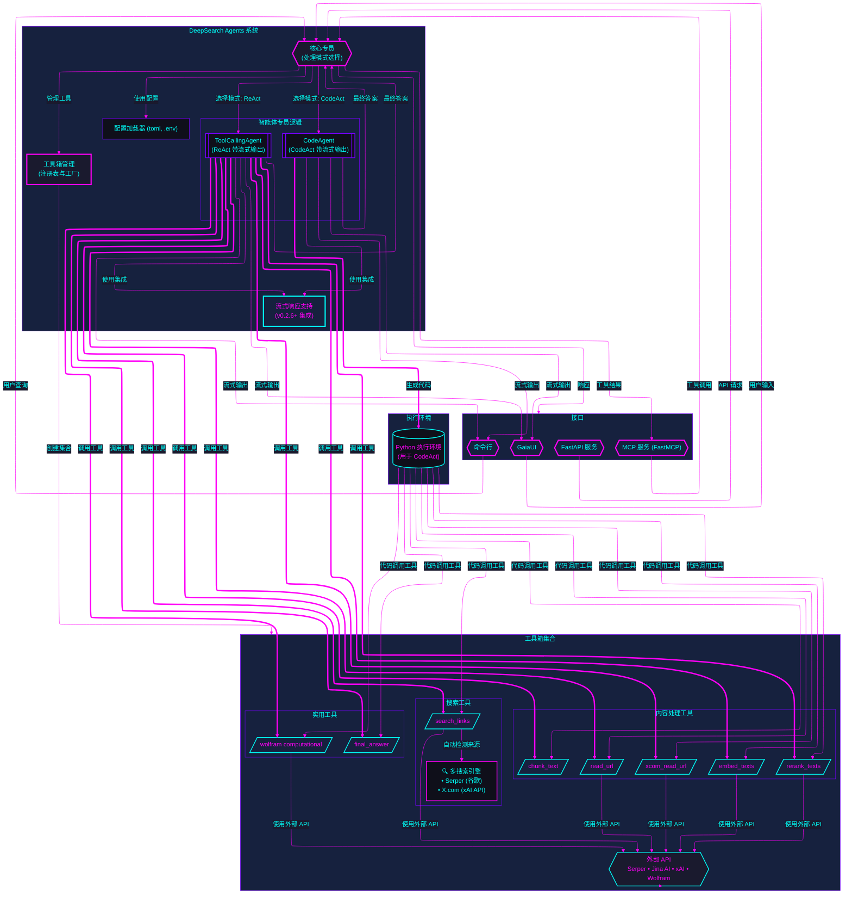

# DeepSearchAgent

与 💖 构建 | 人与 AI

<h2>

 

 

 🚅

 


[](https://github.com/astral-sh/uv)
[](https://opensource.org/licenses/MIT)
[](https://github.com/DeepSearch-AgentTeam/DeepSearchAgent/releases/tag/v0.2.8)

[](https://deepwiki.com/lwyBZss8924d/DeepSearchAgents)

</h2>

> 自开源 正是此道

[EN](README.md)

## 1. 项目介绍 | Introduction

DeepSearchAgent 项目是一个基于 ReAct（Reasoning + Acting）推理行动框架和 CodeAct（可执行代码式智能体专员）理念的智能体专员系统，旨在实现深度网络搜索与推理。它利用大型语言模型（LLM）的推理能力以及外部工具箱集合的调用能力，能够通过多步搜索、多模态网页文本处理、阅读和多步骤推理处理既宽又深的复杂网络搜索任务，并提供可溯源的参考资料。该项目基于 Hugging Face 的 smolagents 框架，实现了既可以调用预定义工具又可以执行代码的双模式智能体专员。

项目支持命令行界面 (CLI) 和标准的 FastAPI 服务，以及 GradioUI Web GUI 服务，方便广大开发者开发实验和在各种系统中集成和使用。是一个面相新手友好的 Code Agent 开源项目。

## 2. ✨ 特性 | Features

- 👻 **深度搜索任务能力**：通过多步搜索、阅读和推理过程，处理网络内容以回答复杂问题
- **DeepSearch 专员**：同时支持 CodeAct（Python 代码执行）模式与 ReAct（工具调用）模式，可在 `config.toml`（`src/core/config/settings.py`）中配置 Agent 运行时、语言模型和工具参数。
- 🪄 **可扩展工具箱**：内置网络搜索、内容获取、文本处理、语义排序和计算功能的工具集
- 🔍 **文本嵌入与重排序**：使用 Jina AI 嵌入和重排序模型处理 URL Web 多模态内容
- 🧠 **周期性规划更新**: 在执行过程中实施战略性重评以优化搜索路径
- 🔄 **迭代优化**：基于初步发现持续改进搜索和分析策略
- 💻 **多种开发调试交互模式**：提供 CLI 命令行交互 & 标准的 FastAPI 服务 & GradioUI Web GUI 服务
- 🔗 **可追溯引用**：为生成的答案提供来源和参考
- 📺 **流式输出**: 支持智能体专员专员步骤和最终答案的实时流式传输，并提供富文本格式
- 🧮 **计算引擎**：集成 WolframAlpha 计算引擎，支持数学和计算问题
- 📝 **JSON/Markdown 渲染**: 自动检测并以用户友好的格式呈现结构化输出

**参考用例**

- **CodeAct Mode Example**: Full CLI run showing multi-step deep search process.
  - Start:
    
  
  
  
  

  - FinalAnswer:
    

**正在紧张迭代中的开发计划:**
1. 封装 DeepSearchAgents 后端➕前端为 Docker 容器化开箱即用App;

2. [DONE] DeepSearchAgents 的 DeepSearchToolbox 增加 MCP Client/MCP tools HUB, 支持 MCP Tools 配置和调用;

3. [DONE] 提供封装 DeepSearchAgents 为 MCP 服务器, 提供 DeepSearchAgent MCP tools 服务;

4. [DONE] 多垂直搜索引擎源聚合支持（在 Google 基础上增加 x.com 等社交网络 urls 索引源）并支持可配置的提供商选择;

5. [TODO] 增加基于 `DeepWiki` Remote MCP tool,强化 `GitHub URLs` 垂直采集解析器;

6. 深度搜索策略提供更多策略参数, 增加支持基于 Tokens 预算的策略参数;

7. 实现性增加 DeepSearchAgents 基于深度搜索蒙特卡洛搜索树策略的Agent Action 搜索宽度&深度辅助方法和工具以及策略控制参数;

8. 实验性增加 DeepSearchAgents 的 Agent Runs 评估器(独立评估DeepSearchAgents 的 深度搜索路径&结果评估Agent);

9. 增加 Agent 持久化记忆功能 & 给用户提供持久化搜索记录;

10. 适配 code_sandbox Docker 自动化配置, 增加更多远程 code_sandbox 安全环境 SDK支持;

11. 集成全流程 Agent Runs 遥测适配("OpenTelemetry" & Langfuse);

12. Human-in-the-loop 暂定& Agent Runs 多路径分支回溯;

13. Agent Runs 并发竞技场模式;

## 3. 🚀 快速开始 (CLI, FastAPI) | Quick Start

本节将指导您设置环境、安装依赖项，并通过命令行界面或标准 FastAPI 服务运行 DeepSearchAgent。

### 安装与配置 | Installation & Setup

1.  **先决条件:**
    *   Python 3.13+。
    *   `uv` (推荐，pip/venv 的更快替代品): [安装 uv](https://github.com/astral-sh/uv)。
    *   Git。

2.  **克隆代码库:**

    ```bash
    git clone https://github.com/DeepSearch-AgentTeam/DeepSearchAgent.git
    cd DeepSearchAgent
    ```

3.  **创建虚拟环境 (推荐):**

    ```bash
    # 使用 uv
    uv venv
    source .venv/bin/activate  # Unix/macOS 系统
    # .venv\Scripts\activate   # Windows 系统

    # 或使用标准 venv
    # python -m venv .venv
    # source .venv/bin/activate  # Unix/macOS 系统
    # .venv\Scripts\activate   # Windows 系统
    ```

4.  **安装依赖项:**

    *   **用于运行 FastAPI 服务:**

        ```bash
        uv pip install .
        ```

    *   **用于运行 CLI 或进行开发:**

        ```bash
        # 以可编辑模式安装核心 + CLI 依赖 + 开发工具
        uv pip install -e ".[cli]"
        ```

    *   **用于开发:**

        ```bash
        uv pip install -e ".[dev,test,cli]"
        ```

5.  **配置:**

    ```bash
    # 从模板创建配置文件
    cp config.template.toml config.toml
    cp .env.template .env

    # 编辑 config.toml 配置模型、智能体专员参数、服务设置
    # nano config.toml

    # 编辑 .env 添加 API 密钥 (LITELLM_MASTER_KEY, SERPER_API_KEY 等)
    # nano .env
    ```

**配置详情:**
*   `config.toml`：包含非敏感配置，如模型 ID、智能体专员参数（最大步骤数、执行器类型）、服务设置（主机、端口）等。详见 `config.template.toml` 文件

*   `.env`：仅包含敏感 API 密钥（例如 `LITELLM_MASTER_KEY`、`SERPER_API_KEY`、`JINA_API_KEY`、`WOLFRAM_ALPHA_APP_ID`）。

### (1) 运行 CLI 调试台 | Running the CLI console

确保您已安装 CLI 依赖项 (参见 安装与配置 第 4 步)。

```bash
# 运行 CLI（交互模式，使用 config.toml 中的设置）
make cli
# 或直接使用:
uv run python -m src.agents.cli
```

CLI 参数将覆盖 `config.toml` 中定义的设置。

### (2) 运行 FastAPI 服务 | Running the FastAPI Service

确保您已安装核心依赖项 (参见 安装与配置 第 4 步)。

```bash
# 启动主 API 服务器（使用 config.toml 中的 host/port，例如 http://0.0.0.0:8000）
make run
# 或直接使用:
uv run -- uvicorn src.agents.main:app --reload
# 注意：--host 和 --port 现在通过 main.py 从 config.toml 获取
# 使用 LOG_LEVEL 环境变量设置日志级别（例如 LOG_LEVEL=debug make run）
```

**API 端口**：

* `POST /run_react_agent`：运行 React 智能体专员。
* `POST /run_deepsearch_agent`：运行由 `config.toml` 中 `service.deepsearch_agent_mode`（或 `DEEPSEARCH_AGENT_MODE` 环境变量）配置的智能体专员。
* `GET /`：API 信息和健康检查。

向配置的深度搜索 REST API 端口发送 API 请求示例：

```bash
curl -X POST http://localhost:8000/run_deepsearch_agent \
  -H "Content-Type: application/json" \
  -d '{"user_input": "搜索关于OpenAI的GPT-4.1 API的最新消息。"}'
```

*（如果 `config.toml` 中的主机和端口已更改，请将 `localhost:8000` 替换为实际值）*

### (3) 运行 GradioUI Web GUI Web 服务 | Running the GradioUI Web GUI Service

```bash
make app
# 或直接使用:
python src/app.py
```

### (4) 运行 MCP 服务 (MCP Tools `deepsearch_tool`) | Running the MCP Server (MCP Tools `deepsearch_tool`)

DeepSearchAgent 现在支持作为模型上下文协议（MCP）服务器，暴露深度搜索功能作为一个 MCP 工具 `deepsearch_tool`，可以被任何 MCP 客户端访问。

```bash
# Run the FastMCP server with default settings
python -m src.agents.servers.run_fastmcp
# or
python -m src.agents.servers.run_fastmcp --agent-type codact --port 8100
```

该命令会启动一个 FastMCP 服务器，使用 Streamable HTTP 传输，地址为 `http://localhost:8100/mcp`（默认），通过 `deepsearch_tool` 端点提供对 DeepSearchAgent 功能的访问。

**服务器参数：**

* `--agent-type`：要使用的深度搜索任务的智能体专员类型（`codact` 或 `react`，默认：`codact`）
* `--port`：服务器端口号（默认：`8100`）
* `--host`：主机地址（默认：`0.0.0.0`）
* `--debug`：启用调试日志
* `--path`：自定义 URL 路径（默认：`/mcp`）

**使用 MCP Inspector 进行调试：**

可以使用 MCP Inspector 来调试和交互 DeepSearchAgent MCP 服务器：

1. 如果还没有安装 MCP Inspector，请先安装：

```bash
npm install -g @modelcontextprotocol/inspector
```

2. 启动 MCP Inspector MCP 客户端开发调试控制台：

```bash
npx @modelcontextprotocol/inspector
```

3. 请在打开的浏览器界面中（通常在 `http://127.0.0.1:6274`）：

  * 设置传输类型：`Streamable HTTP`
  * 设置 URL：`http://localhost:8100/mcp`
  * 点击"Connect"
  * 转到"工具"标签并选择"deepsearch_tool"
  * 输入您的搜索查询并点击"Run Tool"按钮

4. 您将会看到实时的进度更新和最终的搜索结果在 MCP Inspector 调试台网页界面中呈现。

**FastMCP 服务器在 FastAPI 应用中：**

您也可以将 FastMCP 服务器嵌入到主 FastAPI 应用中：

```bash
# 启动运行主 API 服务器并启用 FastMCP 集成
python -m src.main --enable-fastmcp --agent-type codact
```

当使用 `--enable-fastmcp` 运行时，主 API 服务器会在 `/mcp-server`（默认）挂载 FastMCP 服务器进行集成操作。

## 4. 🛠️ 架构与模块 | Architecture and Modules

核心系统架构包括：

1.  **核心专员模块（`src/agents/react_agent.py`、`src/agents/codact_agent.py`）**：基于 `smolagents` 实现 ReAct 和 CodeAct 逻辑。`src/agents/runtime.py` 为运行时管理器，负责管理智能体专员运行时环境。
2.  **专员核心运行时模块（`src/agents/runtime.py`）**：负责管理智能体专员运行时环境。
3.  **专员工具箱集合（`src/agents/tools/`）**：智能体专员可以调用的函数（网络搜索、读取 URL 等）。
4.  **FastAPI 服务（`src/api`）**：FastAPI 服务，提供 REST API 相关服务。
5.  **CLI 接口 (`src/cli.py`)**：提供具有丰富格式的交互式命令行界面。
6.  **GaiaUI Web 界面 (`src/app.py`)**：基于 Gradio 的 Web GUI，与智能体专员交互。
7.  **MCP 工具服务器 (`src/agents/servers/run_fastmcp.py`)**：提供 MCP 协议的流式 Streamable HTTP 服务。

*架构图已更新至版本 `v0.2.8`*



## 5. ⚙️ AI 专员模式 (ToolCalling ReAct vs CodeAct) | Agent Modes

DeepSearchAgent 支持两种智能体专员工作模式 CodeAct 代码执行模式 和用于实验对照的 ReAct 普通工具调用模式。`/run_deepsearch_agent` 端点使用的默认模式由 `config.toml`（`service.deepsearch_agent_mode`）或 `DEEPSEARCH_AGENT_MODE` 环境变量配置。

现在两种模式都支持流式输出，可以实时查看智能体专员的推理和执行过程。

### CodeAct 模式（代码执行）| CodeAct Mode (Code Execution)

在 CodeAct 模式下，智能体专员产生可执行的 Python 代码，并通过运行代码来完成推理和动作。这使它能够处理更复杂的操作，将多个步骤组合到一次代码执行中。

**示例格式：**

```python
results = search_links("示例查询")
content = read_url(results[0]["link"])
final_answer("结果是...")
```

### ReAct 模式（工具调用）| ReAct Mode (Tool Calling)

在 ReAct 模式下，智能体专员以经典的推理+行动方式运行，动作以调用预定义工具的形式执行。在推理过程中，LLM 会生成结构化的"行动"输出，指明要使用的工具及其参数。

**示例格式：**

```json
{
  "name": "search_links",
  "arguments": {
    "query": "示例查询"
  }
}
```

### 对比与使用场景 | Comparison and Use Cases

| 差异 | ToolCalling ReAct 模式 | CodeAct 模式 |
|-------------|------------|--------------|
| **动作表示** | 结构化 JSON 指令 | 可执行 Python 代码 |
| **复杂操作能力** | 需要多个步骤完成复杂逻辑 | 可以使用编程结构组合多个步骤 |
| **模型要求** | 通用对话能力 | 需要代码生成能力 |
| **调试与可解释性** | 易读的思考和动作记录 | 代码追踪与错误反馈 |
| **最适合** | 简单查询，固定工作流 | 复杂任务，灵活工具编排 |
| **流式支持** | 支持 | 支持 |
| **规划能力** | 每 N 步周期性规划 | 每 N 步周期性规划 |

## 6. 🔧 工具链机制 | Toolchain Mechanism

DeepSearchAgent 拥有一套可扩展的工具链，用于辅助智能体专员检索和处理信息。各工具相互配合，形成完整的查询解答流程：

### 搜索与发现工具

- **`search_links`（搜索链接）**: 接受查询字符串，调用外部搜索引擎 API 获取包含标题、摘要和 URL 的网页结果列表。**v0.2.8 新增**：现在支持多搜索引擎：
  - **Serper API（谷歌）**：传统网络搜索，提供全面覆盖
  - **X.com（xAI API）**：来自 X.com/Twitter 的实时社交媒体内容，具备实时数据访问能力
  - **自动检测**：根据查询内容自动选择合适的搜索引擎（例如，X.com 特定术语、@用户名、话题标签）

### 内容获取与处理工具

- **`read_url`（读取 URL）**: 从标准网页获取 HTML 内容并使用 Jina AI Reader API 提取格式化文本进行分析。
- **`xcom_read_url`（X.com URL 读取）**: **v0.2.8 新增**：使用 xAI 的 Live Search API 专门读取 X.com（Twitter）内容的工具。为社交媒体内容提供实时访问帖子、个人资料和搜索结果，具备增强的提取功能。
- **`chunk_text`（文本分段）**: 使用智能分段将长文本拆分为便于详细分析的小段。
- **`embed_texts`（文本嵌入）**: 将文本段编码为向量表示，用于语义相似度操作。
- **`rerank_texts`（文本重排）**: 根据查询对文本段进行相关性排序，找出最相关信息。

### 计算与答案工具

- **`wolfram`（计算引擎）**: 调用 WolframAlpha API 处理数学或计算查询。
- **`final_answer`（最终答案）**: 表示智能体专员已得出结论，使用结构化输出终止推理循环。

### 工具箱管理系统

**v0.2.8 新增**：`toolbox.py` 模块为管理 DeepSearchAgent 工具提供统一接口：

- **工具注册表**：用于所有内置和外部工具的集中注册系统
- **工厂方法**：具备正确 API 密钥配置的自动化工具实例化
- **扩展支持**：与 Hugging Face Hub 集合和 MCP（模型上下文协议）服务器集成
- **配置加载**：基于 `config.toml` 设置的自动工具加载

#### 工具箱功能特性：

```python
# 使用特定工具创建工具集合
toolbox.create_tool_collection(
    api_keys=api_keys,
    tool_names=["search_links", "read_url", "xcom_read_url"],
    verbose=True
)

# 从 Hub 集合加载工具
toolbox.load_from_hub("collection_slug", trust_remote_code=True)

# 从 MCP 服务器加载工具
with toolbox.load_from_mcp(server_params, trust_remote_code=True):
    # 使用来自 MCP 服务器的工具
    pass
```

### 增强搜索工作流

在典型的 v0.2.8 增强序列中：

1. **智能搜索**：智能体专员使用 `search_links`，它自动检测查询是否与 X.com 内容相关（提及 @用户名、话题标签、热门话题）并路由到合适的搜索引擎
2. **内容获取**：根据来源，使用 `read_url` 处理标准网页内容，或使用 `xcom_read_url` 处理 X.com 内容
3. **处理流水线**：对于复杂内容，使用 `chunk_text`、`embed_texts` 和 `rerank_texts` 识别关键段落
4. **计算分析**：当需要计算时，调用 `wolfram` 进行数学分析
5. **结论**：这个循环会持续直到智能体专员确定已有足够信息调用 `final_answer`

### 多源智能

增强的工具链现在提供：
- **双重搜索能力**：传统网络搜索和实时社交媒体智能
- **来源感知处理**：针对不同内容类型的不同提取策略
- **统一接口**：无论底层数据源如何，都提供一致的工具调用
- **实时数据**：通过 xAI 集成访问实时社交媒体内容

## 7. 📺 流式传输和渲染功能 | Streaming and Rendering Features

>= `v0.2.6.dev` 版本 DeepSearchAgent 现在包含全面的流式传输和渲染功能(CLI & GUI)：

### 流式输出 | Streaming Output

- **实时响应**: 实时查看智能体专员的思考过程和结果
- **逐 Token 生成**: 观察答案是如何逐个 Token 构建的
- **进度可视化**: 跟踪搜索进度、访问过的 URL 和查询执行情况
- **规划步骤显示**: 查看智能体专员重新评估其策略时的周期性规划步骤

### 富文本渲染 | Rich Rendering

- **JSON 结构检测**: 自动识别和解析 JSON 输出
- **Markdown 格式化**: 使用正确的格式渲染 Markdown 内容
- **结构化报告**: 创建组织良好的面板以便于信息查阅
- **来源归属**: 清晰显示最终答案中使用的参考来源
- **统计数据显示**: 显示 Token 计数、生成速度和搜索指标

### CLI 体验增强 | CLI Experience Enhancements

- **交互式控制**: 使用斜杠命令如 `/exit`、`/quit` 和 `/multiline`
- **错误处理**: 健壮的错误恢复机制即使出现问题也能保持会话运行
- **任务显示管理**: 防止在流式模式下重复显示任务
- **格式自动检测**: 识别并以最合适的格式渲染最终输出

## 8. 💡 理论基础 | Theoretical Foundations

### ReAct 框架原理 | ReAct Paradigm Principles

ReAct（Reasoning + Acting）是一种让语言模型同时生成思考过程和动作指令的范式。这个框架将"推理"与"行动"交织在一起：模型用自然语言思考（记录思考过程），同时产生具体的动作（如搜索或阅读）与外部工具或环境交互。

研究表明，这种推理与行动的紧密结合优于纯推理或纯行动的方法，有效降低了幻觉和错误传播，同时提高了问题解决过程的可解释性和可控性。

### CodeAct 可执行代码智能体专员 | CodeAct Executable Code Agents

CodeAct 指的是让智能体专员以代码形式生成并执行动作的方法。核心思想是在每个决策步骤，模型直接产出可执行的代码，通过运行代码来调用工具或执行计算。

与静态指令相比，代码作为行动表示具有更强的表达能力和灵活性：它可以组合多个工具调用，使用编程逻辑处理复杂数据结构，甚至重用先前定义的函数，极大地扩展了智能体专员的行动空间。

### 周期性规划与自适应搜索 | Periodic Planning and Adaptive Search

两种智能体专员模式都实现了周期性规划间隔，允许智能体专员每 N 步重新评估其策略。这通过以下方式实现更有效的搜索路径：

- 评估相对于原始任务的进展
- 识别信息收集中的差距
- 根据已发现的内容调整搜索方向
- 当当前途径效果不佳时，优先考虑新的搜索途径

## 9. 📦 安装 | Installation

### 要求 | Requirements

- Python 3.13+
- 从 `config.template.toml` 创建 `config.toml` 并自定义参数。
- 从 `.env.template` 创建 `.env` 并添加所需的 API 密钥：
  - `LITELLM_MASTER_KEY`（如果使用兼容 LiteLLM 的模型）
  - `SERPER_API_KEY`（通过 `search_links` 进行网络搜索）
  - `JINA_API_KEY`（通过 `read_url`、`embed_texts`、`rerank_texts` 进行内容处理）
  - `WOLFRAM_ALPHA_APP_ID`（可选，通过 `wolfram` 进行计算查询）
  - `LITELLM_BASE_URL`（可选，如果使用自定义 LiteLLM 端点）

## 10. 🤝 贡献 | Contributing

欢迎贡献！请随时提交 Pull Request。

## 11. 📄 许可证 | License

本项目使用 MIT 许可证

## 12. 📝 致谢 | Acknowledgements 开源项目

特别感谢以下开源项目(以及未列出但同样重要的项目)，`愿原力与你同在`：

- [Hugging Face](https://huggingface.co/) 🤗
- [smolagents](https://github.com/huggingface/smolagents)
- [Litellm](https://github.com/BerriAI/litellm) 🚅
- [FastAPI](https://github.com/tiangolo/fastapi)
- [Jina AI](https://github.com/jina-ai)
- [Langchain](https://github.com/langchain-ai/langchain)

## 13. 理论基础与参考文献 | Theoretical Foundations & References

> - [ReAct: Synergizing Reasoning and Acting in Language Models](https://react-lm.github.io/) `arXiv:2210.03629v3`
> - [Executable Code Actions Elicit Better LLM Agents](https://arxiv.org/html/2402.01030v4) `arXiv:2402.01030v4`
> - [DynaSaur: Large Language Agents Beyond Predefined Actions](https://arxiv.org/html/2411.01747v1) `arXiv:2411.01747v1`
> - [LLMCompiler: An LLM Compiler for Parallel Function Calling](https://arxiv.org/abs/2312.04511v3) `arXiv:2312.04511v3`
> - [ReWOO: Decoupling Reasoning from Observations for Efficient Augmented Language Models](https://arxiv.org/abs/2305.18323) `arXiv:2305.18323v1`
> - [smolagents.agents.CodeAgent](https://github.com/huggingface/smolagents/blob/7983378593da4b393a95335aad8431f6c9d2ac23/src/smolagents/agents.py)
> - [Jina AI DeepResearch repository](https://github.com/jina-ai/node-DeepResearch)
> - [A Practical Guide to Implementing DeepSearch/DeepResearch](https://jina.ai/news/a-practical-guide-to-implementing-deepsearch-deepresearch/)

## 14. 👨‍💻 AI Coder 结对辅助开发参考

DeepSearchAgent 项目在设计时考虑了现代 AI 工程师与人类工程师协作程序开发&编码的工作流程。我们已经整合了特殊的仓库工作区规则文件(`.cursor/rules/*.mdc`)，以促进 AI 辅助开发并确保代码库的一致性。

### `.cursor/rules/`(`.mdc`) 等价于

- `CLAUDE.md`: `Claude Code` Prompting markdown file.
- `AGENTS.md`: `Codex CLI` & `Codex` Software engineering Agent, Prompting markdown file.

### 使用 `.cursor/rules/` 文件

本仓库在 `.cursor/rules/` 目录中包含特殊的 Markdown 文件，作为人类开发者和 AI 编码助手的上下文指南提示词。这些文件类似于 [Claude Code 最佳实践](dev-docs/claude-code-best-practices.md) 中描述的 `CLAUDE.md` 概念，提供了关于项目架构、组件和约定的结构化信息。

#### 可用的规则文件

- **agent-architecture.mdc**: 记录了智能体专员设计模式（ReAct 和 CodeAct）及功能
- **configuration.mdc**: 详细说明了定制化的配置系统选项
- **interfaces.mdc**: 描述了可用接口（CLI、FastAPI、MCP Tool Server）
- **jina-ai-api-rules.mdc**: 包含在代码库中使用 Jina AI 各种 API 的指南
- **periodic-planning.mdc**: 解释了用于战略重新评估的周期性规划功能
- **project-overview.mdc**: 提供全面的项目概述和结构
- **tools.mdc**: 记录了用于网络搜索、内容处理和分析的专用工具集合的功能

### 对开发者的好处

这些规则文件为人类开发者和 AI 工程师结对协作提供了：

1. **快速上手**: 可以帮助 AI 工程师迅速理解项目架构和设计决策
2. **一致性开发**: 确保代码遵循既定模式和约定
3. **AI 辅助开发**: 为 AI 工程师提供上下文，生成更准确和相关的代码
4. **代码即文档**: 使文档与代码紧密结合，易于访问

### AI 工程师协作最佳实践

在使用 AI 协助开发这个项目时，我们建议以下工作流程：

1. **了解规则**: 查看与您正在开发的组件相关的 `.cursor/rules/*.mdc` 文件
2. **引用特定规则**: 与 AI 工程师合作时，明确引用相关规则文件
3. **迭代改进**: 使用 AI 进行初始代码生成，然后根据项目约定完善解决方案
4. **复杂变更规划**: 对于复杂功能，在生成实现代码前让 AI 概述计划
5. **测试驱动方法**: 对关键组件，使用 AI 工程师帮助在实现代码前编写测试
6. **更新规则**: 引入重大变更时，更新相关规则文件

### 示例工作流

#### 探索代码库

与 AI 工程师结对探索代码库时，可以这样开始：

```bash
请帮我理解 DeepSearchAgent 架构。参考 .cursor/rules/project-overview.mdc 和 .cursor/rules/agent-architecture.mdc 获取详情。
```

#### 添加新功能

当向工具集合添加新工具时：

```bash
我需要添加一个用于 YouTube 视频分析的新工具。请按照 .cursor/rules/tools.mdc 中的模式和 .cursor/rules/python-code-style-pep8.mdc 中的代码风格帮我实现。
```

#### 更新配置

修改配置系统时：

```bash
我需要为深度搜索 Tokens预算&索引深度添加新的配置选项。请根据 .cursor/rules/configuration.mdc 建议如何扩展配置结构。
```

### 贡献规则

随着项目的发展，我们鼓励贡献者更新和扩展这些规则文件。如果您添加了新的主要组件或更改了现有架构，请更新相关的 `.mdc` 文件以反映这些变化。这有助于将文档维护为准确反映代码库当前状态的活跃资源。

## 项目结构 | Project Structure

```tree
src/
├── agents/                   # 智能体专员实现和核心逻辑
│   ├── prompt_templates/     # 模块化提示模板系统
│   │   ├── __init__.py
│   │   ├── codact_prompts.py # CodeAct 智能体专员提示和模板
│   │   └── react_prompts.py  # ReAct 智能体专员提示和模板
│   ├── servers/              # 服务器实现
│   │   ├── __init__.py
│   │   ├── gradio_patch.py   # Gradio UI 增强和补丁
│   │   ├── run_fastmcp.py    # FastMCP MCP 服务器实现
│   │   └── run_gaia.py       # Gradio UI 网页服务器
│   ├── ui_common/            # 共享 UI 组件和工具
│   │   ├── __init__.py
│   │   ├── agent_step_callback.py  # 智能体专员执行步骤回调
│   │   ├── console_formatter.py    # 控制台输出格式化
│   │   ├── constants.py            # UI 相关常量
│   │   ├── gradio_adapter.py       # Gradio 接口适配器
│   │   └── gradio_helpers.py       # Gradio 工具函数
│   ├── __init__.py
│   ├── base_agent.py         # 基础智能体专员接口和通用功能
│   ├── codact_agent.py       # CodeAct 智能体专员实现
│   ├── react_agent.py        # ReAct 智能体专员实现
│   └── runtime.py            # 智能体专员运行时管理器
├── api/                      # FastAPI 服务组件
│   ├── v1/                   # API 版本 1 实现
│   │   ├── endpoints/        # API 端点定义
│   │   │   ├── __init__.py
│   │   │   ├── agent.py      # 智能体专员相关端点
│   │   │   └── health.py     # 健康检查端点
│   │   ├── __init__.py
│   │   └── router.py         # API 路由配置
│   ├── __init__.py
│   └── api.py                # 主 API 配置
├── core/                     # 核心系统组件
│   ├── chunk/                # 文本分块组件
│   │   └── segmenter.py      # Jina AI 分段器实现
│   ├── config/               # 配置处理
│   │   ├── __init__.py
│   │   └── settings.py       # 设置管理和配置加载
│   ├── ranking/              # 内容排序和嵌入
│   │   ├── __init__.py
│   │   ├── base_ranker.py    # 基础排序接口
│   │   ├── chunker.py        # 文本分块工具
│   │   ├── jina_embedder.py  # Jina AI 嵌入实现
│   │   └── jina_reranker.py  # Jina AI 重排序实现
│   ├── scraping/             # 网页内容抓取
│   │   ├── __init__.py
│   │   ├── result.py         # 抓取结果数据结构
│   │   ├── scraper.py        # 通用网页抓取实现
│   │   ├── utils.py          # 抓取工具函数
│   │   └── xcom_scraper.py   # X.com (Twitter) 专用抓取器
│   ├── search_engines/       # 搜索引擎集成
│   │   ├── __init__.py
│   │   ├── search_serper.py  # Serper API (谷歌) 搜索引擎
│   │   └── search_xcom.py    # X.com (xAI API) 搜索引擎
│   └── __init__.py
├── tools/                    # 工具实现
│   ├── __init__.py
│   ├── chunk.py              # 文本分块工具
│   ├── embed.py              # 文本嵌入工具
│   ├── final_answer.py       # 最终答案生成工具
│   ├── readurl.py            # 标准 URL 内容读取工具
│   ├── rerank.py             # 内容重排序工具
│   ├── search.py             # 多引擎网络搜索工具
│   ├── toolbox.py            # 工具管理和注册系统
│   ├── wolfram.py            # Wolfram Alpha 计算工具
│   └── xcom_readurl.py       # X.com (Twitter) URL 读取工具
├── app.py                    # Gradio UI 网页应用程序入口
├── cli.py                    # 命令行界面
└── main.py                   # FastAPI 应用程序入口
```

### 主要目录说明

- **`agents/`**: 核心智能体专员实现，包含 ReAct 和 CodeAct 范式，以及提示模板和 UI 组件
- **`api/`**: FastAPI 服务基础设施，包含版本化端点和健康检查
- **`core/`**: 基础系统组件，包括配置、搜索引擎、内容处理和抓取功能
- **`tools/`**: 完整的工具链，具有统一的工具箱管理，支持传统网络搜索和 X.com 社交媒体集成
- **根文件**: 不同接口模式的应用程序入口点（CLI、FastAPI、Gradio UI）
