# DeepSearchAgent

与 💖 构建 | 人与 AI


[](https://github.com/astral-sh/uv)
[](https://opensource.org/licenses/MIT)
[](https://github.com/DeepSearch-AgentTeam/DeepSearchAgent/releases/tag/v0.2.3)

> 自开源 正是此道

[EN](README.md)

## 1. 项目介绍 | Introduction

DeepSearchAgent 项目是一个结合 ReAct（Reasoning + Acting）推理行动框架和 CodeAct（可执行代码式智能体）理念的智能体系统，旨在实现深度网络搜索与推理。它利用大型语言模型（LLM）的推理能力以及外部工具的调用能力，能够通过多步搜索、阅读和计算来回答复杂问题，并提供可溯源的参考资料。该项目基于 Hugging Face 的 smolagents 框架，实现了既可以调用预定义工具又可以执行代码的双模式智能体。

它支持命令行界面 (CLI) 和标准的 FastAPI 服务，方便开发者在各种系统中集成和使用。

## 2. ✨ 特性 | Features

TODO: MCP (Model Context Protocol) Server for MCP tool server support

- 🔍 **深度研究能力**：通过多步搜索、阅读和推理过程，处理网络内容以回答复杂问题
- 🧩 **双模式智能体**：同时支持 ReAct（工具调用）和 CodeAct（Python代码执行）模式，可通过 `config.yaml` 或环境变量配置
- 🔧 **可扩展工具链**：内置网络搜索、内容获取、文本处理、语义排序和计算功能的工具集
- ⚙️ **灵活配置**：通过 `config.yaml` 文件管理参数和通过 `.env` 管理 API 密钥
- 📊 **语义理解**：使用先进的嵌入和重排序技术来识别最相关的内容
- 🧮 **计算集成**：与 WolframAlpha 连接以解决数学和计算问题
- 🖥️ **多种接口**：提供丰富的命令行体验和标准的 FastAPI 服务
- 📝 **可追溯引用**：为生成的答案提供来源和参考
- 🔄 **迭代优化**：基于初步发现持续改进搜索和分析策略

**参考用例**
[GPT-4.1 Model Comparison Example](docs/examples/codact-gpt-4.1-example.md)

## 3. 🚀 快速开始 (CLI, FastAPI) | Quick Start

本节将指导您设置环境、安装依赖项，并通过命令行界面或标准 FastAPI 服务运行 DeepSearchAgent。

### 安装与配置 | Installation & Setup

1.  **先决条件:**
    *   Python 3.13+。
    *   `uv` (推荐，pip/venv 的更快替代品): [安装 uv](https://github.com/astral-sh/uv)。
    *   Git。

2.  **克隆代码库:**
    ```bash
    git clone https://github.com/DeepSearch-AgentTeam/DeepSearchAgent.git
    cd DeepSearchAgent
    ```

3.  **创建虚拟环境 (推荐):**
    ```bash
    # 使用 uv
    uv venv
    source .venv/bin/activate  # Unix/macOS 系统
    # .venv\Scripts\activate   # Windows 系统

    # 或使用标准 venv
    # python -m venv .venv
    # source .venv/bin/activate  # Unix/macOS 系统
    # .venv\Scripts\activate   # Windows 系统
    ```

4.  **安装依赖项:**

    *   **用于运行 FastAPI 服务:**
        ```bash
        uv pip install .
        ```
    *   **用于运行 CLI 或进行开发:**
        ```bash
        # 以可编辑模式安装核心 + CLI 依赖 + 开发工具
        uv pip install -e ".[cli]"
        ```

5.  **配置:**
    ```bash
    # 从模板创建配置文件
    cp config.yaml.template config.yaml
    cp .env.template .env

    # 编辑 config.yaml 配置模型、智能体参数、服务设置
    # nano config.yaml

    # 编辑 .env 添加 API 密钥 (LITELLM_MASTER_KEY, SERPER_API_KEY 等)
    # nano .env
    ```

**配置详情:**
*   `config.yaml`：包含非敏感配置，如模型 ID、智能体参数（最大步骤数、执行器类型）、服务设置（主机、端口）等。

```yaml
# 示例 config.yaml 内容
# 模型配置
models:
  orchestrator_id: "openrouter/openai/gpt-4.1"  # 用于主 LLM 编排
  search_id: "openrouter/openai/gpt-4.1"        # 用于搜索（仅在不同时使用）
  reranker_type: "jina-reranker-m0"             # 默认重排器类型

# 智能体通用设置
agents:
  common:
    verbose_tool_callbacks: true        # 如果为 true，显示完整的工具输入/输出
  
  # ReAct 智能体特定设置
  react:
    max_steps: 25                       # 最大推理步骤数

  # CodeAct 智能体特定设置
  codact:
    executor_type: "local"              # local 或 lambda（用于 AWS Lambda 执行）
    max_steps: 25                       # 最大执行步骤数
    verbosity_level: 1                  # 0=最小, 1=正常, 2=详细
    executor_kwargs: {}                 # 执行器的额外参数
    additional_authorized_imports: []   # 允许导入的额外 Python 模块

# 服务配置
service:
  host: "0.0.0.0"
  port: 8000
  version: "0.2.3"
  deepsearch_agent_mode: "codact"       # "react" 或 "codact"
```

*   `.env`：仅包含敏感 API 密钥（例如 `LITELLM_MASTER_KEY`、`SERPER_API_KEY`、`JINA_API_KEY`、`WOLFRAM_ALPHA_APP_ID`）。您也可以在此处可选地设置 `LOG_LEVEL`（例如 `debug`, `info`, `warning`, `error`）。

### 运行 CLI | Running the CLI

确保您已安装 CLI 依赖项 (参见 安装与配置 第 4 步)。

```bash
# 运行 CLI（交互模式，使用 config.yaml 中的设置）
make cli
# 或直接使用:
uv run python -m src.agents.cli

# 通过 CLI 参数覆盖 config.yaml 中的智能体类型
make cli ARGS="--agent-type react"
# 或直接使用:
uv run python -m src.agents.cli --agent-type react

# 使用单一查询（非交互式）
uv run python -m src.agents.cli --query "搜索关于2024年AI研究的最新新闻"
```

CLI 参数将覆盖 `config.yaml` 中定义的设置。

### 运行 FastAPI 服务 | Running the FastAPI Service

确保您已安装核心依赖项 (参见 安装与配置 第 4 步)。

```bash
# 启动主 API 服务器（使用 config.yaml 中的 host/port，例如 http://0.0.0.0:8000）
make run
# 或直接使用:
uv run -- uvicorn src.agents.main:app --reload
# 注意：--host 和 --port 现在通过 main.py 从 config.yaml 获取
# 使用 LOG_LEVEL 环境变量设置日志级别（例如 LOG_LEVEL=debug make run）
```

**API 端点**：

* `POST /run_react_agent`：运行 React 智能体。
* `POST /run_deepsearch_agent`：运行由 `config.yaml` 中 `service.deepsearch_agent_mode`（或 `DEEPSEARCH_AGENT_MODE` 环境变量）配置的智能体。
* `GET /`：API 信息和健康检查。

向配置的深度搜索端点发送 API 请求示例：

```bash
curl -X POST http://localhost:8000/run_deepsearch_agent \
  -H "Content-Type: application/json" \
  -d '{"user_input": "搜索关于OpenAI的GPT-4.1 API的最新消息。"}'
```
*（如果 `config.yaml` 中的主机和端口已更改，请将 `localhost:8000` 替换为实际值）*

## 4. 🛠️ 架构与模块 | Architecture and Modules

核心系统架构包括：

1.  **核心智能体（`src/agents/agent.py`、`src/agents/codact_agent.py`）**：基于 `smolagents` 实现 ReAct 和 CodeAct 逻辑。
2.  **工具（`src/agents/tools/`）**：智能体可以调用的函数（网络搜索、读取 URL 等）。
3.  **FastAPI 服务（`src/agents/main.py`）**：通过 REST API 暴露智能体功能。
4.  **配置加载器（`src/agents/config_loader.py`）**：管理从 `config.yaml` 和 `.env` 加载设置。

```mermaid
---
config:
  theme: dark
  themeVariables:
    primaryColor: '#1a1a2e'
    primaryTextColor: '#00fff9'
    primaryBorderColor: '#7700ff'
    lineColor: '#ff00f7'
    secondaryColor: '#16213e'
    tertiaryColor: '#0f0f1a'
    mainBkg: '#1a1a2e'
    nodeBorder: '#7700ff'
    clusterBkg: '#16213e'
    clusterBorder: '#7700ff'
    titleColor: '#00fff9'
    edgeLabelBackground: '#1a1a2e'
    textColor: '#00fff9'
  layout: elk
---
flowchart TB
    subgraph Interfaces["Interfaces"]
        direction LR
        CLI{{"CLI"}}
        FastAPI{{"FastAPI 服务"}}
    end
    subgraph DeepSearchAgentSystem["DeepSearch Agents 系统"]
        direction TB
        CoreAgents{{"核心智能体
(处理模式选择)"}}
        ConfigLoader["配置加载器 (yaml, .env)"]
        subgraph Agents["智能体逻辑"]
            direction LR
            ToolAgent[["ToolCallingAgent
(Normal-ReAct)"]]
            CodeAgent[["CodeAgent
(CodeAct-ReAct)"]]
        end
    end
    subgraph ToolCollection["工具集合"]
        direction TB
        SearchLinks[/search_links/]
        ReadURL[/read_url/]
        ChunkText[/chunk_text/]
        EmbedTexts[/embed_texts/]
        RerankTexts[/rerank_texts/]
        Wolfram[/"wolfram computational"/]
        FinalAnswer[/final_answer/]
        ExternalAPIs{{外部 API
Serper, Jina, Wolfram...}}
    end
    subgraph Execution["执行"]
        PythonEnv[("Python 执行
环境 (用于 CodeAct)")]
    end

    CLI -- "用户查询" --> CoreAgents
    FastAPI -- "API 请求" --> CoreAgents
    CoreAgents -- "选择模式: ReAct" --> ToolAgent
    CoreAgents -- "选择模式: CodeAct" --> CodeAgent
    CoreAgents -- "使用配置" --> ConfigLoader

    ToolAgent == "调用工具" ==> SearchLinks
    ToolAgent == "调用工具" ==> ReadURL
    ToolAgent == "调用工具" ==> ChunkText
    ToolAgent == "调用工具" ==> EmbedTexts
    ToolAgent == "调用工具" ==> RerankTexts
    ToolAgent == "调用工具" ==> Wolfram
    ToolAgent == "调用工具" ==> FinalAnswer

    CodeAgent == "生成代码" ==> PythonEnv
    PythonEnv[("Python 执行
环境 (用于 CodeAct)")]
    PythonEnv -- "通过代码调用工具" --> SearchLinks
    PythonEnv -- "通过代码调用工具" --> ReadURL
    PythonEnv -- "通过代码调用工具" --> ChunkText
    PythonEnv -- "通过代码调用工具" --> EmbedTexts
    PythonEnv -- "通过代码调用工具" --> RerankTexts
    PythonEnv -- "通过代码调用工具" --> Wolfram
    PythonEnv -- "通过代码调用工具" --> FinalAnswer

    SearchLinks -- "使用外部 API" --> ExternalAPIs
    ReadURL -- "使用外部 API" --> ExternalAPIs
    EmbedTexts -- "使用外部 API" --> ExternalAPIs
    RerankTexts -- "使用外部 API" --> ExternalAPIs
    Wolfram -- "使用外部 API" --> ExternalAPIs
    ExternalAPIs -.-> ToolCollection

    ToolAgent -. "最终答案" .-> CoreAgents
    CodeAgent -. "最终答案" .-> CoreAgents
    CoreAgents -. "响应" .-> Interfaces

    classDef default fill:#1a1a2e,stroke:#7700ff,stroke-width:2px,color:#00fff9
    classDef interface fill:#16213e,stroke:#ff00f7,stroke-width:3px,color:#00fff9
    classDef agent fill:#0f0f1a,stroke:#7700ff,stroke-width:2px,color:#00fff9
    classDef manager fill:#1a1a2e,stroke:#ff00f7,stroke-width:3px,color:#00fff9
    classDef tool fill:#16213e,stroke:#00fff9,stroke-width:2px,color:#ff00f7
    classDef environment fill:#0f0f1a,stroke:#00fff9,stroke-width:2px,color:#ff00f7
    classDef external fill:#1a1a2e,stroke:#00fff9,stroke-width:2px,color:#ff00f7
    classDef config fill:#0f0f1a,stroke:#7700ff,stroke-width:1px,color:#00fff9

    CLI:::interface
    FastAPI:::interface
    CoreAgents:::manager
    ToolAgent:::agent
    CodeAgent:::agent
    SearchLinks:::tool
    ReadURL:::tool
    ChunkText:::tool
    EmbedTexts:::tool
    RerankTexts:::tool
    Wolfram:::tool
    FinalAnswer:::tool
    PythonEnv:::environment
    ExternalAPIs:::external
    ConfigLoader:::config
```



## 5. ⚙️ 代理模式 (ReAct vs CodeAct) | Agent Modes

DeepSearchAgent 支持两种智能体工作模式：ReAct 工具调用模式和 CodeAct 代码执行模式。`/run_deepsearch_agent` 端点使用的默认模式由 `config.yaml`（`service.deepsearch_agent_mode`）或 `DEEPSEARCH_AGENT_MODE` 环境变量配置。

### ReAct 模式（工具调用）| ReAct Mode (Tool Calling)

在 ReAct 模式下，智能体以经典的推理+行动方式运行，动作以调用预定义工具的形式执行。在推理过程中，LLM 会生成结构化的"行动"输出，指明要使用的工具及其参数。

**示例格式：**
```json
{
  "name": "search_links",
  "arguments": {
    "query": "示例查询"
  }
}
```

### CodeAct 模式（代码执行）| CodeAct Mode (Code Execution)

在 CodeAct 模式下，智能体产生可执行的 Python 代码，并通过运行代码来完成推理和动作。这使它能够处理更复杂的操作，将多个步骤组合到一次代码执行中。

**示例格式：**
```python
results = search_links("示例查询")
content = read_url(results[0]["link"])
final_answer("结果是...")
```

### 对比与使用场景 | Comparison and Use Cases

| 差异 | ReAct 模式 | CodeAct 模式 |
|-------------|------------|--------------|
| **动作表示** | 结构化 JSON 指令 | 可执行 Python 代码 |
| **复杂操作能力** | 需要多个步骤完成复杂逻辑 | 可以使用编程结构组合多个步骤 |
| **模型要求** | 通用对话能力 | 需要代码生成能力 |
| **调试与可解释性** | 易读的思考和动作记录 | 代码追踪与错误反馈 |
| **最适合** | 简单查询，固定工作流 | 复杂任务，灵活工具编排 |

## 6. 🔧 工具链机制 | Toolchain Mechanism

DeepSearchAgent 拥有一套可扩展的工具链，用于辅助智能体检索和处理信息。各工具相互配合，形成完整的查询解答流程：

- **`search_links`（搜索链接）**: 接受查询字符串，调用外部搜索引擎 API 获取包含标题、摘要和 URL 的网页结果列表。
- **`read_url`（读取 URL）**: 从网页获取 HTML 内容并提取格式化文本进行分析。
- **`chunk_text`（文本分段）**: 将长文本拆分为便于详细分析的小段。
- **`embed_texts`（文本嵌入）**: 将文本段编码为向量表示，用于语义相似度操作。
- **`rerank_texts`（文本重排）**: 根据查询对文本段进行相关性排序，找出最相关信息。
- **`wolfram`（计算引擎）**: 调用 WolframAlpha API 处理数学或计算查询。
- **`final_answer`（最终答案）**: 表示智能体已得出结论，终止推理循环。

在典型的工作流程中，智能体首先使用 `search_links` 查找信息源，然后使用 `read_url` 获取内容。对于复杂内容，可以使用 `chunk_text`、`embed_texts` 和 `rerank_texts` 识别关键段落。当需要计算时，它会调用 `wolfram`。这个循环会持续直到智能体确定已有足够信息调用 `final_answer`。

## 7. 💡 理论基础 | Theoretical Foundations

### ReAct 框架原理 | ReAct Paradigm Principles

ReAct（Reasoning + Acting）是一种让语言模型同时生成思考过程和动作指令的范式。这个框架将"推理"与"行动"交织在一起：模型用自然语言思考（记录思考过程），同时产生具体的动作（如搜索或阅读）与外部工具或环境交互。

研究表明，这种推理与行动的紧密结合优于纯推理或纯行动的方法，有效降低了幻觉和错误传播，同时提高了问题解决过程的可解释性和可控性。

### CodeAct 可执行代码智能体 | CodeAct Executable Code Agents

CodeAct 指的是让智能体以代码形式生成并执行动作的方法。核心思想是在每个决策步骤，模型直接产出可执行的代码，通过运行代码来调用工具或执行计算。

与静态指令相比，代码作为行动表示具有更强的表达能力和灵活性：它可以组合多个工具调用，使用编程逻辑处理复杂数据结构，甚至重用先前定义的函数，极大地扩展了智能体的行动空间。

## 8. 📦 安装 | Installation

### 要求 | Requirements

- Python 3.13+
- 从 `config.yaml.template` 创建 `config.yaml` 并自定义参数。
- 从 `.env.template` 创建 `.env` 并添加所需的 API 密钥：
  - `LITELLM_MASTER_KEY`（如果使用兼容 LiteLLM 的模型）
  - `SERPER_API_KEY`（通过 `search_links` 进行网络搜索）
  - `JINA_API_KEY`（通过 `read_url`、`embed_texts`、`rerank_texts` 进行内容处理）
  - `WOLFRAM_ALPHA_APP_ID`（可选，通过 `wolfram` 进行计算查询）
  - `LITELLM_BASE_URL`（可选，如果使用自定义 LiteLLM 端点）
  - `LOG_LEVEL`（可选，例如 `debug`, `info`, `warning`, `error`）

## 9. 🤝 贡献 | Contributing

欢迎贡献！请随时提交 Pull Request。

## 10. 📄 许可证 | License

本项目使用 MIT 许可证

## 11. 📝 致谢 | Acknowledgements 开源项目

特别感谢以下项目和个人，他们使本项目成为可能：

- [smolagents](https://github.com/huggingface/smolagents)
- [Litellm](https://github.com/BerriAI/litellm)
- [Jina AI](https://github.com/jina-ai)
- [FastAPI](https://github.com/tiangolo/fastapi)

## 12. 理论基础与参考文献 | Theoretical Foundations & References

> - [ReAct: Synergizing Reasoning and Acting in Language Models](https://react-lm.github.io/) `arXiv:2210.03629v3`
> - [Executable Code Actions Elicit Better LLM Agents](https://arxiv.org/html/2402.01030v4) `arXiv:2402.01030v4`
> - [DynaSaur: Large Language Agents Beyond Predefined Actions](https://arxiv.org/html/2411.01747v1) `arXiv:2411.01747v1`
> - [LLMCompiler: An LLM Compiler for Parallel Function Calling](https://arxiv.org/abs/2312.04511v3) `arXiv:2312.04511v3`
> - [ReWOO: Decoupling Reasoning from Observations for Efficient Augmented Language Models](https://arxiv.org/abs/2305.18323) `arXiv:2305.18323v1`
> - [smolagents.agents.CodeAgent](https://github.com/huggingface/smolagents/blob/7983378593da4b393a95335aad8431f6c9d2ac23/src/smolagents/agents.py)
> - [Hugging Face smolagents library](https://huggingface.co/docs/smolagents/index)
> - [Jina AI DeepResearch repository](https://github.com/jina-ai/node-DeepResearch)
> - [A Practical Guide to Implementing DeepSearch/DeepResearch](https://jina.ai/news/a-practical-guide-to-implementing-deepsearch-deepresearch/)
> - [DeepSearch on Private Visual Documents: An Enterprise Case Study](https://jina.ai/news/deepsearch-on-private-visual-documents-an-enterprise-case-study/)
> - [Snippet Selection and URL Ranking in DeepSearch/DeepResearch](https://jina.ai/news/snippet-selection-and-url-ranking-in-deepsearch-deepresearch/)
> - [LLM-as-SERP: Search Engine Result Pages from Large Language Models](https://jina.ai/news/llm-as-serp-search-engine-result-pages-from-large-language-models/)
> - [A Practical Guide to Implementing DeepSearch/DeepResearch](https://jina.ai/news/a-practical-guide-to-implementing-deepsearch-deepresearch/)
