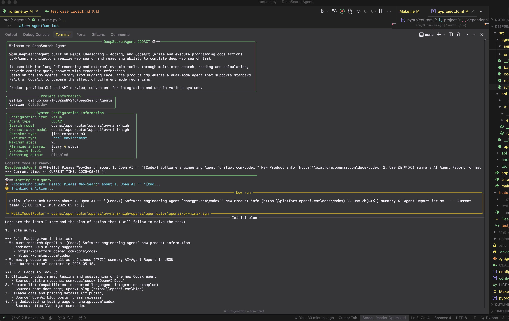
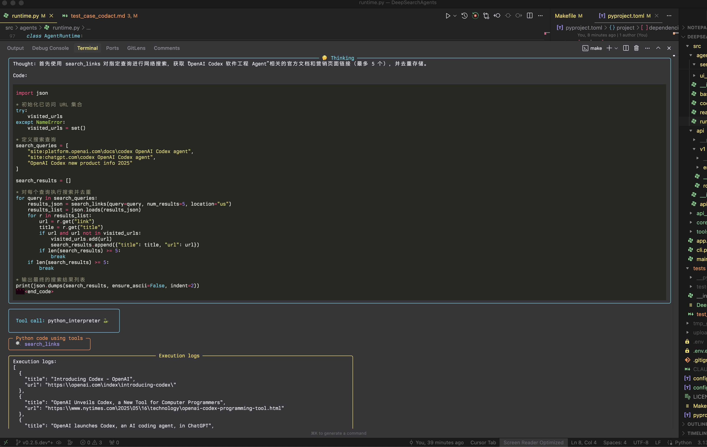

# DeepSearchAgents

🖖 与 💖 构建 | 人与 AI

<h2>

 

 

 🚅

 


[](https://github.com/astral-sh/uv)
[](https://opensource.org/licenses/MIT)
[](https://github.com/DeepSearch-AgentTeam/DeepSearchAgent/releases/tag/v0.3.3.dev)

[](https://deepwiki.com/lwyBZss8924d/DeepSearchAgents)

</h2>

> Come From Open Source, This is the Way

[EN](README.md)

文档更新日期: `2025-08-10`

[`v0.3.3.dev`] 开发状态: `"✅ 完成DSCA前端Alpha版本的开发与集成"`

## 1. 项目介绍 | Introduction

### 🚀 **CODE ACT IS ALL YOU NEED**


DeepSearchAgent 项目体现了 **代码即行动** 是 AI 智能体最强大范式的理念。通过将代码生成和执行作为与世界交互的主要手段，我们在自主系统中解锁了前所未有的灵活性和能力。

DeepSearchAgent 项目是一个基于 ReAct（Reasoning + Acting）推理行动框架和 CodeAct（"代码即行动" 的 AI专员）理念的AI专员系统，旨在以 DeepSearch 多步骤网络深度搜索的基础能力, 实现更广泛任务推理 & 执行的 "DeepResearch" `DR-Multi-Agent` 。它利用 AI 语言模型（LLM）的推理能力以及工具箱集合与 Python packges 沙盒的编程动作调用能力，能够通过多步深度搜索、多模态网页文本处理、阅读和多步骤推理处理既宽又深的复杂网络搜索任务，并提供可溯源的参考资料。该项目基于 Hugging Face 的 smolagents 框架，实现了既可以调用预定义工具箱又可以编写动作代码(实现了 "生成基于任务 Plan 的专用动态 DSL" & "AI 自我创造的动态一次性专用工具") 的双模式AI专员系统。

项目支持终端命令行运行的 CLI TUI界面, 标准的 FastAPI 服务，FastMCP MCP服务器，以及现代化的 WebTUI 前端界面。WebTUI (v0.3.3) 采用终端风格美学设计，提供实时 WebSocket 流式传输、赛博朋克风格设计系统，以及优化的性能表现，完美展示 CodeAct Agent 长程多步骤运行任务。方便广大开发者开发实验和在各种系统中集成和使用。是一个面向 VIBER 新手友好的 Code Agent 体验/学习和扩展的开源项目。

## 2. ✨ 特性 | Features

- 👻 **深度搜索任务能力**：通过多步搜索、阅读和推理过程，处理网络内容以回答复杂问题
- **DeepSearch 专员**：同时支持 CodeAct（Python 代码执行）模式与 ReAct（工具调用）模式，可在 `config.toml`（`src/core/config/settings.py`）中配置 Agent 运行时、语言模型和工具参数。
- 🪄 **可扩展工具箱**：内置网络搜索、内容获取、文本处理、语义排序、计算功能和 GitHub 仓库分析的工具集
- 🌐 **混合搜索引擎** (v0.3.1)：多提供商搜索聚合，支持 Google (Serper)、X.com、Jina AI 和 Exa Neural 搜索，具备智能去重和排序功能
- 🌐 **Web API v2 实时 WebSocket 流式传输** (v0.3.2)：简化的消息处理架构，用于 Web 前端集成，提供实时AI专员执行可见性
- 🔍 **文本嵌入与重排序**：使用 Jina AI 嵌入和重排序模型处理 URL Web 多模态内容
- 📚 **GitHub 仓库问答** (v0.3.1)：使用 DeepWiki MCP 的 AI 驱动仓库分析工具，用于理解 GitHub 项目
- 🐦 **X.com 深度检索** (v0.3.1)：使用 xAI Live Search API 的专用工具，用于搜索、读取和分析 X.com (Twitter) 内容
- 🧠 **周期性规划更新**: 在执行过程中实施战略性重评以优化搜索路径
- 🔄 **迭代优化**：AI专员自我优化基于初步发现持续改进搜索和分析策略, 并通过更新任务计划持续优化任务执行路径, 实现任务目标
- 💻 **多种开发调试和用户交互模式**：提供 CLI 命令行交互 & 标准的 FastAPI 服务 & Web GUI 前端服务
- 🔗 **可追溯引用**：为生成的答案提供来源和参考
- 📺 **流式输出**: 支持AI专员专员步骤和最终答案的实时流式传输，并提供富文本格式
- 🧮 **符号计算**：集成 WolframAlpha 符号计算引擎，支持数学和计算问题
- 📝 **JSON/Markdown 渲染**: 自动检测并以用户友好的格式呈现结构化输出
- 🤝 **分层多AI专员支持** (v0.2.9)：管理者AI专员模式可协调专业AI专员团队进行协作式问题解决
- ⚡ **并行工具执行** (v0.2.9)：多个并发工具调用以提高性能和效率
- 📊 **增强的执行指标** (v0.2.9)：RunResult 对象提供详细的执行元数据，包括令牌使用和时间
- 🔒 **改进的安全性** (v0.2.9)：应用了 smolagents v1.17.0-v1.19.0 的最新安全补丁
- 🧠 **结构化生成** (v0.2.9)：CodeAgent 的可选结构化输出提高了可靠性
- 🔄 **上下文管理器支持** (v0.2.9)：适当的资源清理生命周期以改善内存管理
- 💾 **增强的内存管理** (v0.2.9)：AI专员内存重置和摘要功能，适用于长时间运行的会话

**参考用例** (待更新 v0.3.1+)

*WebTUI Demo:*


<video src="public/DSCA-web-demo.mp4" controls="controls" style="max-width: 100%;">
</video>

- **CodeAct Mode Example**: Full CLI run showing multi-step deep search process.
  - Start:
    
  
  
  
  

  - FinalAnswer:
    

## 📝 To-Do List

1. [DONE] 开发 Web API v2 实时 WebSocket 流式传输 (v0.3.2) - 简化的AI专员事件处理架构，替代复杂的事件驱动系统（从约 5000 行减少到约 500 行）。前端开发和 Docker 封装待定；

2. [DONE] DeepSearchAgents 的 DeepSearchToolbox 增加 MCP Client/MCP tools HUB, 支持 MCP Tools 配置和调用;

3. [DONE] 提供封装 DeepSearchAgents 为 MCP 服务器, 提供 DeepSearchAgent MCP tools 服务;

4. [DONE] 支持多垂直搜索引擎源聚合（Google、X.com、Jina AI、Exa Neural）与混合搜索聚合和智能结果去重 (v0.3.1);

5. [DONE] 升级到 smolagents v1.19.0，支持分层AI专员管理、并行工具执行和增强的流式架构;

6. [DONE] 增加基于 `DeepWiki` Remote MCP tool，强化 `GitHub URLs` 垂直采集解析器，具备 GitHub 仓库问答能力 (v0.3.1);

7. [部分工具层已支持]深度搜索策略提供更多策略参数, 增加支持基于 Tokens 预算的策略参数;

8. [实验性版本测试中] 实现性增加 DeepSearchAgents 基于深度搜索蒙特卡洛搜索树策略的Agent Action 搜索宽度&深度辅助方法和工具以及策略控制参数;

9. [TODO] LLM as Judge: 实验性增加 DeepSearchAgents 的 Agent Runs 评估器(独立评估DeepSearchAgents 的 深度搜索路径&结果评估Agent);

10. [TODO] 增加 Agent 持久化记忆层功能 & 给用户提供持久化搜索记录;

11. 添加适合的开源沙盒(E2B-like)适配 code_sandbox Docker 自动化配置, 增加更多远程 code_sandbox 安全环境 SDK支持;

12. 集成全流程 Agent Runs 遥测适配("OpenTelemetry" & Langfuse) (与 Docker 打包版本一起集成);

13. [TODO] Human-in-the-loop & Agent Runs 多路径分支回溯功能;


14. [实验中] 基于特殊 tokens 协议的 multi_agent_HiRA (Hierarchical Reasoning Framework for Deep Search) 特殊实现版本(`arXiv-2507.02652v1`);

15. [实验中] 增加基于 [`submodular-optimization`]("子模优化算法") 的 agent omini-tools-query pipeline 的辅助方法优化各种外部查询工具使用时的 reQuery 查询效果, 辅助方法 pipeline 利用"子模优化算法"优化查询选择, 生成多样化的工具搜素查询输入并进行效果评估, 返回 ReAct Agent action callback 帮助 Agent 观察查询结果优化效果以在下一轮 Action 持续迭代抵近 Steps Action 的检索目标。(https://jina.ai/news/submodular-optimization-for-diverse-query-generation-in-deepresearch/)

## 3. 🚀 快速开始 (CLI, FastAPI) | Quick Start

本节将指导您设置环境、安装依赖项，并通过命令行界面或标准 FastAPI 服务运行 DeepSearchAgent。

### 安装与配置 | Installation & Setup

1.  **先决条件:**
    *   Python 3.13+。
    *   `uv` (推荐，pip/venv 的更快替代品): [安装 uv](https://github.com/astral-sh/uv)。
    *   Git。

2.  **克隆代码库:**

    ```bash
    git clone https://github.com/DeepSearch-AgentTeam/DeepSearchAgent.git
    cd DeepSearchAgent
    ```

3.  **创建虚拟环境 (推荐):**

    ```bash
    # 使用 uv
    uv venv
    source .venv/bin/activate  # Unix/macOS 系统
    # .venv\Scripts\activate   # Windows 系统

    # 或使用标准 venv
    # python -m venv .venv
    # source .venv/bin/activate  # Unix/macOS 系统
    # .venv\Scripts\activate   # Windows 系统
    ```

4.  **安装依赖项:**

    *   **用于运行 FastAPI 服务:**

        ```bash
        uv pip install .
        ```

    *   **用于运行 CLI 或进行开发:**

        ```bash
        # 以可编辑模式安装核心 + CLI 依赖 + 开发工具
        uv pip install -e ".[cli]"
        ```

    *   **用于开发:**

        ```bash
        uv pip install -e ".[dev,test,cli]"
        ```

5.  **配置:**

    ```bash
    # 从模板创建配置文件
    cp config.template.toml config.toml
    cp .env.template .env

    # 编辑 config.toml 配置模型、AI专员参数、服务设置
    # nano config.toml

    # 编辑 .env 添加 API 密钥 (LITELLM_MASTER_KEY, SERPER_API_KEY 等)
    # nano .env
    ```

**配置详情:**
*   `config.toml`：包含非敏感配置，如模型 ID、AI专员参数（最大步骤数、执行器类型）、服务设置（主机、端口）等。详见 `config.template.toml` 文件

*   `.env`：仅包含敏感 API 密钥（例如 `LITELLM_MASTER_KEY`、`SERPER_API_KEY`、`JINA_API_KEY`、`WOLFRAM_ALPHA_APP_ID`）。

### (1) 运行 CLI 调试台 | Running the CLI console

确保您已安装 CLI 依赖项 (参见 安装与配置 第 4 步)。

```bash
# 运行 CLI（交互模式，使用 config.toml 中的设置）
make cli
# 或直接使用:
uv run python -m src.agents.cli

# 使用特定AI专员模式运行
python -m src.cli --agent-type react    # ReAct DeepSearch AI专员模式(基准对照组 TollCalling 模式)
python -m src.cli --agent-type codact   # CodeAct DeepSearch AI专员模式
python -m src.cli --agent-type manager  # 主管 multi-agent 模式 (v0.2.9)

# 主管 multi-agent 模式与研究团队
python -m src.cli --agent-type manager --team research
```

CLI 参数将覆盖 `config.toml` 中定义的设置。

### (2) 运行 FastAPI 服务 | Running the FastAPI Service

确保您已安装核心依赖项 (参见 安装与配置 第 4 步)。

```bash
# 启动主 API 服务器（使用 config.toml 中的 host/port，例如 http://0.0.0.0:8000）
make run
# 或直接使用:
uv run -- uvicorn src.agents.main:app --reload
# 注意：--host 和 --port 现在通过 main.py 从 config.toml 获取
# 使用 LOG_LEVEL 环境变量设置日志级别（例如 LOG_LEVEL=debug make run）
```

**API 端口**：

* `POST /run_codact_agent`：运行 CodeAct DeepSearch AI专员。
* `POST /run_deepsearch_agent`：运行由 `config.toml` 中 `service.deepsearch_agent_mode`（或 `DEEPSEARCH_AGENT_MODE` 环境变量）配置的AI专员。
* `GET /`：API 信息和健康检查。

向配置的深度搜索 REST API 端口发送 API 请求示例：

```bash
curl -X POST http://localhost:8000/run_deepsearch_agent \
  -H "Content-Type: application/json" \
  -d '{"user_input": "搜索关于OpenAI的GPT-4.1 API的最新消息。"}'
```

*（如果 `config.toml` 中的主机和端口已更改，请将 `localhost:8000` 替换为实际值）*

### (3) 使用 Web API v2 | Using the Web API v2

Web API v2 提供实时 WebSocket 流式传输，用于 Web 前端集成。这次重大重构（v0.3.2）提供了一个清晰、可维护的架构，通过 `web_ui.py` 模块直接处理AI专员事件。

**架构概览：**
```
Agent (React/CodeAct) → stream_agent_messages() → DSAgentMessageProcessor → WebSocket → 前端
```

**核心特性：**
- **直接事件处理**：处理来自 smolagents 的 4 种主要事件类型：
  - `PlanningStep`：AI专员规划与策略更新
  - `ActionStep`：工具执行包含思考和结果
  - `FinalAnswerStep`：结构化最终答案
  - `ChatMessageStreamDelta`：实时流式更新
- **元数据驱动路由**：通过消息元数据选择前端组件
- **实时流式传输**：实时观察AI专员推理、工具执行和结果
- **会话管理**：支持多轮对话的会话隔离
- **组件路由**：根据内容将消息路由到聊天、代码编辑器或终端

*后端 WebAPI WebSocket 事件：*
  - **直接事件处理**：处理来自 DeepSearchAgent 后端 WebAPI 的4种主要事件类型：
  - `PlanningStep`：代理规划及策略更新
  - `ActionStep`：工具执行，包含思考过程和结果
  - `FinalAnswerStep`：结构化最终答案
  - `ChatMessageStreamDelta`：实时流式更新
  - **基于元数据的路由**：通过消息元数据选择前端组件
  - **会话管理**：多轮对话与会话隔离
  - **组件路由**：根据内容将消息路由至聊天、WebIDE或终端

**快速开始：**
```javascript
// 连接到 WebSocket
const ws = new WebSocket('ws://localhost:8000/api/v2/ws/my-session?agent_type=codact');

// 基于组件路由处理传入消息
ws.onmessage = (event) => {
  const message = JSON.parse(event.data);
  
  // 基于元数据路由
  if (message.metadata?.component === 'chat') {
    // 在聊天中显示（规划、思考、最终答案）
  } else if (message.metadata?.component === 'webide') {
    // 在代码编辑器中显示（Python 执行）
  } else if (message.metadata?.component === 'terminal') {
    // 在终端中显示（工具输出、日志）
  }
};

// 发送查询
ws.send(JSON.stringify({type: 'query', query: '您的问题'}));
```

**消息格式：**
- 每个 `DSAgentRunMessage` 包含路由元数据
- 消息类型：planning_header、action_thought、tool_call、final_answer 等
- 支持初始 → 增量 → 最终的流式模式

请参阅 `src/api/v2/README.md` 获取完整文档，`src/api/v2/STREAM_EVENTS.md` 了解事件流详情，以及 `src/api/v2/examples/` 中的示例实现。

### (4) 运行 MCP 服务 (MCP Tools `deepsearch_tool`) | Running the MCP Server (MCP Tools `deepsearch_tool`)

DeepSearchAgent 现在支持作为模型上下文协议（MCP）服务器，暴露深度搜索功能作为一个 MCP 工具 `deepsearch_tool`，可以被任何 MCP 客户端访问。

```bash
# Run the FastMCP server with default settings
python -m src.agents.servers.run_fastmcp
# or
python -m src.agents.servers.run_fastmcp --agent-type codact --port 8100
```

该命令会启动一个 FastMCP 服务器，使用 Streamable HTTP 传输，地址为 `http://localhost:8100/mcp`（默认），通过 `deepsearch_tool` 端点提供对 DeepSearchAgent 功能的访问。

**服务器参数：**

* `--agent-type`：要使用的深度搜索任务的AI专员类型（`codact` 或 `react`，默认：`codact`）
* `--port`：服务器端口号（默认：`8100`）
* `--host`：主机地址（默认：`0.0.0.0`）
* `--debug`：启用调试日志
* `--path`：自定义 URL 路径（默认：`/mcp`）

**使用 MCP Inspector 进行调试：**

可以使用 MCP Inspector 来调试和交互 DeepSearchAgent MCP 服务器：

1. 如果还没有安装 MCP Inspector，请先安装：
建议也可以选择使用[MCPJam-Inspector](https://github.com/MCPJam/inspector) 分叉增强版本的 MCP Inspector 客户端开发调试控制台:

```bash
npm install -g @modelcontextprotocol/inspector
```

2. 启动 MCP Inspector MCP 客户端开发调试控制台：

```bash
npx @modelcontextprotocol/inspector
```

3. 请在打开的浏览器界面中（通常在 `http://127.0.0.1:6274`）：

  * 设置传输类型：`Streamable HTTP`
  * 设置 URL：`http://localhost:8100/mcp`
  * 点击"Connect"
  * 转到"工具"标签并选择"deepsearch_tool"
  * 输入您的搜索查询并点击"Run Tool"按钮

4. 您将会看到实时的进度更新和最终的搜索结果在 MCP Inspector 调试台网页界面中呈现。

**FastMCP 服务器在 FastAPI 应用中：**

您也可以将 FastMCP 服务器嵌入到主 FastAPI 应用中：

```bash
# 启动运行主 API 服务器并启用 FastMCP 集成
python -m src.main --enable-fastmcp --agent-type codact
```

当使用 `--enable-fastmcp` 运行时，主 API 服务器会在 `/mcp-server`（默认）挂载 FastMCP 服务器进行集成操作。

### (5) 前端开发快速入门 | Frontend Development Quick Start

DeepSearchAgents 包含一个使用 Next.js 构建的现代 Web 前端，通过 Web API v2 提供丰富的AI专员交互界面。

**技术栈：**
- **框架**：Next.js 15.3.3 with App Router
- **UI 库**：React 19 with TypeScript
- **样式**：TailwindCSS 与自定义设计令牌
- **组件**：Radix UI 原语、Monaco Editor、XTerm.js
- **实时通信**：带自动重连的 WebSocket
- **渲染**：带语法高亮的 React Markdown

**设置前端开发环境：**

```bash
# 进入前端目录
cd frontend

# 安装依赖
npm install
# 或
yarn install

# 创建环境变量
cp .env.example .env.local

# 编辑 .env.local 设置后端 URL
# NEXT_PUBLIC_API_URL=http://localhost:8000
# NEXT_PUBLIC_WS_URL=ws://localhost:8000
```

**开发命令：**

```bash
# 启动开发服务器 (http://localhost:3000)
npm run dev

# 构建生产版本
npm run build

# 运行生产服务器
npm run start

# 运行代码检查
npm run lint
```

**主要前端功能：**
- **基于组件的路由**：消息自动路由到适当的 UI 组件
- **实时流式传输**：实时查看AI专员思考、动作和结果
- **丰富的 UI 组件**：
  - `AgentChat`：主聊天界面，支持消息分组
  - `ActionThoughtCard`：显示AI专员推理（截断至 60 字符）
  - `PlanningCard`：显示带徽章的规划步骤
  - `FinalAnswerDisplay`：结构化最终答案渲染
  - Python 执行的代码编辑器
  - 工具输出的终端
- **会话管理**：持久会话与对话历史
- **响应式设计**：针对桌面和移动设备优化

**前端集成示例：**

```typescript
// 使用 WebSocket hook
import { useWebSocket } from '@/hooks/use-websocket';

function MyComponent() {
  const { messages, sendMessage, isConnected } = useWebSocket({
    sessionId: 'my-session',
    agentType: 'codact'
  });

  const handleQuery = () => {
    sendMessage({
      type: 'query',
      query: '搜索最新的 AI 发展动态'
    });
  };

  return (
    <div>
      {messages.map(msg => (
        <AgentChat key={msg.message_id} message={msg} />
      ))}
    </div>
  );
}
```

请参阅 `frontend/README-DeepSearchAgents.md` 获取完整的前端文档和开发指南。

## 4. 🛠️ 架构与模块 | Architecture and Modules

核心系统架构包括：

1. **核心AI专员模块（`src/agents/react_agent.py`，`src/agents/codact_agent.py`，`src/agents/manager_agent.py`）**：基于 `smolagents` 实现 ReAct、CodeAct 和 Manager 代理逻辑。Manager 代理（v0.2.9）协调专业AI专员团队进行协作式问题解决。
2. **AI专员核心运行时模块（`src/agents/runtime.py`）**：负责管理AI专员的运行时环境，包括层级式AI专员编排。
3. **AI专员工具包集合（`src/tools/`）**：供AI专员调用的功能，如网页搜索、读取 URL 等。
4. **FastAPI 服务（`src/api`）**：提供 REST API 相关服务的 FastAPI 服务。
5. **命令行界面（CLI）（`src/cli.py`）**：提供带有丰富格式化的交互式命令行界面。
6. **Web API v2 （ `src/api/v2/`)** ：实时 WebSocket API，通过 `web_ui.py` 和 `DSAgentMessageProcessor` 直接处理代理事件，将 smolagents 事件转换为富含元数据的信息，用于前端组件路由。
7. **MCP 服务器（ `src/agents/servers/run_fastmcp.py`)** ：FastMCP 服务器，提供带流传输功能的 MCP 工具服务。

### Web API v2 架构（v0.3.2.rc2）

Web API v2 采用简化架构，直接处理 AI 专员长程多步骤运行任务事件：

**事件处理流程：**

```

smolagents 事件 → web_ui.py → DSAgentMessageProcessor → WebSocket → 前端组件

```

**关键组件：**

- **`web_ui.py`**：核心事件处理器，处理来自 smolagents 的4种主要事件类型

- **`DSAgentMessageProcessor`**：将已处理的事件封装为 DSAgentRunMessage 格式

- **会话管理器**：支持多会话及代理生命周期管理

- **WebSocket 端点**：通过丰富的元数据流式传输消息以供前端路由使用

**事件类型映射关系：**

- **PlanningStep（规划步骤 [初始化计划&周期性规划]）** → 多条消息: planning_header、planning_content、planning_footer

- **ActionStep（执行步骤 [执行步骤思考&执行动作代码生成&沙盒代码执行与观察]）** → 多条消息: action_header、action_thought、tool_call、execution_logs

- **FinalAnswerStep（最终答案步骤[DS报告结构化输出]）** → final_answer，包含结构化数据

- **ChatMessageStreamDelta（聊天消息流增量）** → 用于实时更新的流式增量

*架构图已更新至版本 `v0.3.2`*

详见 [docs/architecture-diagram/architecture-diagram-v0.3.2.rc2.mmd](docs/architecture-diagram/architecture-diagram-v0.3.2.rc2.mmd) 获取最新架构图细节。


## 5. ⚙️ AI 专员模式 (ToolCalling ReAct vs CodeAct) | Agent Modes

DeepSearchAgent 支持两种AI专员工作模式 CodeAct 代码执行模式 和用于实验对照的 ReAct 普通工具调用模式。`/run_deepsearch_agent` 端点使用的默认模式由 `config.toml`（`service.deepsearch_agent_mode`）或 `DEEPSEARCH_AGENT_MODE` 环境变量配置。

现在两种模式都支持流式输出，可以实时查看AI专员的推理和执行过程。

### CodeAct 模式（代码执行）| CodeAct Mode (Code Execution)

在 CodeAct 模式下，AI专员产生可执行的 Python 代码，并通过运行代码来完成推理和动作。这使它能够处理更复杂的操作，将多个步骤组合到一次代码执行中。

**示例格式：**

```python
results = search_links("示例查询")
content = read_url(results[0]["link"])
final_answer("结果是...")
```

### ReAct 基准(函数调用工具)对照模式 | ReAct (Function Calling Tool) Baseline Mode

在 ReAct 模式下，AI专员以经典的推理+行动方式运行，动作以调用预定义工具的形式执行。在推理过程中，LLM 会生成结构化的"行动"输出，指明要使用的工具及其参数。

**示例格式：**

```json
{
  "name": "search_links",
  "arguments": {
    "query": "示例查询"
  }
}
```

### 对比与使用场景 | Comparison and Use Cases

| 差异 | ToolCalling ReAct 模式 | CodeAct 模式 |
|-------------|------------|--------------|
| **动作表示** | 结构化 JSON 指令 | 可执行 Python 代码 |
| **复杂操作能力** | 需要多个步骤完成复杂逻辑 | 可以使用编程结构组合多个步骤 |
| **模型要求** | 通用对话能力 | 需要代码生成能力 |
| **调试与可解释性** | 易读的思考和动作记录 | 代码追踪与错误反馈 |
| **最适合** | 简单查询，固定工作流 | 复杂任务，灵活工具编排 |
| **流式支持** | 支持 | 支持 |
| **规划能力** | 每 N 步周期性规划 | 每 N 步周期性规划 |

### 主管 multi-agent 模式（分层多AI专员）- v0.2.9

管理者模式引入了分层AI专员协调，其中管理者AI专员协调一组专业AI专员来协作解决复杂问题。

**架构：**

- **主管**：分解复杂查询的高级协调器
- **专业AI专员**：具有特定专长的团队成员（ReAct 或 CodeAct）
- **委派逻辑**：主管将子任务分配给最合适的AI专员

**研究团队配置：**

默认研究团队包括：
1. **网络研究专家**（ReAct AI专员）：专注于网络搜索、内容检索和信息收集
2. **数据分析专家**（CodeAct AI专员）：处理数据处理、计算和综合

**示例用法：**

```bash
# CLI 与研究团队
python -m src.cli --agent-type manager --team research

# 自定义团队配置
python -m src.cli --agent-type manager --team custom --managed-agents react codact
```

**优势：**

- **协作式问题解决**：不同的AI专员处理其专业领域
- **提高准确性**：结合不同AI专员范式的优势
- **可扩展性**：易于向团队添加新的专业AI专员
- **任务并行化**：管理者可以同时委派多个子任务

| 功能 | 管理者模式 |
|------|------------|
| **AI专员协调** | 分层委派给专业AI专员 |
| **复杂查询处理** | 将任务分解为团队成员的子任务 |
| **模型需求** | 协调 + 专业AI专员能力 |
| **最适合** | 多方面研究、比较分析、复杂工作流 |
| **团队组成** | 可配置的 ReAct/CodeAct AI专员团队 |

## 6. 工具箱和工具链 | 🔧 Agent Toolbox Chain

DeepSearchAgent 拥有一套可扩展的工具链，用于辅助AI专员检索和处理信息。各工具相互配合，形成完整的查询解答流程：

### 搜索与发现工具

- **`search_links`（搜索链接）**: 接受查询字符串，调用外部搜索引擎 API 获取包含标题、摘要和 URL 的网页结果列表。**v0.3.1 增强**：现在支持混合搜索与多个提供商：
  - **Serper API（谷歌）**：传统网络搜索，提供全面覆盖
  - **X.com（xAI API）**：来自 X.com/Twitter 的实时社交媒体内容，具备实时数据访问能力
  - **Jina AI 搜索**：具有高级内容提取的 LLM 优化搜索
  - **Exa Neural 搜索**：具有神经理解的语义搜索
  - **混合聚合**：跨所有提供商的智能去重和排序
  - **自动检测**：根据查询内容自动选择合适的搜索引擎
- **`search_fast`** (v0.3.1)：用于速度关键操作的优化搜索工具
- **`github_repo_qa`** (v0.3.1)：使用 DeepWiki MCP 的 AI 驱动 GitHub 仓库分析

### 内容获取与处理工具

- **`read_url`（读取 URL）**: 从标准网页获取 HTML 内容并提取格式化文本进行分析。**v0.3.1 增强**，具有模块化抓取架构：
  - **自动提供商选择**：根据 URL 和可用性选择最佳抓取器
  - **JinaReader**：LLM 优化的内容提取
  - **Firecrawl**：高级 JavaScript 渲染支持
  - **回退机制**：提供商之间的自动故障转移
- **`xcom_read_url`（X.com URL 读取）**: 使用 xAI 的 Live Search API 专门读取 X.com（Twitter）内容的工具。为帖子、个人资料和搜索结果提供实时访问。
- **`xcom_qa`** (v0.3.1)：用于 X.com 内容分析的深度问答工具，支持搜索、读取和查询操作
- **`chunk_text`（文本分段）**: 使用智能分段将长文本拆分为便于详细分析的小段。
- **`embed_texts`（文本嵌入）**: 将文本段编码为向量表示，用于语义相似度操作。
- **`rerank_texts`（文本重排）**: 根据查询对文本段进行相关性排序，找出最相关信息。

### 计算 & 科学查询工具

- **`wolfram`（计算引擎）**: 调用 WolframAlpha API 处理数学计算或科学查询。

### 结构化输出工具

- **`final_answer`（最终答案）**: 表示AI专员已得出结论，使用结构化输出 & 终止推理循环。

### 工具箱管理系统

`toolbox.py` 模块为管理 DeepSearchAgent 工具提供统一接口：

- **工具注册表**：用于所有内置和外部工具的集中注册系统
- **工厂方法**：具备正确 API 密钥配置的自动化工具实例化
- **扩展支持**：与 Hugging Face Hub 集合和 MCP（模型上下文协议）服务器集成
- **配置加载**：基于 `config.toml` 设置的自动工具加载

#### 工具箱功能特性

```python
# 使用特定工具创建工具集合
toolbox.create_tool_collection(
    api_keys=api_keys,
    tool_names=["search_links", "read_url", "xcom_read_url"],
    verbose=True
)

# 从 Hub 集合加载工具
toolbox.load_from_hub("collection_slug", trust_remote_code=True)

# 从 MCP 服务器加载工具
with toolbox.load_from_mcp(server_params, trust_remote_code=True):
    # 使用来自 MCP 服务器的工具
    pass
```

### 增强搜索工作流任务推理提示词引导模板 | Enhanced Search Workflow Task Reasoning Prompting Template

在典型的 v0.3.1 增强序列中：

1. **混合增强搜索**：AI专员使用 `search_links`，它自动检测查询是否与 X.com 内容相关（提及 @用户名、话题标签、热门话题）并路由到合适的搜索引擎
2. **内容解析**：根据来源，使用 `read_url` 处理标准网页内容，或使用 `xcom_read_url` 处理 X.com 内容
3. **内容处理流水线**：对于复杂内容，使用 `chunk_text`、`embed_texts` 和 `rerank_texts` 识别关键段落
4. **计算分析**：当需要计算时，调用 `wolfram` 进行数学分析
5. **最终答案**：这个循环会持续直到AI专员确定已有足够信息调用 `final_answer`

### 多源AI专员协同搜索

增强的工具链现在提供：

- **混合搜索能力**：传统网络搜索、实时社交媒体、语义搜索和代码库分析
- **自适应解析**：针对不同内容类型的不同提取策略和 Pipeline 解析工具
- **统一接口**：无论底层数据源如何，都提供一致的工具调用
- **实时数据**：通过 xAI 集成访问实时社交媒体内容
- **代码仓库理解**：通过 DeepWiki 集成的 AI 驱动代码仓库分析

## 7. 💡 理论基础 | Theoretical Foundations

### CodeAct 可执行代码AI专员 | CodeAct Executable Code Agents

CodeAct 指的是让AI专员以代码形式生成并执行动作的方法。核心思想是在每个决策步骤，模型直接产出可执行的代码，通过运行代码来调用工具或执行计算。

与静态指令相比，代码作为行动表示具有更强的表达能力和灵活性：它可以组合多个工具调用，使用编程逻辑处理复杂数据结构，甚至重用先前定义的函数，极大地扩展了AI专员的行动空间。

### 周期性规划与自适应搜索 | Periodic Planning and Adaptive Search

AI专员模式实现了周期性规划间隔，允许AI专员每 N 步重新评估其策略。这通过以下方式实现更有效的搜索路径：

- 评估相对于原始任务的进展
- 识别信息收集中的差距
- 根据已发现的内容调整搜索方向
- 当当前途径效果不佳时，优先考虑新的搜索途径

### 参考文献 | References

> - [ReAct: Synergizing Reasoning and Acting in Language Models](https://react-lm.github.io/) `arXiv:2210.03629v3`
> - [Executable Code Actions Elicit Better LLM Agents](https://arxiv.org/html/2402.01030v4) `arXiv:2402.01030v4`
> - [DynaSaur: Large Language Agents Beyond Predefined Actions](https://arxiv.org/html/2411.01747v1) `arXiv:2411.01747v1`
> - [LLMCompiler: An LLM Compiler for Parallel Function Calling](https://arxiv.org/abs/2312.04511v3) `arXiv:2312.04511v3`
> - [ReWOO: Decoupling Reasoning from Observations for Efficient Augmented Language Models](https://arxiv.org/abs/2305.18323) `arXiv:2305.18323v1`
> - [smolagents.agents.CodeAgent](https://github.com/huggingface/smolagents/blob/7983378593da4b393a95335aad8431f6c9d2ac23/src/smolagents/agents.py)
> - [Jina AI DeepResearch repository](https://github.com/jina-ai/node-DeepResearch)
> - [A Practical Guide to Implementing DeepSearch/DeepResearch](https://jina.ai/news/a-practical-guide-to-implementing-deepsearch-deepresearch/)

## 8. 📦 安装 | Installation

### 要求 | Requirements

- Python 3.13+
- 从 `config.template.toml` 创建 `config.toml` 并自定义参数。
- 从 `.env.template` 创建 `.env` 并添加所需的 API 密钥：
  - `LITELLM_MASTER_KEY`（如果使用兼容 LiteLLM 的模型）
  - `SERPER_API_KEY`（通过 `search_links` 进行网络搜索）
  - `JINA_API_KEY`（通过 `read_url`、`embed_texts`、`rerank_texts` 进行内容处理）
  - `WOLFRAM_ALPHA_APP_ID`（可选，通过 `wolfram` 进行计算查询）
  - `LITELLM_BASE_URL`（可选，如果使用自定义 LiteLLM 端点）
  - 等其他 Agent Tools 所需 APIKEY

## 9. 🤝 贡献 | Contributing

欢迎贡献！请随时提交 Pull Request。

## 10. 📄 许可证 | License

本项目使用 MIT 许可证

## 11. 📝 致谢 | Acknowledgements 开源项目

特别感谢以下开源项目(以及未列出但同样重要的项目)，`愿原力与你同在`：

- [Hugging Face](https://huggingface.co/) 🤗
- [smolagents](https://github.com/huggingface/smolagents)
- [Litellm](https://github.com/BerriAI/litellm) 🚅
- [FastAPI](https://github.com/tiangolo/fastapi)
- [Jina AI](https://github.com/jina-ai)
- [Langchain](https://github.com/langchain-ai/langchain)
- [DeepWiki MCP](https://docs.devin.ai/work-with-devin/deepwiki-mcp)

## 12. 👨‍💻 AI Coder 结对辅助开发 & 🖖 VIBE 编程最佳实践分享

DeepSearchAgent 项目在设计时考虑了现代 AI 工程师与人类工程师协作程序开发&编码的工作流程。我们已经整合了特殊的仓库工作区规则文件(`.cursor/rules/*.mdc`)，以促进 AI 辅助开发并确保代码库的一致性。

### `.cursor/rules/`(`.mdc`) 等价于

- `CLAUDE.md`: `Claude Code` Prompting markdown file.
- `AGENTS.md`: `Codex CLI` & `Codex` Software engineering Agent, Prompting markdown file.

### 使用 `.cursor/rules/` 文件

本仓库在 `.cursor/rules/` & `CLAUDE.md` 目录中包含特殊的 Markdown 文件，作为人类开发者和 AI 编码助手的上下文指南提示词。这些文件类似于 [Claude Code 最佳实践](docs/VIBE/claude-code-best-practices.md) 中描述的 `CLAUDE.md` 概念，提供了关于项目架构、组件和约定的结构化信息。

> VIBE 编程最佳实践参考:
> - [claude-code-best-practices](https://www.anthropic.com/engineering/claude-code-best-practices)
> - [vibe-coding-higher-quality-code](https://www.all-hands.dev/blog/vibe-coding-higher-quality-code)
> - [Coding Agents 101: The Art of Actually Getting Things Done](https://devin.ai/agents101#introduction)

#### 可用的规则文件

- `CLAUDE.md`: `Claude Code` 规则 & 记忆文件.

- **agent-architecture.mdc**: 记录了AI专员设计模式（ReAct、CodeAct 和管理者）及功能

- **configuration.mdc**: 详细说明了定制化的配置系统选项

- **interfaces.mdc**: 描述了可用接口（CLI、FastAPI、MCP Tool Server）

- **jina-ai-api-rules.mdc**: 包含在代码库中使用 Jina AI 各种 API 的指南

- **periodic-planning.mdc**: 解释了用于战略重新评估的周期性规划功能

- **project-overview.mdc**: 提供全面的项目概述和结构

- **tools.mdc**: 记录了用于网络搜索、内容处理和分析的专用工具集合的功能

### 对开发者的好处

这些规则文件为人类开发者和 AI 工程师结对协作提供了：

1. **快速上手**: 可以帮助 AI 工程师迅速理解项目架构和设计决策
2. **一致性开发**: 确保代码遵循既定模式和约定
3. **AI 辅助开发**: 为 AI 工程师提供上下文，生成更准确和相关的代码
4. **代码即文档**: 使文档与代码紧密结合，易于访问

### AI 工程师协作最佳实践

在使用 AI 协助开发这个项目时，我们建议以下工作流程：

1. **了解规则**: 查看与您正在开发的组件相关的 `.cursor/rules/*.mdc` 文件
2. **引用特定规则**: 与 AI 工程师合作时，明确引用相关规则文件
3. **迭代改进**: 使用 AI 进行初始代码生成，然后根据项目约定完善解决方案
4. **复杂变更规划**: 对于复杂功能，在生成实现代码前让 AI 概述计划
5. **测试驱动方法!**: 对关键组件，使用 AI 工程师帮助在实现代码前编写测试!
6. **更新规则**: 引入重大变更时，更新相关规则文件

### 示例工作流

#### 探索代码库

与 AI 工程师结对探索代码库时，可以这样开始：

```bash
请帮我理解 DeepSearchAgent 架构。参考 .cursor/rules/project-overview.mdc 和 .cursor/rules/agent-architecture.mdc 获取详情。
```

#### 添加新功能

当向工具集合添加新工具时：

```bash
我需要添加一个用于 YouTube 视频分析的新工具。请按照 .cursor/rules/tools.mdc 中的模式和 .cursor/rules/python-code-style-pep8.mdc 中的代码风格帮我实现。
```

#### 更新配置

修改配置系统时：

```bash
我需要为深度搜索 Tokens预算&索引深度添加新的配置选项。请根据 .cursor/rules/configuration.mdc 建议如何扩展配置结构。
```

### 贡献规则

随着项目的发展，我们鼓励贡献者更新和扩展这些规则文件。如果您添加了新的主要组件或更改了现有架构，请更新相关的 `.mdc` 文件以反映这些变化。这有助于将文档维护为准确反映代码库当前状态的活跃资源。

## 13. 项目结构 | Project Structure

```tree
src/
├── agents/                   # AI专员实现和核心逻辑
│   ├── prompt_templates/     # 模块化提示模板系统
│   │   ├── __init__.py
│   │   ├── codact_prompts.py # CodeAct AI专员提示和模板
│   │   └── react_prompts.py  # ReAct AI专员提示和模板
│   ├── servers/              # 服务器实现
│   │   ├── __init__.py
│   │   ├── run_fastmcp.py    # FastMCP MCP 服务器实现
│   │   └── run_fastmcp.py    # FastMCP MCP 服务器
│   ├── ui_common/            # 共享 UI 组件和工具
│   │   ├── __init__.py
│   │   ├── agent_step_callback.py     # AI专员执行步骤回调
│   │   ├── console_formatter.py       # 控制台输出格式化
│   │   ├── constants.py               # UI 相关常量
│   │   └── streaming_formatter.py     # 流式输出格式化器 (v0.2.9)
│   ├── __init__.py
│   ├── base_agent.py         # 基础AI专员接口和通用功能
│   ├── codact_agent.py       # CodeAct AI专员实现
│   ├── manager_agent.py      # 管理者AI专员实现 (v0.2.9)
│   ├── react_agent.py        # ReAct AI专员实现
│   ├── run_result.py         # AI专员运行结果对象 (v0.2.9)
│   ├── runtime.py            # AI专员运行时管理器
│   └── stream_aggregator.py  # 流聚合逻辑 (v0.2.9)
├── api/                      # FastAPI 服务组件
│   ├── v1/                   # API 版本 1 实现
│   │   ├── endpoints/        # API 端点定义
│   │   │   ├── __init__.py
│   │   │   ├── agent.py      # AI专员相关端点
│   │   │   └── health.py     # 健康检查端点
│   │   ├── __init__.py
│   │   └── router.py         # API 路由配置
│   ├── v2/                   # API 版本 2 (v0.3.2) - WebSocket 流式传输
│   │   ├── examples/         # 客户端示例实现
│   │   │   ├── test_agent_steps_full.js  # WebSocket 流式测试
│   │   │   ├── test_debug.py             # 直接处理器测试
│   │   │   └── test_simple_agent.py      # AI专员集成示例
│   │   ├── __init__.py
│   │   ├── endpoints.py      # WebSocket 和 REST 端点
│   │   ├── web_ui.py         # 核心事件处理和路由
│   │   ├── ds_agent_message_processor.py  # 消息处理器包装
│   │   ├── main.py           # 独立 API 服务器
│   │   ├── models.py         # Pydantic 数据模型
│   │   ├── openapi.yaml      # OpenAPI 规范
│   │   ├── README.md         # 完整的 v2 文档
│   │   ├── STREAM_EVENTS.md  # 事件流文档
│   │   ├── session.py        # 会话管理
│   │   └── WebAPIv2-GUI-Interface-API-Docs.md  # 前端集成指南
│   ├── __init__.py
│   └── api.py                # 主 API 配置
├── core/                     # 核心系统组件
│   ├── chunk/                # 文本分块组件
│   │   └── segmenter.py      # 文本分块器
│   ├── config/               # 配置处理
│   │   ├── __init__.py
│   │   └── settings.py       # 设置管理和配置加载
│   ├── ranking/              # 内容排序和嵌入
│   │   ├── __init__.py
│   │   ├── base_ranker.py    # 基础排序接口
│   │   ├── chunker.py        # 文本分块工具
│   │   ├── jina_embedder.py  # Jina AI 词元嵌入器
│   │   └── jina_reranker.py  # Jina AI 重排序器
│   ├── scraping/             # 网页内容抓取 (v0.3.1 重构)
│   │   ├── __init__.py
│   │   ├── base.py           # 基础抓取器抽象
│   │   ├── result.py         # 抓取结果数据结构
│   │   ├── scrape_url.py     # 主抓取协调器
│   │   ├── scraper_firecrawl.py  # Firecrawl 抓取器
│   │   ├── scraper_jinareader.py # JinaReader 抓取器
│   │   ├── scraper_xcom.py   # X.com (Twitter) 专用抓取器
│   │   └── utils.py          # 抓取工具函数
│   ├── search_engines/       # 搜索引擎集成 (v0.3.1 扩展)
│   │   ├── utils/            # 搜索实用模块
│   │   │   ├── __init__.py
│   │   │   └── search_token_counter.py  # 令牌计数工具
│   │   ├── __init__.py
│   │   ├── base.py           # 搜索引擎基类
│   │   ├── search_exa.py     # Exa Search
│   │   ├── search_hybrid.py  # 混合搜索聚合器
│   │   ├── search_jina.py    # Jina AI Search
│   │   ├── search_serper.py  # Serper API (谷歌) 搜索引擎
│   │   ├── search_xcom.py    # X.com Search
│   │   └── search_xcom_sdk.py # X.com SDK
│   ├── github_toolkit/       # GitHub 集成工具 (v0.3.1)
│   │   ├── __init__.py
│   │   └── deepwiki.py       # DeepWiki 远程MCP 客户端包装器
│   ├── xcom_toolkit/         # X.com 工具包 (v0.3.1)
│   │   ├── __init__.py
│   │   └── xai_live_search.py # xAI Live Search 客户端
│   └── __init__.py
├── tools/                    #  Agent 工具集合 (v0.3.1 扩展)
│   ├── __init__.py
│   ├── chunk.py              # 文本分块工具
│   ├── embed.py              # 文本词元嵌入工具
│   ├── final_answer.py       # 最终答案格式化工具
│   ├── github_qa.py          # GitHub 仓库问答工具 (v0.3.1)
│   ├── readurl.py            # 通用 URL 内容读取工具
│   ├── rerank.py             # 内容重排序工具
│   ├── search.py             # 多引擎网络聚合搜索工具
│   ├── search_fast.py        # 快速搜索工具 (v0.3.1)
│   ├── search_helpers.py     # 搜索辅助工具 (v0.3.1)
│   ├── toolbox.py            # 工具管理和注册系统
│   ├── wolfram.py            # 符号计算工具
│   ├── xcom_qa.py            # X.com 深度问答工具 (v0.3.1)
│   └── xcom_readurl.py       # X.com (Twitter) URL 读取工具
├── cli.py                    # 命令行版本界面
└── main.py                   # FastAPI 主入口

frontend/                     # Next.js WebTUI 前端工程 (v0.3.3)

```
