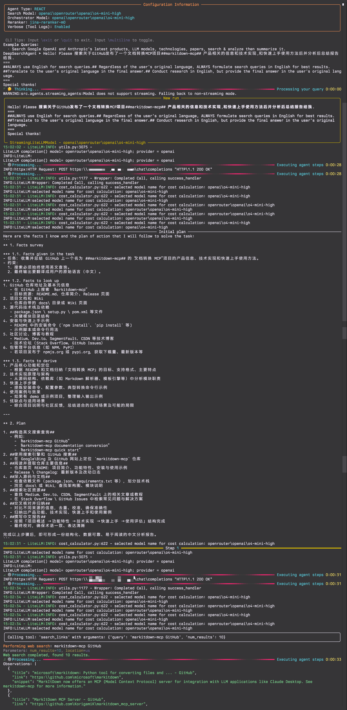
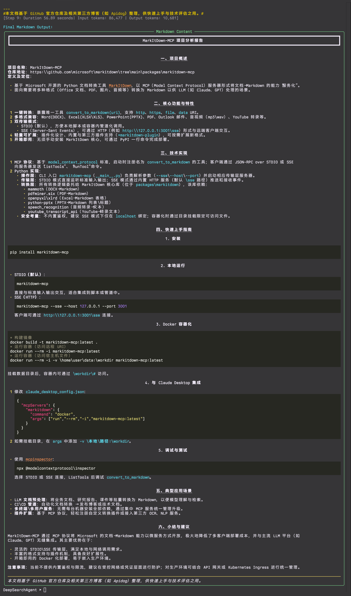
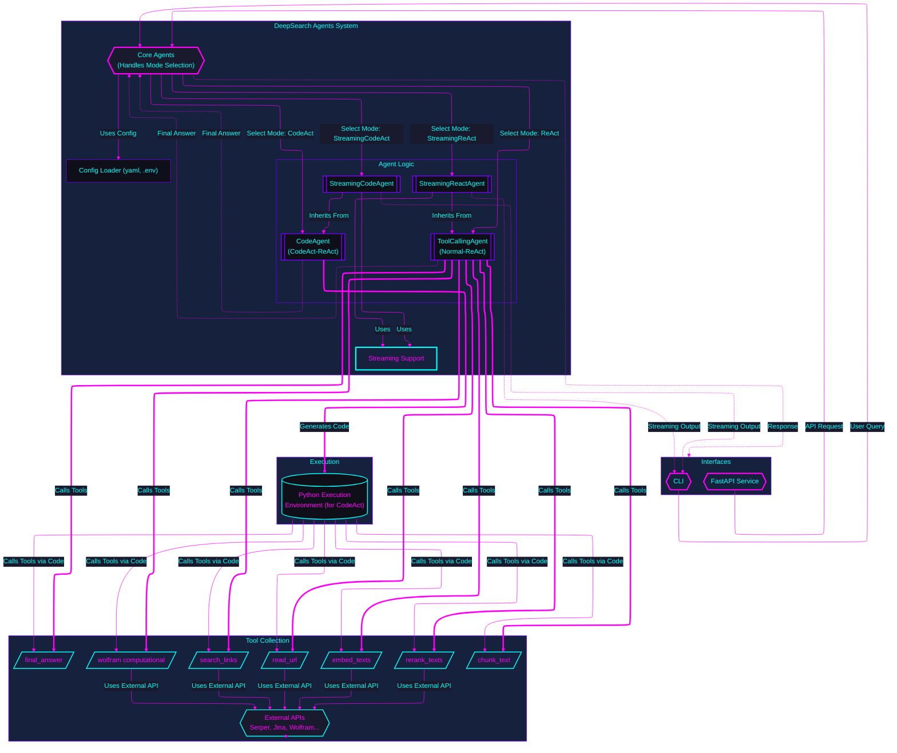

# DeepSearchAgent

与 💖 构建 | 人与 AI


[](https://github.com/astral-sh/uv)
[](https://opensource.org/licenses/MIT)
[](https://github.com/DeepSearch-AgentTeam/DeepSearchAgent/releases/tag/vv0.2.4.dev)

> 自开源 正是此道

[EN](README.md)

## 1. 项目介绍 | Introduction

DeepSearchAgent 项目是一个结合 ReAct（Reasoning + Acting）推理行动框架和 CodeAct（可执行代码式智能体）理念的智能体系统，旨在实现深度网络搜索与推理。它利用大型语言模型（LLM）的推理能力以及外部工具的调用能力，能够通过多步搜索、阅读和计算来回答复杂问题，并提供可溯源的参考资料。该项目基于 Hugging Face 的 smolagents 框架，实现了既可以调用预定义工具又可以执行代码的双模式智能体。

它支持命令行界面 (CLI) 和标准的 FastAPI 服务，方便开发者在各种系统中集成和使用。

## 2. ✨ 特性 | Features

- 🔍 **深度研究能力**：通过多步搜索、阅读和推理过程，处理网络内容以回答复杂问题
- 🧩 **双模式智能体**：同时支持 ReAct（工具调用）和 CodeAct（Python代码执行）模式，可通过 `config.yaml` 或环境变量配置
- 🔧 **可扩展工具链**：内置网络搜索、内容获取、文本处理、语义排序和计算功能的工具集
- ⚙️ **灵活配置**：通过 `config.yaml` 文件管理参数和通过 `.env` 管理 API 密钥
- 📊 **语义理解**：使用先进的嵌入和重排序技术来识别最相关的内容
- 🧮 **计算集成**：与 WolframAlpha 连接以解决数学和计算问题
- 🖥️ **多种接口**：提供丰富的命令行体验和标准的 FastAPI 服务
- 📝 **可追溯引用**：为生成的答案提供来源和参考
- 🔄 **迭代优化**：基于初步发现持续改进搜索和分析策略
- 📺 **流式输出**: 支持智能体步骤和最终答案的实时流式传输，并提供富文本格式
- 🔍 **JSON/Markdown 渲染**: 自动检测并以用户友好的格式呈现结构化输出
- 🧠 **周期性规划**: 在执行过程中实施战略性重评以优化搜索路径

**参考用例**
- **CodeAct Mode Example**: Full CLI run showing multi-step deep search process.
  - Start:
    
  - End:
    
- **ReAct Mode Example**: Full CLI run demonstrating the ReAct agent's process.
  - Start:
    
  - End:
    

**正在紧张迭代中的开发计划:**
1. CLI 集成版本支持 Docker 容器化快速部署;
2. 封装 FastAPI 各种 Agents 为 MCP (Model Context Protocol) Server, 提供 MCP tools 服务;
3. DeepSearchAgents 的 ToolCollection 增加 MCP Client/MCP tools HUB, 支持 MCP Tools 配置和调用;
4. 深度搜索策略提供更多策略参数, 支持 Tokens 预算参数;
5. 实验性增加 DeepSearchAgents 的 Agent Runs 评估器(独立评估DeepSearchAgents 的 深度搜索路径&结果评估Agent);
6. 适配 code_sandbox Docker 自动化配置, 增加更多远程 code_sandbox 安全环境 SDK支持;
7. 集成全流程 agent runs 遥测适配(Langfuse);
8. human-in-the-loop 暂定& agent runs 多路径分支回溯;
9. agent runs 并发竞技场模式;

## 3. 🚀 快速开始 (CLI, FastAPI) | Quick Start

本节将指导您设置环境、安装依赖项，并通过命令行界面或标准 FastAPI 服务运行 DeepSearchAgent。

### 安装与配置 | Installation & Setup

1.  **先决条件:**
    *   Python 3.13+。
    *   `uv` (推荐，pip/venv 的更快替代品): [安装 uv](https://github.com/astral-sh/uv)。
    *   Git。

2.  **克隆代码库:**
    ```bash
    git clone https://github.com/DeepSearch-AgentTeam/DeepSearchAgent.git
    cd DeepSearchAgent
    ```

3.  **创建虚拟环境 (推荐):**
    ```bash
    # 使用 uv
    uv venv
    source .venv/bin/activate  # Unix/macOS 系统
    # .venv\Scripts\activate   # Windows 系统

    # 或使用标准 venv
    # python -m venv .venv
    # source .venv/bin/activate  # Unix/macOS 系统
    # .venv\Scripts\activate   # Windows 系统
    ```

4.  **安装依赖项:**

    *   **用于运行 FastAPI 服务:**
        ```bash
        uv pip install .
        ```
    *   **用于运行 CLI 或进行开发:**
        ```bash
        # 以可编辑模式安装核心 + CLI 依赖 + 开发工具
        uv pip install -e ".[cli]"
        ```

5.  **配置:**
    ```bash
    # 从模板创建配置文件
    cp config.yaml.template config.yaml
    cp .env.template .env

    # 编辑 config.yaml 配置模型、智能体参数、服务设置
    # nano config.yaml

    # 编辑 .env 添加 API 密钥 (LITELLM_MASTER_KEY, SERPER_API_KEY 等)
    # nano .env
    ```

**配置详情:**
*   `config.yaml`：包含非敏感配置，如模型 ID、智能体参数（最大步骤数、执行器类型）、服务设置（主机、端口）等。

```yaml
# 示例 config.yaml 内容
# 模型配置
models:
  orchestrator_id: "openrouter/openai/gpt-4.1"  # 用于主 LLM 编排
  search_id: "openrouter/openai/gpt-4.1"        # 用于搜索（仅在不同时使用）
  reranker_type: "jina-reranker-m0"             # 默认重排器类型

# 智能体通用设置
agents:
  common:
    verbose_tool_callbacks: true        # 如果为 true，显示完整的工具输入/输出
  
  # ReAct 智能体特定设置
  react:
    max_steps: 25                       # 最大推理步骤数
    enable_streaming: true              # 为最终答案启用流式输出
    planning_interval: 7                # 智能体规划步骤的间隔

  # CodeAct 智能体特定设置
  codact:
    executor_type: "local"              # local 或 lambda（用于 AWS Lambda 执行）
    max_steps: 25                       # 最大执行步骤数
    verbosity_level: 1                  # 0=最小, 1=正常, 2=详细
    enable_streaming: true              # 启用流式响应 (CLI 优先)
    executor_kwargs: {}                 # 执行器的额外参数
    additional_authorized_imports: []   # 允许导入的额外 Python 模块
    planning_interval: 5                # 智能体规划步骤的间隔

# 服务配置
service:
  host: "0.0.0.0"
  port: 8000
  version: "v0.2.4.dev"
  deepsearch_agent_mode: "codact"       # "react" 或 "codact"
```

*   `.env`：仅包含敏感 API 密钥（例如 `LITELLM_MASTER_KEY`、`SERPER_API_KEY`、`JINA_API_KEY`、`WOLFRAM_ALPHA_APP_ID`）。您也可以在此处可选地设置 `LOG_LEVEL`（例如 `debug`, `info`, `warning`, `error`）。

### 运行 CLI | Running the CLI

确保您已安装 CLI 依赖项 (参见 安装与配置 第 4 步)。

```bash
# 运行 CLI（交互模式，使用 config.yaml 中的设置）
make cli
# 或直接使用:
uv run python -m src.agents.cli

# 通过 CLI 参数覆盖 config.yaml 中的智能体类型
make cli ARGS="--agent-type react"
# 或直接使用:
uv run python -m src.agents.cli --agent-type react

# 启用或禁用流式输出
uv run python -m src.agents.cli --enable-streaming  # 启用流式
uv run python -m src.agents.cli --no-streaming      # 禁用流式

# 配置规划间隔
uv run python -m src.agents.cli --planning-interval 5  # 用于 CodeAct
uv run python -m src.agents.cli --react-planning-interval 7  # 用于 ReAct

# 使用单一查询（非交互式）
uv run python -m src.agents.cli --query "搜索关于 OpenAI 的新 GPT-4.1 API 的最新消息。"
```

CLI 参数将覆盖 `config.yaml` 中定义的设置。

### 运行 FastAPI 服务 | Running the FastAPI Service

确保您已安装核心依赖项 (参见 安装与配置 第 4 步)。

```bash
# 启动主 API 服务器（使用 config.yaml 中的 host/port，例如 http://0.0.0.0:8000）
make run
# 或直接使用:
uv run -- uvicorn src.agents.main:app --reload
# 注意：--host 和 --port 现在通过 main.py 从 config.yaml 获取
# 使用 LOG_LEVEL 环境变量设置日志级别（例如 LOG_LEVEL=debug make run）
```

**API 端点**：

* `POST /run_react_agent`：运行 React 智能体。
* `POST /run_deepsearch_agent`：运行由 `config.yaml` 中 `service.deepsearch_agent_mode`（或 `DEEPSEARCH_AGENT_MODE` 环境变量）配置的智能体。
* `GET /`：API 信息和健康检查。

向配置的深度搜索端点发送 API 请求示例：

```bash
curl -X POST http://localhost:8000/run_deepsearch_agent \
  -H "Content-Type: application/json" \
  -d '{"user_input": "搜索关于OpenAI的GPT-4.1 API的最新消息。"}'
```
*（如果 `config.yaml` 中的主机和端口已更改，请将 `localhost:8000` 替换为实际值）*

## 4. 🛠️ 架构与模块 | Architecture and Modules

核心系统架构包括：

1.  **核心智能体（`src/agents/agent.py`、`src/agents/codact_agent.py`）**：基于 `smolagents` 实现 ReAct 和 CodeAct 逻辑。
2.  **流式支持 (`src/agents/streaming_agents.py`, `src/agents/streaming_models.py`)**: 为两种智能体类型提供实时流式输出能力。
3.  **工具（`src/agents/tools/`）**：智能体可以调用的函数（网络搜索、读取 URL 等）。
4.  **FastAPI 服务（`src/agents/main.py`）**：通过 REST API 暴露智能体功能。
5.  **CLI 接口 (`src/agents/cli.py`)**: 提供具有丰富格式的交互式命令行界面。
6.  **配置加载器（`src/agents/config_loader.py`）**：管理从 `config.yaml` 和 `.env` 加载设置。



## 5. ⚙️ 代理模式 (ReAct vs CodeAct) | Agent Modes

DeepSearchAgent 支持两种智能体工作模式：ReAct 工具调用模式和 CodeAct 代码执行模式。`/run_deepsearch_agent` 端点使用的默认模式由 `config.yaml`（`service.deepsearch_agent_mode`）或 `DEEPSEARCH_AGENT_MODE` 环境变量配置。

现在两种模式都支持流式输出，可以实时查看智能体的推理和执行过程。

### ReAct 模式（工具调用）| ReAct Mode (Tool Calling)

在 ReAct 模式下，智能体以经典的推理+行动方式运行，动作以调用预定义工具的形式执行。在推理过程中，LLM 会生成结构化的"行动"输出，指明要使用的工具及其参数。

**示例格式：**
```json
{
  "name": "search_links",
  "arguments": {
    "query": "示例查询"
  }
}
```

### CodeAct 模式（代码执行）| CodeAct Mode (Code Execution)

在 CodeAct 模式下，智能体产生可执行的 Python 代码，并通过运行代码来完成推理和动作。这使它能够处理更复杂的操作，将多个步骤组合到一次代码执行中。

**示例格式：**
```python
results = search_links("示例查询")
content = read_url(results[0]["link"])
final_answer("结果是...")
```

### 流式模式 | Streaming Mode

版本 v0.2.4.dev 的新特性，ReAct 和 CodeAct 两种类型的智能体现在都支持流式输出。启用时：

- ReAct 智能体 (StreamingReactAgent) 会流式传输每个思考步骤、工具调用和最终答案
- CodeAct 智能体 (StreamingCodeAgent) 会流式传输最终答案，同时保持代码步骤的标准执行方式
- CLI 会实时渲染特殊格式（JSON/Markdown），并带有富文本格式

**注意**：

> ⚠️ **警告**：当前流式功能实现存在已知问题，不建议在生产环境中使用。我们建议在 `config.yaml` 中将 react 和 codact 智能体的 `enable_streaming` 设置为 `false`，直到发布更稳定的版本。我们正在努力在未来版本中改进流式处理实现。

### 对比与使用场景 | Comparison and Use Cases

| 差异 | ReAct 模式 | CodeAct 模式 |
|-------------|------------|--------------|
| **动作表示** | 结构化 JSON 指令 | 可执行 Python 代码 |
| **复杂操作能力** | 需要多个步骤完成复杂逻辑 | 可以使用编程结构组合多个步骤 |
| **模型要求** | 通用对话能力 | 需要代码生成能力 |
| **调试与可解释性** | 易读的思考和动作记录 | 代码追踪与错误反馈 |
| **最适合** | 简单查询，固定工作流 | 复杂任务，灵活工具编排 |
| **流式支持** | 完全流式（所有步骤） | 最终答案流式 |
| **规划能力** | 每 N 步周期性规划 | 每 N 步周期性规划 |

## 6. 🔧 工具链机制 | Toolchain Mechanism

DeepSearchAgent 拥有一套可扩展的工具链，用于辅助智能体检索和处理信息。各工具相互配合，形成完整的查询解答流程：

- **`search_links`（搜索链接）**: 接受查询字符串，调用外部搜索引擎 API 获取包含标题、摘要和 URL 的网页结果列表。
- **`read_url`（读取 URL）**: 从网页获取 HTML 内容并提取格式化文本进行分析。
- **`chunk_text`（文本分段）**: 将长文本拆分为便于详细分析的小段。
- **`embed_texts`（文本嵌入）**: 将文本段编码为向量表示，用于语义相似度操作。
- **`rerank_texts`（文本重排）**: 根据查询对文本段进行相关性排序，找出最相关信息。
- **`wolfram`（计算引擎）**: 调用 WolframAlpha API 处理数学或计算查询。
- **`final_answer`（最终答案）**: 表示智能体已得出结论，终止推理循环。

在典型的工作流程中，智能体首先使用 `search_links` 查找信息源，然后使用 `read_url` 获取内容。对于复杂内容，可以使用 `chunk_text`、`embed_texts` 和 `rerank_texts` 识别关键段落。当需要计算时，它会调用 `wolfram`。这个循环会持续直到智能体确定已有足够信息调用 `final_answer`。

## 7. 📺 流式传输和渲染功能 | Streaming and Rendering Features

版本 v0.2.4.dev 新增，DeepSearchAgent 现在包含全面的流式传输和渲染功能：

### 流式输出 | Streaming Output

- **实时响应**: 实时查看智能体的思考过程和结果
- **逐 Token 生成**: 观察答案是如何逐个 Token 构建的
- **进度可视化**: 跟踪搜索进度、访问过的 URL 和查询执行情况
- **规划步骤显示**: 查看智能体重新评估其策略时的周期性规划步骤

### 富文本渲染 | Rich Rendering

- **JSON 结构检测**: 自动识别和解析 JSON 输出
- **Markdown 格式化**: 使用正确的格式渲染 Markdown 内容
- **结构化报告**: 创建组织良好的面板以便于信息查阅
- **来源归属**: 清晰显示最终答案中使用的参考来源
- **统计数据显示**: 显示 Token 计数、生成速度和搜索指标

### CLI 体验增强 | CLI Experience Enhancements

- **交互式控制**: 使用斜杠命令如 `/exit`、`/quit` 和 `/multiline`
- **错误处理**: 健壮的错误恢复机制即使出现问题也能保持会话运行
- **任务显示管理**: 防止在流式模式下重复显示任务
- **格式自动检测**: 识别并以最合适的格式渲染最终输出

## 8. 💡 理论基础 | Theoretical Foundations

### ReAct 框架原理 | ReAct Paradigm Principles

ReAct（Reasoning + Acting）是一种让语言模型同时生成思考过程和动作指令的范式。这个框架将"推理"与"行动"交织在一起：模型用自然语言思考（记录思考过程），同时产生具体的动作（如搜索或阅读）与外部工具或环境交互。

研究表明，这种推理与行动的紧密结合优于纯推理或纯行动的方法，有效降低了幻觉和错误传播，同时提高了问题解决过程的可解释性和可控性。

### CodeAct 可执行代码智能体 | CodeAct Executable Code Agents

CodeAct 指的是让智能体以代码形式生成并执行动作的方法。核心思想是在每个决策步骤，模型直接产出可执行的代码，通过运行代码来调用工具或执行计算。

与静态指令相比，代码作为行动表示具有更强的表达能力和灵活性：它可以组合多个工具调用，使用编程逻辑处理复杂数据结构，甚至重用先前定义的函数，极大地扩展了智能体的行动空间。

### 周期性规划与自适应搜索 | Periodic Planning and Adaptive Search

版本 v0.2.4.dev 新增，两种智能体模式都实现了周期性规划间隔，允许智能体每 N 步重新评估其策略。这通过以下方式实现更有效的搜索路径：

- 评估相对于原始任务的进展
- 识别信息收集中的差距
- 根据已发现的内容调整搜索方向
- 当当前途径效果不佳时，优先考虑新的搜索途径

## 9. 📦 安装 | Installation

### 要求 | Requirements

- Python 3.13+
- 从 `config.yaml.template` 创建 `config.yaml` 并自定义参数。
- 从 `.env.template` 创建 `.env` 并添加所需的 API 密钥：
  - `LITELLM_MASTER_KEY`（如果使用兼容 LiteLLM 的模型）
  - `SERPER_API_KEY`（通过 `search_links` 进行网络搜索）
  - `JINA_API_KEY`（通过 `read_url`、`embed_texts`、`rerank_texts` 进行内容处理）
  - `WOLFRAM_ALPHA_APP_ID`（可选，通过 `wolfram` 进行计算查询）
  - `LITELLM_BASE_URL`（可选，如果使用自定义 LiteLLM 端点）
  - `LOG_LEVEL`（可选，例如 `debug`, `info`, `warning`, `error`）

## 10. 🤝 贡献 | Contributing

欢迎贡献！请随时提交 Pull Request。

## 11. 📄 许可证 | License

本项目使用 MIT 许可证

## 12. 📝 致谢 | Acknowledgements 开源项目

特别感谢以下项目和个人，他们使本项目成为可能：

- [Hugging Face](https://huggingface.co/) 🤗
- [smolagents](https://github.com/huggingface/smolagents) 
- [Litellm](https://github.com/BerriAI/litellm) 🚅
- [FastAPI](https://github.com/tiangolo/fastapi)
- [Jina AI](https://github.com/jina-ai)
- [Langchain](https://github.com/langchain-ai/langchain)
- [Langgraph](https://github.com/langchain-ai/langgraph)

## 13. 理论基础与参考文献 | Theoretical Foundations & References

> - [ReAct: Synergizing Reasoning and Acting in Language Models](https://react-lm.github.io/) `arXiv:2210.03629v3`
> - [Executable Code Actions Elicit Better LLM Agents](https://arxiv.org/html/2402.01030v4) `arXiv:2402.01030v4`
> - [DynaSaur: Large Language Agents Beyond Predefined Actions](https://arxiv.org/html/2411.01747v1) `arXiv:2411.01747v1`
> - [LLMCompiler: An LLM Compiler for Parallel Function Calling](https://arxiv.org/abs/2312.04511v3) `arXiv:2312.04511v3`
> - [ReWOO: Decoupling Reasoning from Observations for Efficient Augmented Language Models](https://arxiv.org/abs/2305.18323) `arXiv:2305.18323v1`
> - [smolagents.agents.CodeAgent](https://github.com/huggingface/smolagents/blob/7983378593da4b393a95335aad8431f6c9d2ac23/src/smolagents/agents.py)
> - [Hugging Face smolagents library](https://huggingface.co/docs/smolagents/index)
> - [Jina AI DeepResearch repository](https://github.com/jina-ai/node-DeepResearch)
> - [A Practical Guide to Implementing DeepSearch/DeepResearch](https://jina.ai/news/a-practical-guide-to-implementing-deepsearch-deepresearch/)
> - [DeepSearch on Private Visual Documents: An Enterprise Case Study](https://jina.ai/news/deepsearch-on-private-visual-documents-an-enterprise-case-study/)
> - [Snippet Selection and URL Ranking in DeepSearch/DeepResearch](https://jina.ai/news/snippet-selection-and-url-ranking-in-deepsearch-deepresearch/)
> - [LLM-as-SERP: Search Engine Result Pages from Large Language Models](https://jina.ai/news/llm-as-serp-search-engine-result-pages-from-large-language-models/)
> - [A Practical Guide to Implementing DeepSearch/DeepResearch](https://jina.ai/news/a-practical-guide-to-implementing-deepsearch-deepresearch/)

## 14. 👨‍💻 AI Coder 结对辅助开发参考

DeepSearchAgent 项目在设计时考虑了现代 AI 工程师与人类工程师协作程序开发&编码的工作流程。我们已经整合了特殊的仓库工作区规则文件(`.cursor/rules/*.mdc`)，以促进 AI 辅助开发并确保代码库的一致性。

### cursor-rules(`.mdc`) 等价于

- `CLAUDE.md`: Claude Code best practices
- Codex CLI prompts: Codex CLI prompts for DeepSearchAgent
- etc.

### 使用 .cursor/rules 文件

本仓库在 `.cursor/rules/` 目录中包含特殊的文档文件，作为人类开发者和 AI 编码助手的上下文指南。这些文件类似于 [Claude Code 最佳实践](dev-docs/claude-code-best-practices.md) 中描述的 `CLAUDE.md` 概念，提供了关于项目架构、组件和约定的结构化信息。

#### 可用的规则文件

- **agent-architecture.mdc**: 记录了智能体设计模式（ReAct 和 CodeAct）及功能
- **configuration.mdc**: 详细说明了定制化的配置系统选项
- **interfaces.mdc**: 描述了可用接口（CLI、FastAPI、MCP Tool Server）
- **jina-ai-api-rules.mdc**: 包含在代码库中使用 Jina AI 各种 API 的指南
- **periodic-planning.mdc**: 解释了用于战略重新评估的周期性规划功能
- **project-overview.mdc**: 提供全面的项目概述和结构
- **tools.mdc**: 记录了用于网络搜索、内容处理和分析的专用工具集合的功能

### 对开发者的好处

这些规则文件为人类开发者和 AI 工程师结对协作提供了：

1. **快速上手**: 可以帮助 AI 工程师迅速理解项目架构和设计决策
2. **一致性开发**: 确保代码遵循既定模式和约定
3. **AI 辅助开发**: 为 AI 工程师提供上下文，生成更准确和相关的代码
4. **代码即文档**: 使文档与代码紧密结合，易于访问

### AI 工程师协作最佳实践

在使用 AI 协助开发这个项目时，我们建议以下工作流程：

1. **了解规则**: 查看与您正在开发的组件相关的 `.cursor/rules/*.mdc` 文件
2. **引用特定规则**: 与 AI 工程师合作时，明确引用相关规则文件
3. **迭代改进**: 使用 AI 进行初始代码生成，然后根据项目约定完善解决方案
4. **复杂变更规划**: 对于复杂功能，在生成实现代码前让 AI 概述计划
5. **测试驱动方法**: 对关键组件，使用 AI 工程师帮助在实现代码前编写测试
6. **更新规则**: 引入重大变更时，更新相关规则文件

### 示例工作流

#### 探索代码库

与 AI 工程师结对探索代码库时，可以这样开始：

```bash
请帮我理解 DeepSearchAgent 架构。参考 .cursor/rules/project-overview.mdc 和 .cursor/rules/agent-architecture.mdc 获取详情。
```

#### 添加新功能

当向工具集合添加新工具时：

```bash
我需要添加一个用于 YouTube 视频分析的新工具。请按照 .cursor/rules/tools.mdc 中的模式和 .cursor/rules/python-code-style-pep8.mdc 中的代码风格帮我实现。
```

#### 更新配置

修改配置系统时：

```bash
我需要为深度搜索 Tokens预算&索引深度添加新的配置选项。请根据 .cursor/rules/configuration.mdc 建议如何扩展配置结构。
```

### 贡献规则

随着项目的发展，我们鼓励贡献者更新和扩展这些规则文件。如果您添加了新的主要组件或更改了现有架构，请更新相关的 `.mdc` 文件以反映这些变化。这有助于将文档维护为准确反映代码库当前状态的活跃资源。