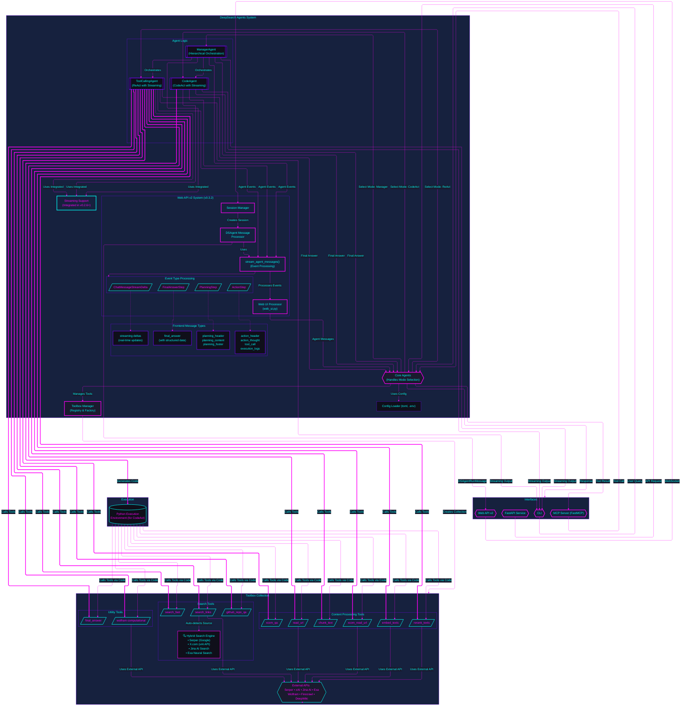

# DeepSearchAgent System Architecture Diagram

**Version:** `v0.3.2.rc2`

**Update Date:** `2025-07-29`

```mermaid
---
config:
  theme: dark
  themeVariables:
    primaryColor: '#1a1a2e'
    primaryTextColor: '#00fff9'
    primaryBorderColor: '#7700ff'
    lineColor: '#ff00f7'
    secondaryColor: '#16213e'
    tertiaryColor: '#0f0f1a'
    mainBkg: '#1a1a2e'
    nodeBorder: '#7700ff'
    clusterBkg: '#16213e'
    clusterBorder: '#7700ff'
    titleColor: '#00fff9'
    edgeLabelBackground: '#1a1a2e'
    textColor: '#00fff9'
  layout: elk
  flowchart:
    curve: linear
---
flowchart TB
    subgraph Interfaces["Interfaces"]
        direction LR
        CLI{{"CLI"}}
        FastAPI{{"FastAPI Service"}}
        WebAPIv2{{"Web API v2"}}
        MCPServer{{"MCP Server (FastMCP)"}}
    end
    subgraph DeepSearchAgentSystem["DeepSearch Agents System"]
        direction TB
        CoreAgents{{"Core Agents
(Handles Mode Selection)"}}
        ConfigLoader["Config Loader (toml, .env)"]
        StreamingSupport["Streaming Support
(Integrated in v0.2.6+)"]
        ToolboxManager["Toolbox Manager
(Registry & Factory)"]
        subgraph WebAPIv2System["Web API v2 System (v0.3.2)"]
            direction TB
            SessionManager["Session Manager"]
            WebUIProcessor["Web UI Processor
(web_ui.py)"]
            DSAgentProcessor["DSAgent Message
Processor"]
            StreamAgentMessages["stream_agent_messages()
(Event Processing)"]
            subgraph EventTypes["Event Type Processing"]
                direction LR
                PlanningEvent[/"PlanningStep"/]
                ActionEvent[/"ActionStep"/]
                FinalAnswerEvent[/"FinalAnswerStep"/]
                StreamDeltaEvent[/"ChatMessageStreamDelta"/]
            end
        end
        subgraph MessageTypes["Frontend Message Types"]
            direction TB
            PlanningMsgs["planning_header
planning_content
planning_footer"]
            ActionMsgs["action_header
action_thought
tool_call
execution_logs"]
            FinalAnswerMsg["final_answer
(with structured data)"]
            StreamingDeltas["streaming deltas
(real-time updates)"]
        end
        subgraph Agents["Agent Logic"]
            direction LR
            ToolAgent[["ToolCallingAgent
(ReAct with Streaming)"]]
            CodeAgent[["CodeAgent
(CodeAct with Streaming)"]]
            ManagerAgent[["ManagerAgent
(Hierarchical Orchestration)"]]
        end
    end
    subgraph Toolbox["Toolbox Collection"]
        direction TB
        subgraph SearchTools["Search Tools"]
            SearchLinks[/search_links/]
            SearchFast[/search_fast/]
            SearchEngines["🔍 Hybrid Search Engine
• Serper (Google)
• X.com (xAI API)  
• Jina AI Search
• Exa Neural Search"]
            GitHubQA[/github_repo_qa/]
        end
        subgraph ContentTools["Content Processing Tools"]
            ReadURL[/read_url/]
            XcomReadURL[/xcom_read_url/]
            XcomQA[/xcom_qa/]
            ChunkText[/chunk_text/]
            EmbedTexts[/embed_texts/]
            RerankTexts[/rerank_texts/]
        end
        subgraph UtilityTools["Utility Tools"]
            Wolfram[/"wolfram computational"/]
            FinalAnswer[/final_answer/]
        end
        ExternalAPIs{{External APIs  
Serper • xAI • Jina AI • Exa
Wolfram • Firecrawl • DeepWiki}}
    end
    subgraph Execution["Execution"]
        PythonEnv[("Python Execution
Environment (for CodeAct)")]
    end

    CLI -- "User Query" --> CoreAgents
    FastAPI -- "API Request" --> CoreAgents
    WebAPIv2 -- "WebSocket" --> SessionManager
    SessionManager -- "Creates Session" --> DSAgentProcessor
    DSAgentProcessor -- "Uses" --> StreamAgentMessages
    StreamAgentMessages -- "Processes Events" --> WebUIProcessor
    WebUIProcessor -- "Agent Messages" --> CoreAgents
    MCPServer -- "Tool Call" --> CoreAgents
    CoreAgents -- "Select Mode: ReAct" --> ToolAgent
    CoreAgents -- "Select Mode: CodeAct" --> CodeAgent
    CoreAgents -- "Select Mode: Manager" --> ManagerAgent
    CoreAgents -- "Uses Config" --> ConfigLoader
    CoreAgents -- "Manages Tools" --> ToolboxManager
    ToolAgent -- "Uses Integrated" --> StreamingSupport
    CodeAgent -- "Uses Integrated" --> StreamingSupport
    ManagerAgent -- "Uses Integrated" --> StreamingSupport
    ManagerAgent -- "Orchestrates" --> ToolAgent
    ManagerAgent -- "Orchestrates" --> CodeAgent

    ToolboxManager -- "Creates Collection" --> Toolbox
    SearchLinks -- "Auto-detects Source" --> SearchEngines
    
    ToolAgent == "Calls Tools" ==> SearchLinks
    ToolAgent == "Calls Tools" ==> SearchFast
    ToolAgent == "Calls Tools" ==> GitHubQA
    ToolAgent == "Calls Tools" ==> ReadURL
    ToolAgent == "Calls Tools" ==> XcomReadURL
    ToolAgent == "Calls Tools" ==> XcomQA
    ToolAgent == "Calls Tools" ==> ChunkText
    ToolAgent == "Calls Tools" ==> EmbedTexts
    ToolAgent == "Calls Tools" ==> RerankTexts
    ToolAgent == "Calls Tools" ==> Wolfram
    ToolAgent == "Calls Tools" ==> FinalAnswer

    CodeAgent == "Generates Code" ==> PythonEnv
    PythonEnv -- "Calls Tools via Code" --> SearchLinks
    PythonEnv -- "Calls Tools via Code" --> SearchFast
    PythonEnv -- "Calls Tools via Code" --> GitHubQA
    PythonEnv -- "Calls Tools via Code" --> ReadURL
    PythonEnv -- "Calls Tools via Code" --> XcomReadURL
    PythonEnv -- "Calls Tools via Code" --> XcomQA
    PythonEnv -- "Calls Tools via Code" --> ChunkText
    PythonEnv -- "Calls Tools via Code" --> EmbedTexts
    PythonEnv -- "Calls Tools via Code" --> RerankTexts
    PythonEnv -- "Calls Tools via Code" --> Wolfram
    PythonEnv -- "Calls Tools via Code" --> FinalAnswer

    SearchLinks -- "Uses External API" --> ExternalAPIs
    ReadURL -- "Uses External API" --> ExternalAPIs
    XcomReadURL -- "Uses External API" --> ExternalAPIs
    EmbedTexts -- "Uses External API" --> ExternalAPIs
    RerankTexts -- "Uses External API" --> ExternalAPIs
    Wolfram -- "Uses External API" --> ExternalAPIs
    ExternalAPIs --> Toolbox

    ToolAgent -- "Final Answer" --> CoreAgents
    CodeAgent -- "Final Answer" --> CoreAgents
    ManagerAgent -- "Final Answer" --> CoreAgents
    ToolAgent -- "Streaming Output" --> CLI
    CodeAgent -- "Streaming Output" --> CLI
    ManagerAgent -- "Streaming Output" --> CLI
    ToolAgent -- "Agent Events" --> StreamAgentMessages
    CodeAgent -- "Agent Events" --> StreamAgentMessages
    ManagerAgent -- "Agent Events" --> StreamAgentMessages
    DSAgentProcessor -- "DSAgentRunMessage" --> WebAPIv2
    CoreAgents -- "Response" --> Interfaces
    CoreAgents -- "Tool Result" --> MCPServer
    
    %% Event Type Processing
    StreamAgentMessages --> EventTypes
    PlanningEvent -.-> PlanningMsgs
    ActionEvent -.-> ActionMsgs
    FinalAnswerEvent -.-> FinalAnswerMsg
    StreamDeltaEvent -.-> StreamingDeltas

    classDef default fill:#1a1a2e,stroke:#7700ff,stroke-width:2px,color:#00fff9
    classDef interface fill:#16213e,stroke:#ff00f7,stroke-width:3px,color:#00fff9
    classDef agent fill:#0f0f1a,stroke:#7700ff,stroke-width:2px,color:#00fff9
    classDef manager fill:#1a1a2e,stroke:#ff00f7,stroke-width:3px,color:#00fff9
    classDef tool fill:#16213e,stroke:#00fff9,stroke-width:2px,color:#ff00f7
    classDef environment fill:#0f0f1a,stroke:#00fff9,stroke-width:2px,color:#ff00f7
    classDef external fill:#1a1a2e,stroke:#00fff9,stroke-width:2px,color:#ff00f7
    classDef config fill:#0f0f1a,stroke:#7700ff,stroke-width:1px,color:#00fff9
    classDef streaming fill:#16213e,stroke:#00fff9,stroke-width:3px,color:#ff00f7
    classDef mcpserver fill:#16213e,stroke:#ff00f7,stroke-width:3px,color:#00fff9
    classDef searchengine fill:#0f0f1a,stroke:#ff00f7,stroke-width:2px,color:#00fff9
    classDef webapi fill:#16213e,stroke:#ff00f7,stroke-width:3px,color:#00fff9
    classDef event fill:#1a1a2e,stroke:#00fff9,stroke-width:2px,color:#ff00f7
    classDef message fill:#0f0f1a,stroke:#7700ff,stroke-width:2px,color:#00fff9

    CLI:::interface
    FastAPI:::interface
    WebAPIv2:::interface
    MCPServer:::mcpserver
    CoreAgents:::manager
    ToolAgent:::agent
    CodeAgent:::agent
    ManagerAgent:::agent
    StreamingSupport:::streaming
    ToolboxManager:::manager
    SearchLinks:::tool
    SearchFast:::tool
    GitHubQA:::tool
    SearchEngines:::searchengine
    ReadURL:::tool
    XcomReadURL:::tool
    XcomQA:::tool
    ChunkText:::tool
    EmbedTexts:::tool
    RerankTexts:::tool
    Wolfram:::tool
    FinalAnswer:::tool
    PythonEnv:::environment
    ExternalAPIs:::external
    ConfigLoader:::config
    SessionManager:::webapi
    WebUIProcessor:::webapi
    DSAgentProcessor:::webapi
    StreamAgentMessages:::webapi
    PlanningEvent:::event
    ActionEvent:::event
    FinalAnswerEvent:::event
    StreamDeltaEvent:::event
    PlanningMsgs:::message
    ActionMsgs:::message
    FinalAnswerMsg:::message
    StreamingDeltas:::message
```
